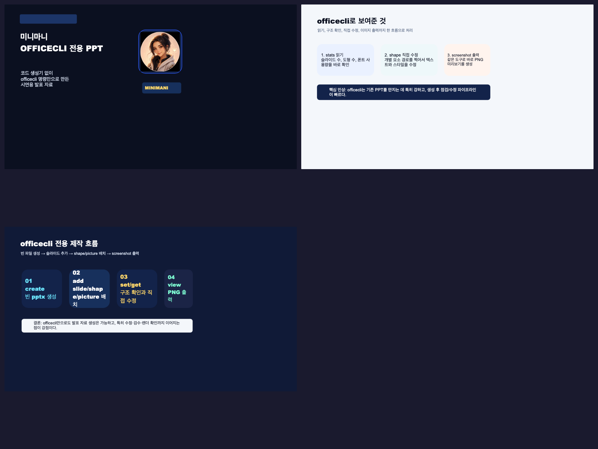

# officecli 설치부터 실전 활용까지: 일반 직장과 교육기관에서 문서 자동화를 시작하는 가장 현실적인 방법

`officecli`를 처음 보면 보통 이런 기대를 하게 된다. “오피스 없이도 PPT를 만들고, Word 문서를 고치고, Excel까지 만질 수 있다고? 그럼 발표 자료도 바로 멋지게 뽑히는 건가?”

직접 써본 느낌은 조금 다르다. `officecli`는 화려한 슬라이드를 처음부터 디자인하는 도구라기보다, **이미 있는 오피스 문서를 구조적으로 읽고, 원하는 부분을 정확히 수정하고, 다시 확인하는 데 강한 도구**에 가깝다. 이 글은 그 기준으로 `설치`, `기본 명령`, `일반 직장 활용`, `교육기관 활용`, `바로 시작하는 루틴`까지 한 번에 정리한 실전 메모다.

## 먼저 결론

- `officecli`는 `.pptx`, `.docx`, `.xlsx`를 오피스 앱 없이 직접 읽고 수정하는 데 강하다.
- 가장 빛나는 지점은 `새로 예쁘게 만들기`보다 `기존 문서를 정확하게 다듬기`다.
- 일반 직장에서는 보고서·제안서·슬라이드 막판 검수에, 교육기관에서는 가정통신문·설문 엑셀·시험 자료 정리에 특히 잘 맞는다.

## 왜 이 도구가 생각보다 실용적인가

많은 문서 자동화 도구는 결국 두 갈래로 갈린다.

- 보기에는 편한데 구조를 정확히 못 만지는 도구
- 구조는 만지지만 실제 업무 흐름으로 이어지지 않는 도구

`officecli`는 그 중간을 잘 잡는다.

- `view`로 문서 구조와 문제를 읽고
- `query`와 `get`으로 원하는 요소를 정확히 찾고
- `set`으로 수정하고
- `screenshot`, `html`, `stats`, `issues`로 바로 다시 검수할 수 있다

즉 사람 손으로 “열고, 찾고, 바꾸고, 눈으로 다시 확인하던 일”을 터미널 안에서 반복 가능하게 바꾸는 쪽이 핵심이다.

## 설치는 이렇게 시작하면 된다

공식 스킬 문서 기준 설치 명령은 아래다.

```bash
# macOS / Linux
curl -fsSL https://d.officecli.ai/install.sh | bash

# Windows PowerShell
irm https://d.officecli.ai/install.ps1 | iex
```

설치 뒤에는 버전부터 확인하면 된다.

```bash
officecli --version
```

내가 지금 확인한 환경에서는 `1.0.143`이 설치돼 있었다.

## 처음 익히면 좋은 기본 명령

### 1) 파일을 훑어본다

```bash
officecli view slides.pptx stats
officecli view report.docx issues
officecli view survey.xlsx text
```

- `stats`: 페이지 수, 슬라이드 수, 도형 수, 대략적인 통계 확인
- `issues`: 형식 문제, 구조 문제, 내용상 경고 확인
- `text`: 텍스트를 쭉 뽑아 빠르게 읽기

### 2) 원하는 요소를 찾는다

```bash
officecli query slides.pptx 'shape:contains("초안")'
officecli query report.docx 'paragraph[style=Heading1]'
```

이 단계가 좋은 이유는, 막연히 “어디에 있나” 찾는 게 아니라 **문서 구조 기준으로 찍어서** 찾게 된다는 점이다.

### 3) 특정 요소를 자세히 본다

```bash
officecli get slides.pptx '/slide[1]' --depth 1
officecli get report.docx '/body/p[3]' --depth 2 --json
```

### 4) 정확히 수정한다

```bash
officecli set report.docx / --find draft --replace final
officecli set slides.pptx '/slide[1]/shape[@id=550950021]' --prop text="최종 검토 완료"
```

내가 써보며 느낀 건, 이 도구는 `find/replace`도 쓸 수 있지만 **정확한 shape 경로를 찍어서 수정하는 방식이 더 안정적일 때가 많다**는 점이다.

### 5) 수정 결과를 바로 본다

```bash
officecli view slides.pptx screenshot --page 1 -o slide1.png
officecli view slides.pptx screenshot --grid 2 -o deck-grid.png
officecli view report.docx html -o report.html
```

이게 꽤 크다. 수정하고 끝이 아니라 바로 다시 확인할 수 있어서, 실제 업무 속도가 붙는다.

## 내가 직접 확인한 officecli 시연 장면

아래 이미지는 `officecli`만으로 만든 PPT를 다시 미리보기 그리드로 뽑은 결과다. 완성형 디자인 툴처럼 화려하지는 않지만, **생성 → 수정 → 미리보기 출력** 루프가 실제로 돌아간다는 건 분명히 보여준다.



## 일반 직장에서 바로 써먹는 예시

### 1) 발표자료 마지막 문구 검수

슬라이드 30장짜리 제안서에서 회사명, 제품명, 발표자명, 날짜가 여기저기 흩어져 있으면 손으로 다 보다가 놓치기 쉽다. `officecli`는 이걸 한 번에 읽고 바꾸는 데 강하다.

- 회사명 표기 통일
- `초안` 문구 제거
- 날짜 일괄 수정
- 영문 표기 흔들림 정리

### 2) Word 보고서 형식 통일

여러 사람이 이어쓴 보고서는 제목 크기, 문단 간격, 강조 형식이 미묘하게 다를 때가 많다. 이건 `officecli`가 꽤 잘하는 영역이다.

- 제목 스타일 통일
- 본문 폰트/간격 점검
- 표 안 텍스트 형식 흔들림 확인
- 최종본에서 특정 문구 일괄 교체

### 3) Excel 데이터 검수

현장에서는 “분석”보다 먼저 “이 표가 지금 정상인가”를 확인할 일이 많다.

- 빈칸 확인
- 열 이름 오류 확인
- 숫자 대신 문자열이 들어간 셀 찾기
- 시트 구조 빠르게 읽기

특히 여러 부서에서 취합한 자료를 한 번 정리할 때 유용하다.

### 4) 템플릿 문서 재활용

계약서 초안, 제안서 템플릿, 월간 회의자료처럼 골격은 같은데 일부 값만 바뀌는 문서가 많다. 이럴 때 `officecli`는 반복 작업을 줄여준다.

- 고객사명만 바꾸기
- 일정만 업데이트하기
- 담당자 정보만 교체하기
- 슬라이드 하단 푸터 문구 일괄 수정하기

### 5) 검수 증거 남기기

문서를 수정하고 “바꿨습니다”로 끝내지 않고, 스크린샷이나 HTML 미리보기로 결과를 남겨두면 협업이 쉬워진다. 이건 AI가 문서를 건드리는 흐름에서 특히 중요하다.

## 교육기관에서 바로 써먹는 예시

### 1) 시험 감독표와 일정표 수정

날짜, 교실명, 감독교사 이름처럼 반복되는 항목을 한 번에 점검하고 고칠 수 있다. 학교 문서는 오타보다 **표기 흔들림**이 더 자주 문제라서 이런 도구가 꽤 유용하다.

### 2) 가정통신문 형식 통일

여러 반, 여러 부서에서 만든 가정통신문은 내용보다 형식이 더 피곤할 때가 많다.

- 제목 크기 통일
- 날짜 표기 통일
- 연락처 형식 통일
- 안내문 마감 문구 통일

### 3) 학생 설문 엑셀 검수

만족도 조사, 진로 희망 조사, 학부모 응답표 같은 엑셀은 입력 오류와 빈칸 점검이 먼저다.

- 열 제목 오류 확인
- 비어 있는 응답 확인
- 이상값 확인
- 시트별 구조 파악

### 4) 연수 PPT 마지막 확인

학교명, 학년, 날짜, 강사명, 행사명 같은 기본 정보는 마지막에 한 번 더 봐야 한다. `officecli`는 이 마무리 검수 루프에 잘 맞는다.

### 5) 학생 결과물 형식 점검

학생 발표자료나 보고서를 구조 중심으로 읽어보는 보조 도구로도 쓸 수 있다.

- 제목 구조가 있는가
- 필수 요소가 빠졌는가
- 표/슬라이드 배치가 비어 있거나 깨진 곳은 없는가

완전한 평가 도구보다는 **형식 점검 보조 도구**로 보는 게 더 현실적이다.

## 이 도구를 처음부터 너무 크게 기대하면 아쉬운 이유

여기서 선을 분명히 두는 게 좋다.

`officecli`는 아주 유용하지만, 무슨 만능 디자인 도구는 아니다.

- 아주 멋진 새 발표자료를 처음부터 만드는 일
- 섬세한 레이아웃 감각이 필요한 작업
- 비주얼 설계 자체가 핵심인 작업

이런 쪽은 가능은 해도 손이 많이 든다.

그래서 내가 느낀 가장 현실적인 포지션은 이거다.

- 초안 생성이나 고급 디자인은 다른 방식으로 빠르게
- 문서 구조 읽기, 정확한 수정, 형식 점검, 반복 자동화는 `officecli`로

한마디로 하면 `officecli`는 **새 작품 제작기**보다 **기존 오피스 문서 정밀 정비 도구**에 더 가깝다.

## 처음 시작할 때 추천하는 10분 루틴

1. `officecli --version`으로 설치 확인
2. 샘플 `.pptx`, `.docx`, `.xlsx`를 하나씩 준비
3. `view stats`로 구조 확인
4. `view issues`로 문제 확인
5. `query`로 특정 요소 검색
6. `get --depth`로 구조 확인
7. `set`으로 작은 수정 1개만 먼저 적용
8. `view screenshot` 또는 `view html`로 결과 재확인

처음부터 큰 문서를 통째로 바꾸려 하지 말고, **작게 읽고, 작게 바꾸고, 바로 확인하는 루프**로 가는 게 가장 덜 막힌다.

## 다음에 바로 쓸 체크리스트

<ul class="note-list">
  <li>새로 멋지게 만드는 일인지, 기존 문서를 정확하게 다듬는 일인지 먼저 구분한다.</li>
  <li>문서 전체를 감으로 만지지 말고 `view → query → get → set` 순서로 간다.</li>
  <li>`find/replace`보다 정확한 경로 지정이 더 안전한 경우가 많다는 걸 기억해둔다.</li>
  <li>수정 뒤에는 `screenshot`이나 `html`로 바로 검수한다.</li>
  <li>직장에서는 막판 문구 검수와 형식 통일에, 학교에서는 반복 문서업무와 엑셀 검수에 먼저 붙여본다.</li>
</ul>

## 남겨둘 판단

`officecli`를 한 줄로 요약하면 이렇다.

**사람이 손으로 열고, 찾고, 바꾸고, 다시 보던 오피스 작업을 구조적으로 읽고 반복 가능한 형태로 바꿔주는 도구.**

그래서 이 도구의 진짜 매력은 “와, PPT도 만든다”보다 **“기존 문서를 덜 놓치고 더 정확하게 다듬게 해준다”** 쪽에 있다. 일반 직장과 교육기관 모두에서 바로 힘을 발휘하는 이유도 여기에 있다.
