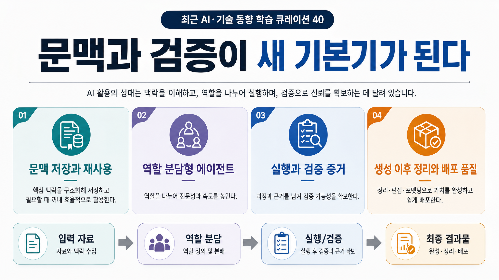

# 2026-06-20 · 문맥과 검증이 새 기본기가 된다 · 릴리스 40건

이번에 받은 <strong>「최근 AI·기술 동향 학습 큐레이션 40」</strong>은 표면적으로 꽤 넓다. LMCache, LLM Wiki, Contents Hub, Hermes, Goose, Codex, HWPX 도구, Arduino App Lab, BananaX, OpenWhispr까지 한 묶음 안에 같이 들어 있다.

이렇게 주제가 넓으면 보통은 “요즘 도구가 정말 많다” 정도로 끝나기 쉽다. 그런데 이번 40개를 다시 읽으며 더 또렷하게 남은 건 다른 쪽이었다. 이제 차이는 새 모델 이름을 많이 아는가보다 <strong>문맥을 어떻게 쌓고, 역할을 어떻게 나누고, 실행 뒤 무엇으로 검증할지를 먼저 설계하는가</strong>에서 난다는 점이었다.

## 먼저 결론

- 이번 40선의 공통 화두는 새 도구 수집보다 <strong>문맥 저장과 재사용 구조</strong>에 있었다.
- 에이전트는 답변 생성기보다 <strong>역할 분담과 승인 지점을 가진 작은 운영 팀</strong>처럼 다뤄지고 있다.
- 개발 도구의 가치는 코드 제안보다 <strong>실행, 테스트, 검증 증거까지 남길 수 있는가</strong>에서 갈린다.
- 한국형 문서 처리, 인포그래픽, 발표 자료, 메이커 실습 자료는 모두 <strong>생성 이후의 정리, 편집, 배포 품질</strong>을 더 중요하게 만든다.
- 수업이나 실전 프로젝트에서는 “무엇을 만들까”보다 <strong>어떤 자료를 넣고, 누가 검토하고, 무엇을 완료 증거로 삼을까</strong>를 먼저 정하는 편이 훨씬 강하다.

## 왜 이번 40선이 한 방향으로 읽혔나

이번 자료에는 크게 여섯 축이 들어 있다.

- 문맥과 지식 기반 AI
- 에이전트 운영과 자동화 팀
- Codex와 개발자 워크플로우
- 문서 처리와 한국형 콘텐츠 제작
- 앱, API, 메이커 실습
- 시각, 게임, 음성 제작 도구

카테고리는 이렇게 나뉘어 있지만, 실제로는 거의 다 같은 질문으로 수렴한다.

- 좋은 답을 위해 어떤 문맥을 모아야 하나
- 한 AI에게 다 맡길지, 여러 역할로 나눌지
- 실행 결과를 무엇으로 확인할지
- 생성 결과를 어떻게 다듬어 실제 제출물로 바꿀지
- 반복해서 쓸 절차를 어디까지 고정할지

그래서 이번 40선은 링크를 많이 소개하는 자료라기보다, <strong>AI 활용의 기본기가 어디로 옮겨가고 있는지 보여주는 운영 지도</strong>처럼 읽는 편이 더 맞았다.

## 이번 묶음에서 가장 크게 보인 네 가지 변화

### 1) 문맥은 옵션이 아니라 기본 인프라가 된다

LMCache, LLM Wiki, Obsidian 검색 연결, Contents Hub, NotebookLM 확장 자료를 같이 놓고 보면 방향이 분명하다. 이제는 한 번 잘 대답하는 것보다, <strong>이미 읽은 것과 이미 만든 것을 다시 불러와 다음 작업에 연결하는 구조</strong>가 더 중요해진다.

예전에는 프롬프트 한 줄을 얼마나 잘 쓰느냐가 감탄 포인트였다면, 이제는 그보다 이런 질문이 더 중요해진다.

- 내 자료가 다음 답변에 실제로 반영되나
- 공개 자료와 개인 노트를 같이 읽게 할 수 있나
- 읽은 자료를 다음 발표나 문서에 다시 쓸 수 있나
- 긴 문맥 비용을 줄이면서도 기억을 유지할 수 있나

결국 문맥은 배경 설명이 아니라, AI를 계속 쓸수록 쌓이는 <strong>작업 인프라</strong>가 된다.

### 2) 에이전트는 혼자 똑똑한 도구보다 작은 운영 팀에 가까워진다

Hermes 운영 사례, 다중 에이전트 세팅, Harness 제어 원칙, Goose, 인터랙티브 HTML 레슨 배포, 텔레그램 개인 비서 자료를 같이 보면 공통점이 선명하다.

중요한 건 “AI가 무엇을 답했나”보다,

- 누가 조사했는가
- 누가 초안을 만들었는가
- 누가 승인했는가
- 어디까지 자동으로 올렸는가

같은 운영선이다.

그래서 에이전트 활용은 점점 챗봇 감탄사에서 멀어지고, <strong>역할 분담, 승인 지점, 실패 복구선이 있는 작업 체계</strong> 쪽으로 가고 있다.

### 3) 개발 도구의 차이는 코드 생성보다 검증 표면에서 난다

Codex iOS 플러그인, Agent Skills, Ultragoal Skill, Ponytail, Gajae-Code, FableCodex, FableLayer를 한 줄로 읽으면 메시지가 꽤 명확하다.

이제 개발 도구가 잘한다는 말은 단순히 코드 몇 줄을 빨리 뽑아준다는 뜻이 아니다.

- 목표를 유지하는가
- 인터뷰와 계획을 남기는가
- 실행 로그와 테스트 결과를 보여주는가
- 안전 규칙과 권한 경계를 관리하는가
- 실패를 빨리 발견할 중간 산출물을 만들게 하는가

즉 개발에서도 새 기본기는 “잘 생성한다”보다 <strong>잘 검증하게 만든다</strong>에 더 가까워지고 있다.

### 4) 결과물 경쟁은 생성보다 정리와 배포 품질에서 갈린다

Satgat, kordoc, BananaX, NotebookLM 슬라이드 자료, Perfect Pixel, sprite-gen, Notchprompt, OpenWhispr 자료를 보면 생성 도구는 이미 많다. 그런데 실제로 오래 남는 가치는 그 다음에 있다.

- 한국어 문장을 덜 어색하게 다듬는가
- HWPX, PDF 같은 실제 업무 형식을 처리하는가
- 인포그래픽, PPT, 카드뉴스처럼 전달 가능한 형태로 바꾸는가
- 픽셀아트, 스프라이트, 음성 입력처럼 후처리 병목을 줄이는가

결국 생산성의 차이는 “만들 수 있느냐”보다 <strong>읽히게, 제출되게, 다시 쓰이게 정리할 수 있느냐</strong>에서 난다.

## 수업과 실전에서 바로 남는 장면

이번 묶음은 소개로만 끝내기 아깝다. 실제로는 아래 같은 장면에 바로 붙일 수 있다.

### 1) 개인 지식 기반 AI 실험

Obsidian, LLM Wiki, Contents Hub를 묶으면 “좋은 질문을 하는 법”보다 “좋은 문맥을 쌓는 법”을 먼저 가르칠 수 있다. 같은 질문을 빈 맥락과 개인 위키 맥락에 각각 넣어보면, 프롬프트보다 지식 구조가 답변 품질을 얼마나 바꾸는지 드러난다.

### 2) 에이전트 팀 운영 수업

Hermes, 다중 에이전트 세팅, Goose, Codex 자료를 같이 읽으면 조사자, 초안 작성자, 비판적 검토자, 배포 담당자처럼 역할 카드를 나누는 수업 설계가 가능하다. 이 방식은 “AI를 써라”보다 훨씬 구체적이다.

### 3) 검증 중심 개발 과제

Gajae-Code, FableLayer, Codex 고급 설정 자료를 보면 이제는 코드만 제출시키는 과제보다, 실행 로그와 테스트 증거까지 같이 내게 하는 과제가 더 자연스럽다. 학생도 결과가 아니라 과정과 근거를 남기는 습관을 배우게 된다.

### 4) 한국형 문서 자동화 흐름

Satgat, kordoc, 한국어 윤문 도구를 묶으면 학교나 행정 문서처럼 “내용은 맞는데 형식이 어색한” 문제를 줄일 수 있다. 생성형 AI가 실제 현장에 들어오려면 결국 이 형식 층이 필요하다.

### 5) 메이커와 앱 실습의 데이터 흐름 이해

API, Arduino App Lab, 미니앱 SDK 자료는 초보자에게 특히 좋다. 데이터가 어디서 들어오고, 어디에 저장되고, 어떤 앱이나 화면으로 나가는지 손으로 만져보게 만들기 때문이다.

## 그래서 이번 40개는 어떻게 읽는 게 좋을까

처음부터 순서대로 40개를 다 보는 것보다 아래 흐름으로 읽는 편이 훨씬 선명하다.

### 1단계: 문맥과 지식 기반 자료부터 본다

- LMCache
- LLM Wiki with Obsidian
- Obsidian 검색 연결
- Contents Hub

이 구간은 AI 활용의 출발점이 프롬프트가 아니라 <strong>지식 구조</strong>라는 감각을 만든다.

### 2단계: 에이전트 운영 자료로 넘어간다

- Hermes 콘텐츠팀
- 5인 회사 Hermes 운영기
- 다중 에이전트 세팅
- Harness 제어 원칙
- 텔레그램 개인 비서

이 구간은 AI를 도구가 아니라 <strong>운영해야 하는 팀원</strong>으로 보게 만든다.

### 3단계: 개발자 워크플로우를 읽는다

- Codex iOS 플러그인
- Agent Skills
- Ultragoal Skill
- Ponytail
- Gajae-Code
- FableLayer

여기서는 잘 만드는 법보다 <strong>어떻게 검증하게 만들지</strong>를 먼저 읽는 편이 남는다.

### 4단계: 문서와 결과물 품질 자료를 붙인다

- Satgat
- kordoc
- BananaX
- NotebookLM 슬라이드 프롬프트
- OpenWhispr

이 구간에서는 생성 후 후처리와 배포 품질이 왜 중요한지 감이 잡힌다.

## 실제로 한 것

1. 40개를 카테고리 나열로 끝내지 않고, 문맥 저장, 역할 분담, 검증, 후처리라는 네 축으로 다시 묶었다.
2. 첨부 노트에 있던 “무엇을 만들까보다 어떤 자료를 넣고 누가 검토하며 무엇으로 완료를 판단할까를 먼저 설계하라”는 감각을 이번 글의 중심으로 끌어올렸다.
3. 개별 툴 소개보다, 각 자료가 어떤 작업 병목을 줄이려는지 중심으로 다시 읽었다.
4. 마지막에는 다시 찾아보기 쉽도록 복사용 링크 표를 그대로 남겼다.

## 막혔던 지점

> 이번 40선은 주제가 넓은 대신, 그대로 옮기면 정보는 많아도 한 문장 논지가 약해질 위험이 컸다.

그래서 이번 글에서는 “어떤 자료가 많았다”보다 <strong>이번 묶음이 결국 무엇을 새 기본기로 밀고 있나</strong>를 먼저 고정하는 쪽이 중요했다. 가장 잘 맞는 한 문장은 “문맥과 검증이 새 기본기가 된다”였다.

## 다음에 바로 쓸 체크리스트

<ul class="note-list">
  <li>새 모델이나 도구를 보기 전에, 내 자료를 어떤 문맥 구조로 쌓을지 먼저 정한다.</li>
  <li>에이전트는 한 번에 다 시키지 말고 조사·작성·검토·배포 역할로 나눠 본다.</li>
  <li>개발 과제는 코드만 보지 말고 실행 로그, 테스트, 완료 증거를 같이 요구한다.</li>
  <li>문서 자동화는 내용 생성보다 한국어 문체, 형식, 제출물 품질 층을 따로 본다.</li>
  <li>인포그래픽, PPT, 카드뉴스는 예쁜 그림보다 한 장 요약과 전달 구조를 먼저 설계한다.</li>
  <li>메이커 실습은 추상 개념 설명보다 입력·저장·실행·표시 흐름을 눈에 보이게 만든다.</li>
</ul>

## 남겨둘 판단

이번 40선을 다시 읽고 남는 판단은 분명하다. 이제 AI 활용의 격차는 더 센 모델을 먼저 아는가에서 나지 않는다. <strong>문맥을 쌓아두고, 역할을 나누고, 검증 증거를 남기고, 결과물을 실제 형식으로 정리하는 기본기</strong>를 갖췄는가에서 더 크게 난다.

그래서 앞으로도 비슷한 큐레이션을 읽을 때는 “이 도구가 대단한가”보다, <strong>이 자료가 내 운영 구조를 어디서 바꾸게 만드는가</strong>를 먼저 보는 쪽이 더 오래 남는다.

## 복사용 링크 표

| 카테고리 | 주제 | 제목 | 원본 링크 | 릴리스 공개 링크 |
| --- | --- | --- | --- | --- |
| 문맥과 지식 기반 AI | LLM 추론 캐시 | LMCache: KV 캐시를 재사용 가능한 AI 내이티브 지식으로 전환 | [원본](https://github.com/LMCache/LMCache) | [릴리스 공개 링크](https://lilys.ai/digest/10187101/11863963?s=1&noteVersionId=8417703) |
| 문서 처리와 한국형 콘텐츠 제작 | 한국어 윤문 | 사람같이 인간같이 글을 다듬는 윤문하는 im-not-strange-ai 플러그인 | [원본](https://github.com/itssosunny/im-not-strange-ai) | [릴리스 공개 링크](https://lilys.ai/digest/10186837/11863611?s=1&noteVersionId=8417337) |
| 문맥과 지식 기반 AI | 개인 위키 | LLM Wiki 쓰면 AI 답변이 얼마나 달라질까? 직접 비교해봤습니다 \| LLM Wiki with Obsidian | [원본](https://www.youtube.com/watch?v=yhWdfk4FHio) | [릴리스 공개 링크](https://lilys.ai/digest/10181550/11856885?s=1&noteVersionId=8410368) |
| 에이전트 운영과 자동화 팀 | 콘텐츠 배포 자동화 | Hermes로 24시간 일하는 AI 콘텐츠팀 만들기 \| 승인만 하면 알아서 올려줍니다 | [원본](https://www.youtube.com/watch?v=96BAQ3v3NhI) | [릴리스 공개 링크](https://lilys.ai/digest/10181543/11856875?s=1&noteVersionId=8410358) |
| Codex와 개발자 워크플로우 | iOS 개발 지원 | 앱 개발에서 한발짝 앞서 나가는 Codex! iOS 공식 개발 플러그인 및 시뮬레이터 미러링 기능 출시! | [원본](https://www.youtube.com/watch?v=dTye65WE0IE) | [릴리스 공개 링크](https://lilys.ai/digest/10177400/11850840?s=1&noteVersionId=8404096) |
| 문맥과 지식 기반 AI | 검색과 노트 연결 | 구글 검색 결과에 옵시디언 노트 검색하는 오픈 소스 | [원본](https://github.com/johnfkoo951/obsidian-omnisearch-google-cmds) | [릴리스 공개 링크](https://lilys.ai/digest/10176784/11850046?s=1&noteVersionId=8403258) |
| Codex와 개발자 워크플로우 | 에이전트 스킬 | Agent Skills | [원본](https://github.com/addyosmani/agent-skills) | [릴리스 공개 링크](https://lilys.ai/digest/10176736/11849974?s=1&noteVersionId=8403183) |
| Codex와 개발자 워크플로우 | 목표 지속 루프 | Ultragoal Skill | 원본 URL 미확인 | [릴리스 공개 링크](https://lilys.ai/digest/10176296/11849502?s=1&noteVersionId=8402663) |
| Codex와 개발자 워크플로우 | 에이전트 코드 생성 최적화 | Ponytail: AI 에이전트의 코드 생성 방식을 최적화 시켜주는 도구 | [원본](https://github.com/DietrichGebert/ponytail) | [릴리스 공개 링크](https://lilys.ai/digest/10174050/11846786?s=1&noteVersionId=8399776) |
| 앱, API, 메이커 실습 | 미니앱 개발 도구 | 앱인토스 미니앱 개발자를 위한 오픈소스 도구 3가지 - 앱인토스 | [원본](https://techchat-apps-in-toss.toss.im/) | [릴리스 공개 링크](https://lilys.ai/digest/10173754/11846407?s=1&noteVersionId=8399384) |
| 문맥과 지식 기반 AI | 로컬 콘텐츠 인박스 | Contents Hub: 구독 콘텐츠를 한 곳에 모아 AI 에이전트가 요약하고 관리하는 로컬 인박스 | [원본](https://github.com/yansfil/contents-hub) | [릴리스 공개 링크](https://lilys.ai/digest/10173722/11846366?s=1&noteVersionId=8399342) |
| 시각, 게임, 음성 제작 도구 | AI 인포그래픽 선택 | BananaX \| 4つのAIインフォグラフィックサイト一覧 | [원본](https://furoku.github.io/bananaX/) | [릴리스 공개 링크](https://lilys.ai/digest/10173501/11846103?s=1&noteVersionId=8399077) |
| Codex와 개발자 워크플로우 | Codex 고급 설정 | Codex 고급 설정: 프로필, 훅, 모델 제공자, 보안 및 관찰 가능성 | [원본](https://developers.openai.com/codex/config-basic) | [릴리스 공개 링크](https://lilys.ai/digest/10173422/11846010?s=1&noteVersionId=8398980) |
| 문서 처리와 한국형 콘텐츠 제작 | 한국형 문서 디자인 | Satgat(삿갓): 한국형 문서 디자인 시스템 | [원본](https://satgat.vercel.app/) | [릴리스 공개 링크](https://lilys.ai/digest/10162266/11831441?s=1&noteVersionId=8383673) |
| 문서 처리와 한국형 콘텐츠 제작 | HWP/HWPX/PDF 처리 | kordoc: HWP/HWPX/PDF 파일을 마크다운으로 변환, 비교, 분석, 생성 | [원본](https://github.com/chrisryugj/kordoc) | [릴리스 공개 링크](https://lilys.ai/digest/10162162/11831291?s=1&noteVersionId=8383512) |
| 에이전트 운영과 자동화 팀 | 소규모 조직 에이전트 운영 | 5인 회사 운영하며 직접 헤르메스 에이전트 720시간 돌려본 후기 (feat. Slack, Hostinger) | [원본](https://www.youtube.com/watch?v=9m8iMzEBuSU) | [릴리스 공개 링크](https://lilys.ai/digest/10162100/11831216?s=1&noteVersionId=8383430) |
| 문맥과 지식 기반 AI | NotebookLM 산출물 확장 | 비디오부터 PPT, 인포그래픽까지 원클릭! NotebookLM 200% 활용법 | [원본](https://www.youtube.com/watch?v=jwNaSFE4XU0) | [릴리스 공개 링크](https://lilys.ai/digest/10156516/11831220?s=1&noteVersionId=8383434) |
| 에이전트 운영과 자동화 팀 | 다중 에이전트 세팅 | 나 대신 일하는 가상의 직원 3명 무료로 고용하는 법 (다중 에이전트 세팅) [14/16] | [원본](https://www.youtube.com/watch?v=1aDuCZolAaI) | [릴리스 공개 링크](https://lilys.ai/digest/10156505/11823829?s=1&noteVersionId=8375597) |
| 에이전트 운영과 자동화 팀 | 멀티 에이전트 제어 원칙 | 안드레 카파시 + 하네스 멀티 에이전트 = 이제 무적입니다 (v2.1) | [원본](https://www.youtube.com/watch?v=mcNaoV8M-tg) | [릴리스 공개 링크](https://lilys.ai/digest/10143753/11807920?s=1&noteVersionId=8358935) |
| 에이전트 운영과 자동화 팀 | Hermes 데스크톱 | Hermes 데스크톱 앱 완벽 가이드 \| 설치 · 연동 · 핵심 기능까지 | [원본](https://www.youtube.com/watch?v=qA_Kp0Burx8) | [릴리스 공개 링크](https://lilys.ai/digest/10143736/11807902?s=1&noteVersionId=8358916) |
| 앱, API, 메이커 실습 | API 기초 | API가 도대체 뭐길래? 아두이노로 실시간 데이터 받아오기 | [원본](https://www.youtube.com/watch?v=vvlmeBPmNT0) | [릴리스 공개 링크](https://lilys.ai/digest/10143691/11807849?s=1&noteVersionId=8358859) |
| 에이전트 운영과 자동화 팀 | 셀프 호스팅 AI | 더 이상 유료 구독 AI는 필요 없다? 오디세우스(Odysseus) 설치부터 활용까지! | [원본](https://www.youtube.com/watch?v=yk9QcrpmZ7c) | [릴리스 공개 링크](https://lilys.ai/digest/10143571/11807697?s=1&noteVersionId=8358687) |
| 시각, 게임, 음성 제작 도구 | 게임 에셋 | Assets Kenney | [원본](https://kenney.nl/assets/category:2D) | [릴리스 공개 링크](https://lilys.ai/digest/10143508/11807677?s=1&noteVersionId=8358665) |
| 시각, 게임, 음성 제작 도구 | 픽셀아트 정제 | GitHub - theamusing/perfectPixel: Refine and quantize messy AI pixel art into clean, perfect pixels. | [원본](https://github.com/theamusing/perfectPixel) | [릴리스 공개 링크](https://lilys.ai/digest/10143451/11807515?s=1&noteVersionId=8358472) |
| 시각, 게임, 음성 제작 도구 | 스프라이트 생성 | GitHub - aldegad/sprite-gen: Generate clean 2D game sprites & animation atlases — component-row pipe | [원본](https://github.com/aldegad/sprite-gen) | [릴리스 공개 링크](https://lilys.ai/digest/10143392/11807434?s=1&noteVersionId=8358374) |
| 문맥과 지식 기반 AI | NotebookLM 슬라이드 프롬프트 | GitHub - bwPhD/awesome-notebookLM: A curated collection of the strongest NotebookLM slide prompts so | [원본](https://github.com/bwPhD/awesome-notebookLM) | [릴리스 공개 링크](https://lilys.ai/digest/10143196/11807160?s=1&noteVersionId=8358063) |
| 에이전트 운영과 자동화 팀 | 오픈소스 AI 에이전트 | Goose: AI Agent, 코드 제안을 넘어 설치, 실행, 편집, 테스트까지 가능한 오픈소스 AI Agent | [원본](https://aaif.io/) | [릴리스 공개 링크](https://lilys.ai/digest/10140680/11803939?s=1&noteVersionId=8354594) |
| 앱, API, 메이커 실습 | Arduino App Lab | 아두이노가 이렇게 쉬워졌다고? App Lab 핵심 기능 총정리 | [원본](https://www.youtube.com/watch?v=PxvOPFhJlco) | [릴리스 공개 링크](https://lilys.ai/digest/10138478/11800790?s=1&noteVersionId=8351300) |
| Codex와 개발자 워크플로우 | 무한 캔버스 IDE | Cate 무한 캔버스 기반 데스크탑 IDE | [원본](https://github.com/0-AI-UG/cate) | [릴리스 공개 링크](https://lilys.ai/digest/10137286/11799206?s=1&noteVersionId=8349647) |
| Codex와 개발자 워크플로우 | 터미널 환경 최적화 | oh my pi | [원본](https://github.com/can1357/oh-my-pi) | [릴리스 공개 링크](https://lilys.ai/digest/10137091/11798926?s=1&noteVersionId=8349357) |
| 시각, 게임, 음성 제작 도구 | 발표 보조 도구 | 맥북 노치 옆에 대본을 띄워주는 텔레프롬프터 앱 | [원본](https://github.com/saif0200/notchprompt) | [릴리스 공개 링크](https://lilys.ai/digest/10118181/11773988?s=1&noteVersionId=8323412) |
| 에이전트 운영과 자동화 팀 | 인터랙티브 수업 자동 배포 | Hermes Agent를 활용한 인터렉티브 HTMal 레슨 자동 생성 후 Vercel에 배포 | [원본](https://english-learning-black.vercel.app/) | [릴리스 공개 링크](https://lilys.ai/digest/10117869/11773698?s=1&noteVersionId=8323105) |
| 문서 처리와 한국형 콘텐츠 제작 | 바이브 코딩 시대의 SDLC | The New SDLC With Vibe Coding_Day_1 | 원본 URL 미확인 | [릴리스 공개 링크](https://lilys.ai/digest/10111763/11765571?s=1&noteVersionId=8314703) |
| Codex와 개발자 워크플로우 | 인터뷰-계획-실행 루프 | Gajae-Code: AI 코딩 에이전트, 복잡한 코딩 작업을 심층 인터뷰, 계획 수립, 실행, 검증의 4단계 루프로 간소화하여 효율적이고 신뢰할 수 있는 개발 환경을 제공 | [원본](https://github.com/Yeachan-Heo/gajae-code) | [릴리스 공개 링크](https://lilys.ai/digest/10111670/11765456?s=1&noteVersionId=8314580) |
| Codex와 개발자 워크플로우 | Codex 확장 | FableCodex | [원본](https://github.com/baskduf/FableCodex) | [릴리스 공개 링크](https://lilys.ai/digest/10106620/11758880?s=1&noteVersionId=8307704) |
| Codex와 개발자 워크플로우 | 검증 레이어 | FableLayer | [원본](https://github.com/VoidLight00/fablelayer) | [릴리스 공개 링크](https://lilys.ai/digest/10106557/11758805?s=1&noteVersionId=8307629) |
| 시각, 게임, 음성 제작 도구 | 로컬 음성 입력 | GitHub - OpenWhispr/openwhispr: Voice-to-text dictation app with local (Nvidia Parakeet/Whisper) and | [원본](https://github.com/OpenWhispr/openwhispr) | [릴리스 공개 링크](https://lilys.ai/digest/10106149/11758321?s=1&noteVersionId=8307126) |
| 시각, 게임, 음성 제작 도구 | 음성 타이핑 생태계 | TypeWhisper repositories · GitHub | [원본](https://github.com/TypeWhisper) | [릴리스 공개 링크](https://lilys.ai/digest/10106133/11758300?s=1&noteVersionId=8307104) |
| Codex와 개발자 워크플로우 | AI를 위한 디자인 문서 | getdesign.md: Design.md 컬렉션(다양한 디자인 분석 자료 제공) | [원본](https://github.com/VoltAgent/awesome-design-md) | [릴리스 공개 링크](https://lilys.ai/digest/10092397/11740733?s=1&noteVersionId=8288922) |
| 에이전트 운영과 자동화 팀 | 노코드 개인 비서 | 텔레그램, 구글 시트, Apps Script, 아이폰 단축키 4가지 재료를 활용하여, 코딩 지식 없이도 무료로 나만의 AI 비서 | 원본 URL 미확인 | [릴리스 공개 링크](https://lilys.ai/digest/10092257/11740416?s=1&noteVersionId=8288589) |
