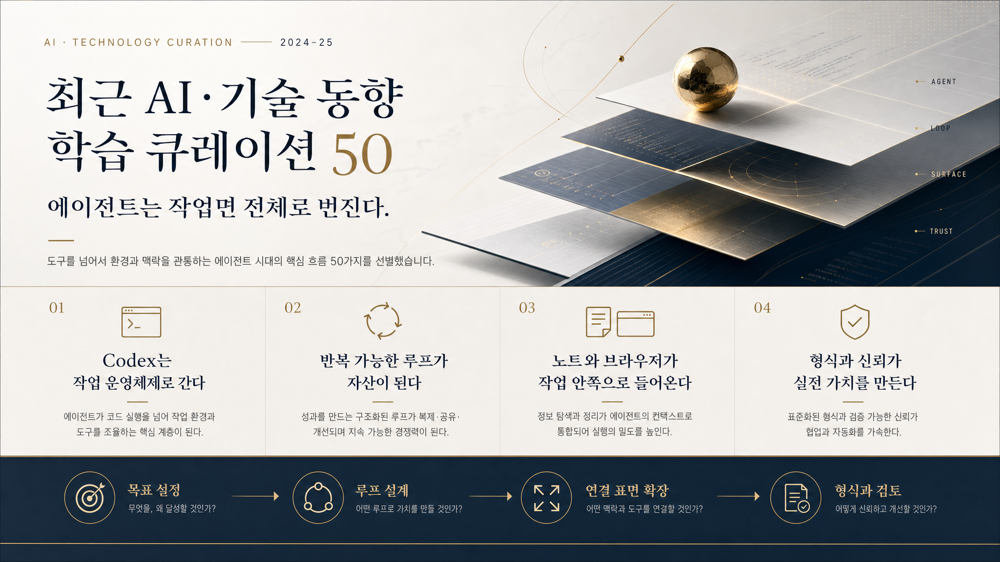

# 2026-06-27 · 에이전트는 작업면 전체로 번진다 · 릴리스 50건

이번에 받은 <strong>「최근 AI·기술 동향 학습 큐레이션 50」</strong>은 얼핏 보면 여느 때보다 더 넓다. OpenAI Codex, Claude Code, Hermes, MCP, 브라우저, Obsidian, HWPX, 보고서 자동화, 공공 문서, 로컬 AI, API, 번역, 발표, 오픈소스 커뮤니티까지 한 묶음 안에 다 들어 있다.

이렇게 범위가 넓으면 대개 “요즘 AI가 여기저기 다 붙는다” 정도로 흘러가기 쉽다. 그런데 이번 50개를 다시 읽고 나니 더 선명하게 남은 건 다른 문장이었다. 이제 에이전트는 특정 앱 안에서 잠깐 코드를 써주는 보조 기능이 아니라, <strong>코딩, 조사, 브라우저, 문서, 지식 노트, 배포 습관까지 이어지는 작업면 전체로 번져 들어가고 있다</strong>는 점이다.

## 먼저 결론

- 이번 50선의 핵심은 새 모델 발표보다 <strong>에이전트가 일하는 표면이 급격히 넓어지고 있다</strong>는 데 있었다.
- Codex와 Claude Code 계열 자료는 AI가 코드 생성기를 넘어 <strong>목표, 루프, 기록, 브라우저, 플러그인, 세션 운영</strong>까지 품기 시작했음을 보여준다.
- Hermes, Harness, Loop Library, FableCodex 같은 자료는 좋은 답변보다 <strong>반복 가능한 작업 루프</strong>를 자산으로 만들려는 흐름이 더 중요해졌음을 드러낸다.
- Obsidian, NotebookLM, LLM Wiki, CmdMD 자료는 에이전트 시대일수록 <strong>노트와 지식 구조가 더 중요한 작업 기반</strong>이 된다는 점을 다시 확인시킨다.
- HWPX, 공공 보고서, 한글 파일명, 한국어 NLP 자료는 생성형 AI의 실전 가치를 <strong>현장 형식과 검토 규칙을 지키는 능력</strong>에서 찾게 만든다.

## 왜 이번 50선이 유독 '작업면' 이야기처럼 읽혔나

이번 자료는 카테고리만 보면 꽤 흩어져 있다.

- OpenAI Codex와 코딩 에이전트 운영
- Claude Code와 에이전트 자동화
- Hermes와 개인 에이전트 런타임
- MCP, 브라우저, 도구 연결
- 개인 지식 시스템과 학습 노트
- 업무 문서와 공공 보고서 자동화
- 로컬 AI와 개인 개발환경
- 플랫폼·OS와 사용자 생산성

표면적으로는 다른 분야처럼 보여도, 실제로는 거의 다 같은 방향으로 수렴한다.

- 에이전트가 어디까지 들어와도 되는가
- 작업을 어떤 루프로 고정해야 반복이 쉬워지는가
- 노트와 문서를 어떻게 작업 기억으로 바꿀 것인가
- 브라우저, 앱, 파일 형식, 보고서 같은 현실 표면을 어떻게 연결할 것인가
- 사람은 어디서 통제권을 쥐어야 하는가

그래서 이번 묶음은 링크 모음보다, <strong>에이전트가 '한 기능'이 아니라 '일하는 표면 전체'를 먹어 들어가는 흐름</strong>을 보여주는 자료로 읽는 편이 더 맞았다.

## 이번 묶음에서 가장 크게 보인 네 가지 변화

### 1) Codex 계열은 코드 도구보다 작업 운영체계 쪽으로 간다

이번 50선에서 가장 눈에 띄는 건 Codex 비중 자체가 커졌다는 점이다. OpenAI의 에이전트 업무 변화 자료, Loop Engineering, Harness, Codex-maxxing, Record & Replay, FableCodex, Cowart, 초보자용 Codex 세팅 자료를 한 줄로 세워두면 공통점이 분명하다.

이제 Codex를 볼 때 중요한 질문은 “얼마나 잘 코드를 쓰나” 하나가 아니다.

- 목표를 얼마나 오래 붙잡는가
- 작업 맥락을 어떻게 기록하는가
- 루프를 어떻게 잘게 나누는가
- 브라우저와 플러그인을 어떻게 붙이는가
- 세션을 어떻게 이어가고 재현하는가

즉 Codex는 더 영리한 자동완성이라기보다, <strong>목표와 절차를 오래 붙잡는 작업 운영체계</strong> 쪽으로 해석하는 편이 맞아졌다.

### 2) 반복 가능한 루프와 팀 구조가 진짜 자산이 된다

Harness, Loop Library, Hermes 자료, Agent Reach 검토 때 봤던 scaffolding 감각, Matt Pocock의 에이전틱 워크플로우, Ponytail 같은 자료를 같이 보면 요즘 흐름은 꽤 명확하다.

좋은 프롬프트 한 줄을 숨겨두는 것보다,

- 어떤 순서로 조사하는가
- 언제 브라우저를 여는가
- 어느 순간 검토를 넣는가
- 어떤 출력이 다음 단계 입력이 되는가
- 실패하면 어디서 다시 시작하는가

같은 루프를 남기는 편이 훨씬 중요해지고 있다.

그래서 이번 50선은 도구 추천 묶음이라기보다, <strong>반복 가능한 작업 습관을 어떻게 구조화할 것인가</strong>에 더 가까운 아카이브처럼 보였다.

### 3) 지식 노트와 브라우저가 에이전트의 바깥이 아니라 안쪽이 된다

CmdMD, Obsidian LLM Wiki, Obsidian Canvas + Claude Code, NotebookLM, Aside, Agent-Native, HIRA MCP 자료를 보면 예전처럼 “AI는 답하고, 노트 앱은 따로 쓰고, 브라우저는 내가 직접 여는” 식의 구분이 점점 약해지고 있다.

중요한 변화는 에이전트가 단독으로 더 똑똑해진 게 아니라,

- 노트 구조를 읽고
- 브라우저에서 확인하고
- 외부 도구를 호출하고
- 다시 결과를 문서로 남기는

이 흐름이 훨씬 자연스러워졌다는 점이다.

즉 지식 시스템과 브라우저는 더 이상 주변 장치가 아니라, <strong>에이전트가 실제로 일하기 위해 들어가야 하는 작업 내부</strong>가 된다.

### 4) 실전 가치는 화려함보다 형식과 신뢰를 맞추는 데서 커진다

claw-hwp, Bareunpy, 공공 보고서 자료, 한글 파일명 처리, STORM, MapGlot, Thunderbit 같은 자료를 같이 보면, 생성형 AI의 가치는 여전히 “얼마나 멋진 걸 만드나”보다 “현실의 형식과 규칙 안에서 쓸 수 있나” 쪽에서 더 크게 드러난다.

특히 한국어 문서와 공공 형식 쪽에서는

- 한글 문서를 직접 다룰 수 있는가
- 파일명, 자모 분리 같은 로컬 문제를 다룰 수 있는가
- 인용과 조사 근거를 남길 수 있는가
- 보고서 품질과 검토 흐름을 지킬 수 있는가

가 실무 체감에 훨씬 가깝다.

그래서 이번 50선은 생성형 AI가 현장으로 들어갈수록, <strong>형식과 신뢰를 맞추는 능력</strong>이 더 중요해진다는 걸 다시 확인시킨다.

## 이번 50선으로 바로 떠오르는 활용 장면

이번 묶음은 그냥 흥미로운 링크 모음으로 넘기기 아깝다. 실제로는 아래 같은 장면에 바로 붙일 수 있다.

### 1) 코딩 수업이나 프로젝트를 '루프' 중심으로 바꾸기

Codex, Harness, Loop Engineering, Record & Replay, FableCodex 자료를 묶으면 학생들에게 “기능 하나 만들어 와” 대신 “목표, 중간 산출물, 검토 기준, 재실행 루프를 먼저 써 와”라고 요구하는 과제를 만들 수 있다.

### 2) 개인 지식 시스템을 진짜 작업 기반으로 바꾸기

Obsidian, NotebookLM, CmdMD, LLM Wiki 자료는 노트를 예쁘게 쌓는 데서 끝내지 않고, 실제 작업 전에 참고하고, 실행 중 다시 꺼내 보고, 끝난 뒤 결과를 남기는 루프로 옮기게 만든다.

### 3) 보고서와 공공 문서를 AI 친화적으로 다시 보기

claw-hwp, 공공 보고서, Bareunpy, 한글 파일명 문제 자료는 “한국어와 공공 형식은 AI가 아직 멀었다”가 아니라, 어떤 병목이 있는지 더 구체적으로 보여준다. 이건 학교 문서 자동화나 행정 흐름 설계에 바로 연결된다.

### 4) 브라우저와 도구 연결을 실전 표면으로 보기

Aside, Agent-Native, HIRA MCP, iOS-remote 같은 자료는 에이전트의 다음 승부처가 모델 내부가 아니라 외부 도구와 실제 인터페이스를 얼마나 안정적으로 다루는가에 있음을 보여준다.

## 그래서 이번 50개는 어떻게 읽는 게 좋을까

처음부터 50개를 다 보기보다 아래 순서로 읽는 편이 흐름이 더 선명하다.

### 1단계: Codex와 루프 자료부터 본다

- How agents are transforming work
- Loop Engineering
- Harness
- Codex-maxxing
- Record & Replay
- FableCodex

이 구간은 이번 묶음의 중심이 `더 잘 답하는 AI`보다 <strong>더 오래 일하는 작업 체계</strong>라는 걸 먼저 보여준다.

### 2단계: Claude Code, Hermes, Agent 자료로 넓힌다

- insane-search
- HIRA Disease MCP
- Hermes 운영 자료
- Hermes 10X 자료
- Matt Pocock 워크플로우

이 구간에서는 에이전트가 단일 코드 도구를 넘어 런타임과 연결 계층으로 넓어지는 모습이 보인다.

### 3단계: 지식 노트와 브라우저 계층을 붙인다

- CmdMD
- Obsidian LLM Wiki
- Obsidian Canvas + Claude Code
- Aside
- Agent-Native

이 구간은 노트와 브라우저가 이제 AI 바깥이 아니라 안쪽으로 들어오는 흐름을 이해하게 만든다.

### 4단계: 문서와 실전 형식 자료를 본다

- claw-hwp
- Bareunpy
- 공공 보고서 자동화
- STORM
- 한글 파일명 처리

여기서는 생성 결과가 실제 제출물과 조사 문서로 바뀌는 층을 볼 수 있다.

## 실제로 한 것

1. 50개를 카테고리 순서대로 요약하기보다, 작업 운영체계, 반복 루프, 연결 표면, 형식 신뢰라는 네 축으로 다시 묶었다.
2. 이번 묶음에서 유독 크게 보인 Codex·Loop·Harness 축을 중심으로 “에이전트는 작업면 전체로 번진다”는 한 문장을 세웠다.
3. 개별 툴 기능보다, 이 자료들이 어디까지 에이전트를 들여놓고 있는지 중심으로 다시 읽었다.
4. 마지막에는 다시 공유하기 쉽게 복사용 링크 표와 용어 정리표를 그대로 남겼다.

## 막혔던 지점

> 이번 50선은 범위가 넓은데도 Codex·Claude Code·Hermes 비중이 높아서, 자칫하면 코딩 도구 모음처럼 보일 위험이 있었다.

그래서 이번 글에서는 “코딩 에이전트가 많다”보다 <strong>에이전트가 어디까지 작업면을 넓혀 가고 있는가</strong>를 먼저 묶는 쪽이 더 중요했다. 가장 잘 맞는 한 문장은 “에이전트는 작업면 전체로 번진다”였다.

## 다음에 바로 쓸 체크리스트

<ul class="note-list">
  <li>새 에이전트 도구를 볼 때는 성능보다 목표 유지, 기록, 재실행 루프부터 본다.</li>
  <li>좋은 프롬프트보다 반복 가능한 작업 순서를 먼저 남긴다.</li>
  <li>노트 앱과 브라우저는 주변 도구가 아니라 에이전트 작업면 일부로 본다.</li>
  <li>한국어 문서 자동화는 초안 생성보다 형식, 인용, 파일 처리 병목을 먼저 본다.</li>
  <li>브라우저·MCP·플러그인 자료는 모델 능력보다 연결 안정성 관점으로 읽는다.</li>
  <li>큐레이션 글에서는 링크 수보다 이번 묶음이 결국 어디로 움직이는지 한 문장부터 세운다.</li>
</ul>

## 남겨둘 판단

이번 50선을 다시 읽고 남는 판단은 이렇다. 이제 AI 도구 경쟁은 “누가 더 그럴듯하게 만들어 주나”에서만 나지 않는다. <strong>에이전트를 작업면 전체에 얼마나 자연스럽게 붙이고, 그 위에 반복 가능한 루프와 검토 기준을 남길 수 있느냐</strong>가 더 중요해지고 있다.

그래서 앞으로 비슷한 자료를 볼 때도, 새 모델 이름보다 <strong>이 자료가 내 일하는 화면과 습관을 어디까지 바꾸게 만드는가</strong>를 먼저 보는 쪽이 훨씬 오래 남는다.

## 복사용 링크 표

| 카테고리 | 주제 | 제목 | 원본 링크 | 릴리스 공개 링크 |
|---|---|---|---|---|
| OpenAI Codex와 코딩 에이전트 운영 | 에이전트 AI의 업무 방식 혁신: 단일 상호작용에서 장기 위임형 작업으로 | How agents are transforming work \| OpenAI | [원본](https://openai.com/index/how-agents-are-transforming-work/) | [공개 요약](https://lilys.ai/digest/10279850/11983698?s=1&noteVersionId=8543098) |
| OpenAI Codex와 코딩 에이전트 운영 | 루프 엔지니어링 개요 | Loop Engineering | [원본](https://cobusgreyling.github.io/loop-engineering/) | [공개 요약](https://lilys.ai/digest/10266235/11966218?s=1&noteVersionId=8524541) |
| OpenAI Codex와 코딩 에이전트 운영 | Harness: Claude Code를 위한 팀-아키텍처 팩토리 | Harness: 하네스 구성해줘와 같은 간단한 명령으로 도메인에 최적화된 에이전트팀과 스킬을 자동으로 생성 | [원본](https://github.com/revfactory/harness) | [공개 요약](https://lilys.ai/digest/10265928/11965837?s=1&noteVersionId=8524147) |
| OpenAI Codex와 코딩 에이전트 운영 | Codex-maxxing: 장기 실행 작업을 위한 새로운 접근 방식 | OAI_WhitePaper_Codex-maxxing | PDF 업로드 | [공개 요약](https://lilys.ai/digest/10255900/11952956?s=1&noteVersionId=8510758) |
| OpenAI Codex와 코딩 에이전트 운영 | 개요 | 지금 개발자들은 코덱스 앱을 사용하고 있습니다.사용법 알려드릴게요 l 코덱스 앰버서더 한서우(AI 팟캐스트 #87) | [원본](https://www.youtube.com/watch?v=JaY8mKOBZ0M) | [공개 요약](https://lilys.ai/digest/10254536/11951235?s=1&noteVersionId=8508942) |
| OpenAI Codex와 코딩 에이전트 운영 | coffee-price-mcp 소개 | coffee price mcp | [원본](https://github.com/jeonghwanko/coffee-price-mcp) | [공개 요약](https://lilys.ai/digest/10223908/11911214?s=1&noteVersionId=8466751) |
| OpenAI Codex와 코딩 에이전트 운영 | Cowart: Codex를 위한 로컬 무한 캔버스 플러그인 소개 | Cowart: Codex를 위한 로컬 무한 캔버스 플러그인 | [원본](https://github.com/zhongerxin/Cowart/blob/main/README.en.md) | [공개 요약](https://lilys.ai/digest/10217710/11903294?s=1&noteVersionId=8458475) |
| OpenAI Codex와 코딩 에이전트 운영 | 코덱스 앱의 기본 기능 살펴보기 | 비전공자도 따라하는 바이브코딩 - 코덱스(Codex) 참교육 Ep.2 - 플러그인 사용해보기 | [원본](https://www.youtube.com/watch?v=ppy3Dv9kQBg) | [공개 요약](https://lilys.ai/digest/10216127/11901130?s=1&noteVersionId=8456243) |
| OpenAI Codex와 코딩 에이전트 운영 | 코덱스(Codex) 사용을 위한 사전 준비 | 비전공자도 따라하는 바이브코딩 - 코덱스(Codex) 참교육 Ep. 1 - 3가지 환경에서 세팅 및 기본 사용하기 | [원본](https://www.youtube.com/watch?v=1uAcRFPyuFM) | [공개 요약](https://lilys.ai/digest/10216121/11901124?s=1&noteVersionId=8456237) |
| OpenAI Codex와 코딩 에이전트 운영 | Record & Replay 개요 | Record & Replay – Codex \| OpenAI Developers | [원본](https://developers.openai.com/codex/record-and-replay) | [공개 요약](https://lilys.ai/digest/10202036/11883321?s=1&noteVersionId=8437731) |
| OpenAI Codex와 코딩 에이전트 운영 | FableCodex 개요 | FableCodex: Codex에 Fable 스타일의 작업 습관 추가 | [원본](https://github.com/baskduf/FableCodex) | [공개 요약](https://lilys.ai/digest/10202004/11883285?s=1&noteVersionId=8437694) |
| Claude Code와 에이전트 자동화 | 아이패드를 맥북, 윈도우 노트북처럼 활용하는 원격 데스크톱 솔루션 소개 | 아이패드가 맥북, 윈도우 노트북으로 변신🫢 무료로 이렇게 가능합니다 | [원본](https://www.youtube.com/watch?v=TV3FstetsuI) | [공개 요약](https://lilys.ai/digest/10265784/11965674?s=1&noteVersionId=8523976) |
| Claude Code와 에이전트 자동화 | HIRA Disease MCP 개요 및 활용 방법 | HIRA Disease MCP: 건강보험심사평가원의 질병정보서비스 원격 MCP 서버 | [원본](https://github.com/yoonscare/hira-disease-mcp) | [공개 요약](https://lilys.ai/digest/10260583/11958958?s=1&noteVersionId=8516941) |
| Claude Code와 에이전트 자동화 | insane-search 개요 | insane-search/README.md at main · fivetaku/insane-search · GitHub | [원본](https://github.com/fivetaku/insane-search) | [공개 요약](https://lilys.ai/digest/10254371/11950948?s=1&noteVersionId=8508624) |
| Claude Code와 에이전트 자동화 | Mac Optimizing Looper: AI 에이전트를 활용한 Mac 성능 최적화 | Mac Optimizing Looper: Mac 성능 최적화 메뉴바 앱 | [원본](https://github.com/kargnas/mac-optimizing-looper/blob/main/README-ko.md) | [공개 요약](https://lilys.ai/digest/10206943/11889498?s=1&noteVersionId=8444167) |
| Claude Code와 에이전트 자동화 | 사전 준비 | Claude Code → Kimi Code CLI 완전 마이그레이션 가이드 | [원본](https://hugh-kim.space/kimi-migration-guide.html) | [공개 요약](https://lilys.ai/digest/10193227/11871926?s=1&noteVersionId=8425900) |
| Hermes와 개인 에이전트 런타임 | Hermes 맥미니 서버와 맥북 데스크탑 원격 연결 개요 | 맥미니와 맥북을 Hermes 본체와 원격 모니터로 사용하는 팁 | [원본](https://share.note.sx/o65stp06) | [공개 요약](https://lilys.ai/digest/10276380/11978898?s=1&noteVersionId=8537982) |
| Hermes와 개인 에이전트 런타임 | Understand Anything: 코드베이스를 대화형 지식 그래프로 변환 | Understand Anything: 코드베이스를 대화형 지식 그래프로 변환 | [원본](https://egonex.ai/) | [공개 요약](https://lilys.ai/digest/10255916/11952990?s=1&noteVersionId=8510792) |
| Hermes와 개인 에이전트 런타임 | 수행평가 성적 열람 시스템 사용자 매뉴얼 | 수행평가 성적 열람 시스템 사용자 매뉴얼 | [원본](https://www.youtube.com/watch?v=mOihmdpv2OU) | [공개 요약](https://lilys.ai/digest/10244902/11938774?s=1&noteVersionId=8495555) |
| Hermes와 개인 에이전트 런타임 | Hermes 에이전트의 한계와 잠재력 | This OpenSource Repo will 10X Your Hermes Agent | [원본](https://www.youtube.com/watch?v=yOZVYw9FIWc) | [공개 요약](https://lilys.ai/digest/10202566/11884004?s=1&noteVersionId=8438434) |
| MCP, 브라우저, 도구 연결 | 기존 AI 브라우저의 한계와 Aside 브라우저의 등장 | Aside \| The browser built to do real work for you | [원본](https://aside.com/pricing) | [공개 요약](https://lilys.ai/digest/10283471/11988455?s=1&noteVersionId=8548084) |
| MCP, 브라우저, 도구 연결 | Agent-Native: 에이전트 기반 앱 구축을 위한 프레임워크 | Agent-Native Framework: 앱 내에서 작동하는 강력한 에이전트 구축을 위한 오픈소스 프레임워크 | [원본](https://github.com/BuilderIO/agent-native) | [공개 요약](https://lilys.ai/digest/10206955/11889511?s=1&noteVersionId=8444184) |
| 개인 지식 시스템과 학습 노트 | CmdMD 개요 | CmdMD: MacOS 용 마크다운 에디터, Obsidian Vault 연동 및 라우팅 기능을 통해 노트 정리와 관리를 돕는다. | [원본](https://github.com/johnfkoo951/CmdMD) | [공개 요약](https://lilys.ai/digest/10274025/11975684?s=1&noteVersionId=8534556) |
| 개인 지식 시스템과 학습 노트 | 개요 | Obsidian LLM Wiki 초보자 설치부터 사용까지 | [원본](https://www.youtube.com/channel/UClTURh10OveMga8yNJ8qLFg) | [공개 요약](https://lilys.ai/digest/10254344/11950912?s=1&noteVersionId=8508585) |
| 개인 지식 시스템과 학습 노트 | 옵시디언 캔버스 기능 소개 및 활용법 | 미쳤다! 옵시디언 캔버스에 AI 붙이면 생기는 일 Claude Code x Obsidian \| 오후다섯씨 | [원본](https://www.youtube.com/watch?v=A7QdKqJttu4) | [공개 요약](https://lilys.ai/digest/10254239/11950754?s=1&noteVersionId=8508410) |
| 개인 지식 시스템과 학습 노트 | 루프 엔지니어링의 등장 배경 및 개념 | 요즘 유행하는 Loop Engineering! | [원본](https://www.youtube.com/watch?v=z-3BRkxQ5GM) | [공개 요약](https://lilys.ai/digest/10249869/11945209?s=1&noteVersionId=8502325) |
| 개인 지식 시스템과 학습 노트 | AI는 생산성을 정말 높이고 있을까? | AI는 정말 생산성을 높이고 있는가? | [원본](https://notebooklm.google.com/notebook/ecebaea9-0fe4-4c1c-ad65-cbc78b077957) | [공개 요약](https://lilys.ai/digest/10210939/11894517?s=1&noteVersionId=8449379) |
| 업무 문서와 공공 보고서 자동화 | claw-hwp 개요 | [대박]claw-hwp: Claude나 Codex가 직접 한글 문서를 처리 가능함 | [원본](https://github.com/Dohyun468/claw-hwp) | [공개 요약](https://lilys.ai/digest/10280139/11984071?s=1&noteVersionId=8543503) |
| 업무 문서와 공공 보고서 자동화 | MoaIMF 소개 | MacOS에서 한글 파일명 자모 분리(NFD) 형태 해결하는 메뉴 막대 | [원본](https://github.com/charliehotel/MoaIMF/blob/main/README.md) | [공개 요약](https://lilys.ai/digest/10274826/11976827?s=1&noteVersionId=8535769) |
| 업무 문서와 공공 보고서 자동화 | AI 코딩에서 '하네스'와 개발 환경 설계의 중요성 | [한글자막] Matt Pocock의 에이전틱 엔지니어링 워크플로우를 그대로 따라 해보세요 | [원본](https://www.youtube.com/watch?v=IK6H-lcGYm8) | [공개 요약](https://lilys.ai/digest/10260743/11959118?s=1&noteVersionId=8517105) |
| 업무 문서와 공공 보고서 자동화 | 개요 | Bareunpy: 한국어 자연어 처리 엔진 Bareun 파이썬 클라이언트 라이브러리 | [원본](https://bareun.ai/docs/inside/transformer-architecture/) | [공개 요약](https://lilys.ai/digest/10217644/11903274?s=1&noteVersionId=8458454) |
| 업무 문서와 공공 보고서 자동화 | STORM: 검색 및 다중 관점 질문을 통한 토픽 개요 합성 | Storm: 인터넷 기반 조사 후, 인용이 포함된 전체 길이의 보고서 작성 | [원본](https://github.com/stanford-oval/storm) | [공개 요약](https://lilys.ai/digest/10193087/11871755?s=1&noteVersionId=8425721) |
| AI 서비스 운영과 제품 전략 | Loop Library 개요 | Loop Library: Repeatable AI Agent Workflows \| Forward Future | [원본](https://signals.forwardfuture.ai/loop-library/) | [공개 요약](https://lilys.ai/digest/10193162/11871845?s=1&noteVersionId=8425815) |
| AI 서비스 운영과 제품 전략 | AI를 활용한 초간단 게임 제작 데모 | 6월20일 줌미팅 세미나-2부(쓱님의 게임데모, 성옥님의 3D Printed 키링) | [원본](https://www.youtube.com/watch?v=qaqSRitC654) | [공개 요약](https://lilys.ai/digest/10193036/11871696?s=1&noteVersionId=8425662) |
| 로컬 AI와 개인 개발환경 | FaceStream 소개 | FaceStream: 실시간으로 얼굴을 바꿀 수 있는 웹 앱. WebRTC 기술 활용 | [원본](https://facestream.phileisen.com/) | [공개 요약](https://lilys.ai/digest/10266395/11966438?s=1&noteVersionId=8524767) |
| 로컬 AI와 개인 개발환경 | Audiblez 개요 | EPUB to Audio Book: 전자책을 오디오북으로 변환 | [원본](https://github.com/santinic/audiblez) | [공개 요약](https://lilys.ai/digest/10193108/11871779?s=1&noteVersionId=8425746) |
| 콘텐츠 제작, 발표, 번역 자동화 | AI 프롬프트 공유 거부 신입 사례와 쟁점 | 개인의 노력 VS. 조직의 협업 : AI 프롬프트 공유 거절, 누가 옳은가? \| 류재언 '대화의 밀도', '협상 바이블' 저자, 변호사 \| 공부로 보는 세바시 | [원본](https://www.youtube.com/watch?v=XaQwAAzhtDE) | [공개 요약](https://lilys.ai/digest/10264640/11964182?s=1&noteVersionId=8522404) |
| 플랫폼·OS와 사용자 생산성 | AI 세컨드 브레인 구축의 중요성 | 클로드+LLM WIKI로 나만의 AI 세컨드 브레인 만들기ㅣAI 시대에 LLM 위키가 꼭 필요한 이유 | [원본](https://www.youtube.com/watch?v=ejlk74hWogc) | [공개 요약](https://lilys.ai/digest/10250220/11945664?s=1&noteVersionId=8502825) |
| 플랫폼·OS와 사용자 생산성 | iOS-remote 개요 및 주요 기능 | iOS-remote: 탈옥 없이 USB를 통해 iOS 기기를 웹 브라우저에서 제어하고 화면을 미러링 | [원본](https://github.com/SimonWDC/ios-remote) | [공개 요약](https://lilys.ai/digest/10218645/11904478?s=1&noteVersionId=8459704) |
| 플랫폼·OS와 사용자 생산성 | GitHub Public APIs 프로젝트 개요 | 다양한 분야의 무료 API들을 모아놓은 목록 | [원본](https://github.com/public-apis/public-apis) | [공개 요약](https://lilys.ai/digest/10193124/11871813?s=1&noteVersionId=8425781) |
| 오픈소스와 개발자 커뮤니티 | DESIGN.md 소개 | Design.md | [원본](https://github.com/google-labs-code/design.md/blob/main/docs/spec.md) | [공개 요약](https://lilys.ai/digest/10265838/11965753?s=1&noteVersionId=8524061) |
| 오픈소스와 개발자 커뮤니티 | Anthropic 엔지니어들이 말하는 에이전트 루프의 핵심 | 에이전트 루프 | [원본](https://x.com/AnatoliKopadze/status/2068690663919530207?s=20) | [공개 요약](https://lilys.ai/digest/10213071/11897258?s=1&noteVersionId=8452218) |
| AI 에이전트와 코딩 워크플로우 | AI 생성 코드량을 줄이는 Ponytail 스킬 소개 및 효과 | AI 생성 코드 절반으로 줄이는 5만 스타 스킬, Ponytail 직접 써봤습니다 | [원본](https://www.youtube.com/watch?v=oaENE_9D95Q) | [공개 요약](https://lilys.ai/digest/10245072/11938995?s=1&noteVersionId=8495782) |
| AI 에이전트와 코딩 워크플로우 | Loop Library: AI 에이전트에게 반복 작업을 맡기는 44개 루프 모음 | Loop Library — AI 에이전트에게 반복 작업을 맡기는 44개 루프 모음 | [원본](https://signals.forwardfuture.ai/loop-library/) | [공개 요약](https://lilys.ai/digest/10193178/11871861?s=1&noteVersionId=8425833) |
| 기타 참고 자료 | AI 시대의 두려움과 프롬프트 엔지니어링의 등장 | 언어로 섬세하게 표현되는 인간의 지능! AI 프롬프트 엔지니어링의 시작 : 지적 대화를 위한 AI 언어 수업 특별편(feat.강수진 작가) | [원본](https://www.youtube.com/watch?v=OcmSp1Cn5rg) | [공개 요약](https://lilys.ai/digest/10283531/11988525?s=1&noteVersionId=8548159) |
| 기타 참고 자료 | 생성형 인공지능과 함께 공존하는 시대 | 생성형+인공지능+활용+안내서(학생용) | PDF 업로드 | [공개 요약](https://lilys.ai/digest/10279666/11983443?s=1&noteVersionId=8542828) |
| 기타 참고 자료 | AI 시대, 인문사회 융합 인재 양성의 필요성 | [프리즘] AI 시대, 왜 인문사회인가 \| 중앙일보 | [원본](https://www.koreadaily.com/article/20260624080249463) | [공개 요약](https://lilys.ai/digest/10265455/11965217?s=1&noteVersionId=8523501) |
| 기타 참고 자료 | PP-OCRv6 개요 및 주요 특징 | PP-OCRv6 on Hugging Face: 50-Language OCR from 1.5M to 34.5M Parameters | [원본](https://huggingface.co/blog/PaddlePaddle/pp-ocrv6) | [공개 요약](https://lilys.ai/digest/10223791/11911057?s=1&noteVersionId=8466592) |
| 기타 참고 자료 | MapGlot — 무료 다국어 지도 API · 지도·검색·길찾기 \| 구글맵 대안 | MapGlot — 무료 다국어 지도 API · 지도·검색·길찾기 \| 구글맵 대안 | [원본](https://mapglot.com/) | [공개 요약](https://lilys.ai/digest/10206933?s=1) |
| 기타 참고 자료 | 연구 분석 도구 Thunderbit 소개 | 모든 전문가가 꼭 알아야 할 연구 분석 도구 TOP 25 | [원본](https://thunderbit.com/ko/blog/research-analysis-tools) | [공개 요약](https://lilys.ai/digest/10196648/11876372?s=1&noteVersionId=8430518) |

## 용어 정리

| 용어 | 쉬운 설명 | 일상 예시 |
|---|---|---|
| AI 에이전트 | 목표를 받고 여러 단계를 스스로 처리하는 AI 도구입니다. | 여행 계획을 말하면 항공권, 숙소, 일정 후보를 차례로 찾아주는 비서처럼 볼 수 있습니다. |
| 멀티 에이전트 | 여러 AI 에이전트가 역할을 나눠 함께 일하는 방식입니다. | 한 명은 조사, 한 명은 초안 작성, 한 명은 검수를 맡는 작은 팀과 비슷합니다. |
| CLI | 마우스 대신 글자 명령어로 프로그램을 실행하고 제어하는 방식입니다. | 키오스크 버튼을 누르는 대신 직원에게 원하는 주문을 바로 말하는 것에 가깝습니다. |
| MCP | AI가 외부 도구나 데이터 소스와 약속된 방식으로 연결되도록 돕는 규격입니다. | 여러 전자기기를 같은 규격 포트로 연결하는 표준 잭처럼 이해하면 쉽습니다. |
| 컨텍스트 | AI가 답할 때 참고하는 대화, 문서, 코드 같은 작업 기억입니다. | 회의 중 칠판에 적어 둔 메모를 보며 다음 말을 이어가는 상황과 비슷합니다. |
| 오케스트레이션 | 여러 도구와 에이전트의 실행 순서와 역할을 조율하는 일입니다. | 주방장이 손질, 굽기, 플레이팅 순서를 나눠 지시하는 장면과 같습니다. |
| HWPX | 한글 문서 내용을 XML 기반 구조로 저장하는 형식입니다. | 겉은 문서지만 안쪽은 문장, 표, 서식이 정리된 부품 상자처럼 나뉘어 있는 셈입니다. |
| 로컬 AI | 클라우드가 아니라 내 컴퓨터에서 직접 실행하는 AI 환경입니다. | 음악을 스트리밍하지 않고 기기에 저장해 오프라인으로 듣는 것과 비슷합니다. |
