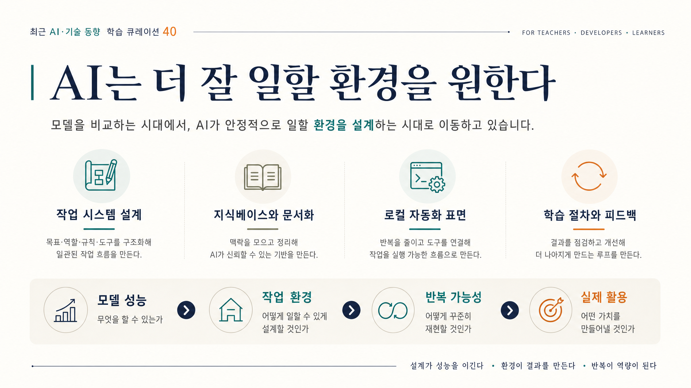

# 2026-07-04 · AI는 더 잘 일할 환경을 원한다 · 릴리스 40건

이번에 받은 <strong>「최근 AI·기술 동향 학습 큐레이션 40」</strong>은 겉으로 보면 꽤 넓다. Claude Code와 Codex 하위 에이전트, LazyCodex, OpenWiki, LLM Wiki, 카카오톡 로컬 검색, AirTranslate, Slide-Grab, OpenMontage, TabFM, 아두이노, 토론 메이트, 독서 코치까지 한 묶음 안에 들어 있다.

이렇게 범위가 넓은 자료는 보통 “요즘 AI가 별걸 다 한다”는 감상으로 끝나기 쉽다. 그런데 이번 40개를 다시 읽으며 남은 문장은 다른 쪽이었다. 이제 중요한 차이는 AI에게 일을 시키는 법을 많이 아는가보다, <strong>AI가 안정적으로 일할 환경을 어떻게 설계하느냐</strong>에 더 크게 달려 있다는 점이다.

## 먼저 결론

- 이번 40선의 핵심은 새 모델 비교보다 <strong>작업 시스템 설계</strong> 쪽으로 무게가 옮겨가고 있다는 데 있었다.
- LLM Wiki, OpenWiki, 세미나 요약 PDF 자료는 AI 품질의 바탕이 여전히 <strong>지식베이스와 문서화</strong>라는 점을 다시 확인시킨다.
- 카카오톡 검색, 시스템 오디오 번역, 슬라이드 편집, 클릭 가이드 같은 자료는 로컬 도구가 <strong>생활 데이터와 업무 표면</strong>을 직접 자동화하는 쪽으로 진화하고 있음을 보여준다.
- AI 튜터, 독서 코치, 토론 메이트 자료는 학습에서 중요한 게 모델 자체보다 <strong>절차와 피드백 루프 설계</strong>라는 점을 더 분명하게 만든다.
- 앞으로 AI 활용의 격차는 “무슨 모델을 쓰나”보다 <strong>어떤 맥락을 넣고, 어떤 역할을 나누고, 어떤 증거로 끝을 판단하나</strong>에서 더 크게 난다.

## 왜 이번 40선이 '환경 설계' 이야기처럼 읽혔나

이번 묶음은 크게 네 갈래로 나뉜다.

- AI 학습 설계와 프롬프트 교육
- 에이전트 코딩과 멀티 에이전트 운영
- 개인 지식베이스와 문서화
- 로컬 도구와 생산성 자동화

표면적으로는 각각 다른 주제처럼 보이지만, 실제로는 거의 같은 질문으로 모인다.

- AI가 참고할 맥락은 어디에 쌓을 것인가
- 작업은 한 모델에게 몰아줄 것인가, 역할을 나눌 것인가
- 브라우저와 앱, 파일과 로컬 데이터는 어떻게 연결할 것인가
- 학습이나 문서 작업은 어떤 절차와 검증선으로 반복할 것인가

그래서 이번 40선은 개별 도구 소개보다, <strong>AI가 일하기 좋은 환경을 어떻게 만들어 줄 것인가에 대한 운영 메모</strong>처럼 읽는 편이 더 맞았다.

## 이번 묶음에서 가장 크게 보인 네 가지 변화

### 1) 에이전트 코딩은 모델 감탄보다 작업 시스템 설계로 이동한다

Claude Code 하위 에이전트, LazyCodex 협업, Codex 하위 에이전트 실습, 하네스 엔지니어링, 다중 모델 루프, Gajae-Code 같은 자료를 같이 보면 메시지가 분명하다.

이제 코딩 에이전트를 볼 때 중요한 질문은 “어떤 모델이 더 세냐” 하나가 아니다.

- 역할을 어떻게 나눌 것인가
- 명세와 계약을 어디에 둘 것인가
- 권한은 어떻게 통제할 것인가
- 검토와 채점 루프는 어떻게 넣을 것인가
- 작업이 길어질 때 방향 이탈을 어떻게 막을 것인가

즉 코딩 에이전트의 차이는 모델 이름보다, <strong>에이전트가 길게 일해도 무너지지 않는 작업 시스템을 가졌는가</strong>에서 난다.

### 2) 지식베이스와 문서화는 여전히 가장 중요한 작업 기반이다

LLM Wiki, OpenWiki, 우로보로스 세미나 요약, 에이전트 지식 베이스 자료를 한 줄로 읽으면 결국 같은 말이 반복된다. AI가 잘 일하려면 먼저 참고할 구조가 있어야 한다는 점이다.

특히 이번 묶음은 지식을 쌓는 것 자체보다,

- 무엇을 검색하게 할 것인가
- 어떤 문서를 기준 문서로 둘 것인가
- 코드와 문서를 어떻게 같이 갱신할 것인가
- 세미나 요약이나 운영 규약을 어떻게 장기 자산으로 남길 것인가

를 더 중요하게 본다.

결국 지식베이스는 예쁘게 정리된 노트 모음이 아니라, <strong>AI가 일을 시작하기 전에 붙잡아야 하는 운영 기반</strong>이 된다.

### 3) 로컬 자동화는 점점 생활 표면으로 내려온다

카카오톡 검색, AirTranslate, 네이버 API 검색 스킬, Slide-Grab, ClickGuide Local, OpenKakao CLI 자료는 공통적으로 “거대한 플랫폼”보다 “내가 매일 건드리는 작은 표면”을 자동화 대상으로 바꾸고 있다.

이 흐름이 중요한 이유는 분명하다. 사람은 거대한 AI 시스템보다,

- 매일 보는 대화 기록
- 듣고 있는 오디오
- 수정해야 하는 슬라이드
- 클릭해서 설명해야 하는 웹페이지

같은 반복 작업에서 더 직접적인 생산성 차이를 느낀다.

그래서 이번 40선은 로컬 자동화가 더 이상 주변 취미가 아니라, <strong>실제 생활과 업무 자료를 AI가 만질 수 있는 표면으로 바꾸는 핵심 층</strong>이라는 걸 보여준다.

### 4) 교육과 학습에서 중요한 건 정답보다 절차 설계다

AI 튜터 프롬프트, 독서 코치, 토론 메이트, 한국어 이미지 프롬프트 카탈로그 자료는 학습에서 AI를 어떻게 써야 하는지 꽤 선명하게 보여준다.

좋은 학습 활용은 단순히 “대답 잘하는 AI”가 아니라,

- 어떤 순서로 질문할지
- 어떤 피드백을 줄지
- 어느 지점에서 다시 생각하게 할지
- 어떤 산출물을 남기게 할지

를 설계하는 문제에 더 가깝다.

그래서 교육 영역에서 AI는 점점 만능 답변기보다, <strong>학습 절차를 설계하는 보조자</strong>로 자리 잡는 쪽으로 보인다.

## 이번 40개로 바로 떠오르는 활용 장면

이번 묶음은 그냥 흥미로운 링크 모음으로 넘기기 아깝다. 실제로는 아래 같은 장면에 바로 붙일 수 있다.

### 1) 수업용 AI 튜터를 만들 때

튜터 프롬프트, 독서 코치, 토론 메이트 자료를 같이 보면 “질문 하나 던지고 답 받기”보다, 학습 목표, 중간 점검, 재질문, 피드백 구조를 먼저 짜는 수업 설계가 가능해진다.

### 2) 코딩 프로젝트를 운영할 때

하위 에이전트, 하네스 엔지니어링, LazyCodex, Gajae-Code 자료를 묶으면 학생이나 팀원에게 기능 요구만 던지는 대신, 명세서와 검증선부터 쓰게 하는 과제로 바꿀 수 있다.

### 3) 개인 지식 시스템을 실전 자산으로 바꿀 때

LLM Wiki와 OpenWiki 자료는 노트를 보관하는 데서 끝내지 않고, 다음 작업에서 AI가 실제로 참조하고 갱신할 수 있는 지식 구조로 바꾸게 해 준다.

### 4) 생활형 자동화를 붙일 때

카카오톡 검색, 오디오 번역, 클릭 가이드 생성 자료는 업무와 일상 사이의 자잘한 반복을 자동화 단위로 다시 보게 만든다. 이쪽이 체감 효과는 의외로 더 크다.

## 그래서 이번 40개는 어떻게 읽는 게 좋을까

처음부터 40개를 다 읽기보다 아래 흐름으로 보는 편이 더 선명하다.

### 1단계: 에이전트 운영 축부터 본다

- Claude Code 하위 에이전트
- LazyCodex 협업
- 하네스 엔지니어링
- 다중 모델 에이전트 루프
- Gajae-Code

이 구간은 이번 묶음의 중심이 <strong>더 똑똑한 답변</strong>이 아니라 <strong>더 안정적인 작업 시스템</strong>이라는 걸 먼저 보여준다.

### 2단계: 지식베이스와 문서화 축을 붙인다

- LLM Wiki에 대한 고찰
- OpenWiki
- 에이전트를 위한 지식 베이스
- 우로보로스 세미나 요약

여기서는 AI의 품질이 결국 <strong>어떤 문맥을 참고하게 만드느냐</strong>에서 갈린다는 걸 확인하게 된다.

### 3단계: 로컬 자동화 축을 본다

- 카카오톡 로컬 검색
- AirTranslate
- Slide-Grab
- ClickGuide Local

이 구간은 AI가 클라우드 채팅창 안에만 머무는 게 아니라, <strong>내 기기와 앱 안의 반복 작업</strong>을 직접 다루기 시작했음을 보여준다.

### 4단계: 학습 설계 축으로 넓힌다

- AI 튜터 프롬프트
- 독서 코치
- 토론 메이트
- 이미지 프롬프트 카탈로그

이 흐름은 교육에서 승부처가 정답 생성보다 <strong>절차와 피드백 설계</strong>라는 쪽으로 이동하고 있음을 보여준다.

## 실제로 한 것

1. 40개 자료를 카테고리 나열로 끝내지 않고, 작업 시스템, 지식베이스, 로컬 자동화, 학습 설계라는 네 축으로 다시 묶었다.
2. 오늘 글의 한 문장을 `AI는 더 잘 일할 환경을 원한다`로 먼저 고정했다.
3. 그 문장을 기준으로, 어떤 자료가 AI의 지능보다 환경 설계를 강조하는지 중심으로 다시 읽었다.
4. 마지막에는 다시 공유하기 쉽도록 복사용 링크 표와 용어 정리표를 그대로 남겼다.

## 막혔던 지점

> 이번 40선은 겉으로 보기에는 너무 넓어서, 자칫하면 “요즘 AI 자료가 참 다양하다”는 밋밋한 정리로 끝날 위험이 있었다.

그래서 이번 글에서는 자료가 많다는 사실보다, <strong>이 자료들이 공통으로 무엇을 새 기본기로 밀고 있나</strong>를 먼저 잡는 게 중요했다. 가장 잘 맞는 문장은 `AI는 더 잘 일할 환경을 원한다`였다.

## 다음에 바로 쓸 체크리스트

<ul class="note-list">
  <li>새 모델을 보기 전에, 어떤 작업 시스템과 검증 루프를 붙일지 먼저 본다.</li>
  <li>AI 품질을 높이고 싶다면 프롬프트보다 먼저 지식베이스 구조를 점검한다.</li>
  <li>생산성 자동화는 거창한 플랫폼보다 내 로컬 반복 작업부터 찾는다.</li>
  <li>교육 활용에서는 답변 품질보다 질문 순서와 피드백 설계를 먼저 고정한다.</li>
  <li>문서와 코드가 함께 움직이는 흐름이 있는지 항상 확인한다.</li>
  <li>큐레이션 글에서는 링크 수보다, 이번 묶음이 결국 어디로 움직이는지 한 문장부터 세운다.</li>
</ul>

## 남겨둘 판단

이번 40선을 다시 읽고 남는 판단은 분명하다. 이제 AI 활용의 격차는 더 센 모델을 먼저 쓰는 데서만 나지 않는다. <strong>AI가 참고할 문맥, 일할 절차, 건드릴 로컬 표면, 검토받을 기준을 먼저 설계할 수 있느냐</strong>에서 더 크게 난다.

그래서 앞으로 비슷한 자료를 읽을 때도 “이 도구가 얼마나 강한가”보다, <strong>이 자료가 내 작업 환경을 어디서 더 안정적으로 바꾸게 만드는가</strong>를 먼저 보는 쪽이 훨씬 오래 남는다.

## 복사용 링크 표

| 카테고리 | 주제 | 제목 | 원본 링크 | 릴리스 공개 링크 |
|---|---|---|---|---|
| AI 학습 설계와 프롬프트 교육 | 개인 맞춤형 AI 튜터 | 궁극의 AI 튜터 프롬프트: 학습 패러다임 혁신 및 전문가 성장 | https://kenny762.tistory.com/m/category/%EC%BB%B4%ED%93%A8%ED%84%B0%2CAI | https://lilys.ai/digest/10385544/12121667?s=1&noteVersionId=8686089 |
| 에이전트 코딩과 멀티 에이전트 운영 | Claude Code 하위 에이전트 | Create custom subagents - Claude Code Docs | https://code.claude.com/docs/en/plugins-reference#agents | https://lilys.ai/digest/10385510/12121586?s=1&noteVersionId=8686004 |
| AI 학습 설계와 프롬프트 교육 | Claude Fable 5 프롬프팅 | Prompting Claude Fable 5 - Claude Platform Docs | https://platform.claude.com/docs/en/about-claude/models/introducing-claude-fable-5-and-claude-mythos-5 | https://lilys.ai/digest/10385508/12121582?s=1&noteVersionId=8686000 |
| 플랫폼·브라우저와 AI 사용 환경 | Safari 자동화와 AI 에이전트 | Apple just turned Safari into something AI agents can control - The New Stack | https://youtube.com/thenewstack?sub_confirmation=1 | https://lilys.ai/digest/10385500/12121568?s=1&noteVersionId=8685984 |
| 개인 지식베이스와 문서화 | 우로보로스 세미나 요약 | 우로보로스_세미나_요약.pdf | 원본 URL 미확인 | https://lilys.ai/digest/10385472/12121518?s=1&noteVersionId=8685931 |
| 에이전트 코딩과 멀티 에이전트 운영 | 헤르메스와 Claude Code | 헤르메스+클로드코드.pdf | 원본 URL 미확인 | https://lilys.ai/digest/10385465/12121510?s=1&noteVersionId=8685923 |
| 로컬 도구와 생산성 자동화 | 카카오톡 로컬 검색 | 카카오톡 대화 내용 검색 | 원본 URL 미확인 | https://lilys.ai/digest/10383830/12119312?s=1&noteVersionId=8683553 |
| 로컬 도구와 생산성 자동화 | 시스템 오디오 전사·번역 | AirTranslate: macOS 시스템 오디오를 실시간으로 캡쳐하여 텍스트로 변환 및 번역까지 하는 앱 | https://github.com/himomohi/AirTranslate | https://lilys.ai/digest/10374547/12107107?s=1&noteVersionId=8670640 |
| 개인 지식베이스와 문서화 | LLM Wiki 구조 | LLM Wiki에 대한 고찰 | https://github.com/cdsassj00/llm-wiki-anatomy | https://lilys.ai/digest/10371282/12102647?s=1&noteVersionId=8666050 |
| 로컬 도구와 생산성 자동화 | 네이버 API 검색 스킬 | skills/naver-api-hub-search/README.md at main · wwwshe/skills · GitHub | https://www.ncloud.com/ | https://lilys.ai/digest/10371266/12102630?s=1&noteVersionId=8666033 |
| 에이전트 코딩과 멀티 에이전트 운영 | Claude와 LazyCodex 협업 | Claude-Lazycodex-Skill: Claude가 지휘자, Codex가 실무자가 되어 tmux에서 협업 및 코딩 | https://claude.com/claude-code | https://lilys.ai/digest/10371008/12102315?s=1&noteVersionId=8665712 |
| 에이전트 코딩과 멀티 에이전트 운영 | NanoClaw 에이전트 도구 | NanoClaw | https://github.com/nanocoai/nanoclaw | https://lilys.ai/digest/10370323/12101459?s=1&noteVersionId=8664814 |
| 로컬 도구와 생산성 자동화 | 개발 환경 자동 세팅 | Lazy-starter-kit: 새 컴퓨터를 위한 개발 환경 자동 세팅 도구 | https://github.com/Heoooooon/lazy-starter-kit | https://lilys.ai/digest/10370288/12101412?s=1&noteVersionId=8664764 |
| 개발·데이터·하드웨어 실험 | 아두이노 보드 선택 | 아두이노 뭘 사야 할까? 나노·우노·메가·우노Q 추천 가이드 | https://www.youtube.com/watch?v=OinPkCc7vck | https://lilys.ai/digest/10368600/12099168?s=1&noteVersionId=8662409 |
| AI 학습 설계와 프롬프트 교육 | Fable 5 독서 코치 | 다시 돌아온 Fable5로 나만의 독서 코치 만들기 | https://www.youtube.com/channel/UCKXP5U8mn3UMC6gWblROxAA | https://lilys.ai/digest/10366699/12096905?s=1&noteVersionId=8660090 |
| 에이전트 코딩과 멀티 에이전트 운영 | Codex 하위 에이전트 활용 | 코덱스(Codex) 참교육 Ep.5 - 하위 에이전트, 플랜 모드, 주석, 리뷰, 사이드 채팅, 이미지 생성 | https://www.youtube.com/watch?v=5EAkye5QfnU | https://lilys.ai/digest/10364164/12093774?s=1&noteVersionId=8656850 |
| 플랫폼·브라우저와 AI 사용 환경 | Notion과 바이브코딩 | 노션에 바이브코딩 올리기, 제미나이 활용 | https://www.youtube.com/watch?v=RmAzjYaIeLY | https://lilys.ai/digest/10364076/12093680?s=1&noteVersionId=8656752 |
| 로컬 도구와 생산성 자동화 | HTML 슬라이드 편집 | Slide-Grab: AI가 생성한 HTML 슬라이드를 편집 및 수정 돕는 브라우저 기반 슬라이드 편집 도구 | https://github.com/NomaDamas/slides-grab | https://lilys.ai/digest/10363539/12093045?s=1&noteVersionId=8656101 |
| 로컬 도구와 생산성 자동화 | 카카오톡 CLI | 카카오톡(KakaoTalk): 카카오톡 대화를 Apple Silicon Mac에서 로컬로 읽고 검색하는 걸 돕늠 CLI 도구 | 원본 URL 미확인 | https://lilys.ai/digest/10363464/12092967?s=1&noteVersionId=8656021 |
| 개발·데이터·하드웨어 실험 | 브라우저 Kubernetes | Webernetes: Kubernetes의 브라우저 실행 버전 | https://webernetes-demo.ngrok.app/ | https://lilys.ai/digest/10363355/12092844?s=1&noteVersionId=8655895 |
| 개발·데이터·하드웨어 실험 | 테이블 파운데이션 모델 | Google Research TabFM(Tabular Foundation Model): 테이블형 데이터 셋을 분류하고 회귀 수행 | https://github.com/google-research/tabfm | https://lilys.ai/digest/10363040/12092412?s=1&noteVersionId=8655456 |
| 개인 지식베이스와 문서화 | 코드베이스 자동 문서화 | OpenWiki: 코드베이스의 문서를 자동으로 작성하고 유지 관리해주는 CLI 도구 | https://github.com/langchain-ai/openwiki | https://lilys.ai/digest/10362776/12092093?s=1&noteVersionId=8655129 |
| 개인 지식베이스와 문서화 | 에이전트 지식 베이스 | 에이전트를 위한 지식 베이스 : LLM Wiki 활용 | https://www.youtube.com/channel/UCLJtuxDBeSpf-d3m6f_DKtA | https://lilys.ai/digest/10357701/12085465?s=1&noteVersionId=8648301 |
| 개인 지식베이스와 문서화 | 우로보로스 개발자 세미나 | 우로보로스_개발자_세미나_요약 | 원본 URL 미확인 | https://lilys.ai/digest/10355351/12082168?s=1&noteVersionId=8644931 |
| 에이전트 코딩과 멀티 에이전트 운영 | 명세 기반 작업 정렬 | 엔지니어가 디자인띵킹을 강연하게 됐을 때 | Q00 Blog | https://github.com/Q00/ouroboros | https://lilys.ai/digest/10353868/12080269?s=1&noteVersionId=8642951 |
| 에이전트 코딩과 멀티 에이전트 운영 | Warden 에이전트 프로필 | GitHub - Q00/OpenWorden: A portable Warden agent profile for keeping AI work aligned with a canonica | https://github.com/Q00/OpenWorden | https://lilys.ai/digest/10353283/12079585?s=1&noteVersionId=8642233 |
| 에이전트 코딩과 멀티 에이전트 운영 | 실세계 에이전트 플랫폼 | GitHub - zep-ia/zepia: Making the real agent world · GitHub | https://github.com/zep-ia/zepia | https://lilys.ai/digest/10353273/12079574?s=1&noteVersionId=8642222 |
| 개발·데이터·하드웨어 실험 | 비디오 제작 에이전트 | OpenMontage: AI Agent를 비디오 제작 스튜디오로 바꿔주는 시스템 | https://github.com/calesthio/OpenMontage | https://lilys.ai/digest/10352878/12079072?s=1&noteVersionId=8641704 |
| 에이전트 코딩과 멀티 에이전트 운영 | 하네스 엔지니어링 | 하네스 엔지니어링이 궁금하다면 프롬프트를 멈추고 명세서를 작성하세요 l 랄프톤1위 수상자 우로보로스 개발자 이재규 | https://www.youtube.com/watch?v=OOScU5c8rPQ | https://lilys.ai/digest/10352182/12078247?s=1&noteVersionId=8640843 |
| 로컬 도구와 생산성 자동화 | OpenKakao CLI | OpenKakao-CLI | https://github.com/JungHoonGhae/openkakao-cli/stargazers | https://lilys.ai/digest/10352128/12078173?s=1&noteVersionId=8640765 |
| 에이전트 코딩과 멀티 에이전트 운영 | 다중 모델 에이전트 루프 | 클로드·코덱스·제미나이로 동시에 에이전트 루프 — 한 모델이 만들고 다른 모델이 채점합니다 | https://www.youtube.com/watch?v=0ScISw3Wuv8 | https://lilys.ai/digest/10352073/12078096?s=1&noteVersionId=8640683 |
| AI 학습 설계와 프롬프트 교육 | AI 토론 메이트 | Sonnet5로 나만의 토론 메이트 만들기 | https://www.youtube.com/watch?v=h3zHkzTK-ms | https://lilys.ai/digest/10351685/12077579?s=1&noteVersionId=8640154 |
| 에이전트 코딩과 멀티 에이전트 운영 | LazyCodex 프롬프트 정제 | lazyprompt: 막연한 아이디어를 lazycodex가 잘 인식하도록 최적의 프롬프트로 변환하는 도구 | https://github.com/devswha/lazyprompt | https://lilys.ai/digest/10350598/12076211?s=1&noteVersionId=8638744 |
| 개발·데이터·하드웨어 실험 | 토스 미니앱 개발 키트 | AppinTossKit: 토스 미니앱 개발을 돕는 키트 | https://github.com/adld-ai/appintoss-kit | https://lilys.ai/digest/10349964/12075309?s=1&noteVersionId=8637815 |
| 로컬 도구와 생산성 자동화 | 스타트업 도구 모음 | 스타트업 창업자를 위한 필수 도구 모음집 | https://t.me/serene_startup | https://lilys.ai/digest/10344078/12067744?s=1&noteVersionId=8629950 |
| 개발·데이터·하드웨어 실험 | 라즈베리파이 관제 솔루션 | 라즈베리파이5 기반 숙박업소 무인 관제 솔루션 Digireal Core | 원본 URL 미확인 | https://lilys.ai/digest/10343954/12067554?s=1&noteVersionId=8629751 |
| AI 학습 설계와 프롬프트 교육 | 한국어 이미지 프롬프트 | Prompts3 한국어 AI 이미지 프롬프트: 시작 가이드 및 카탈로그 활용 | 원본 URL 미확인 | https://lilys.ai/digest/10343808/12067383?s=1&noteVersionId=8629577 |
| 에이전트 코딩과 멀티 에이전트 운영 | Claude Code 권한 설정 | 윈도우에서 claude만 쳐도 권한 확인 건너뛰기 (PowerShell 세팅) | https://docs.claude.com/en/docs/claude-code | https://lilys.ai/digest/10341803/12064628?s=1&noteVersionId=8626752 |
| 로컬 도구와 생산성 자동화 | 클릭 가이드 자동 생성 | ClickGuide Local: 웹사이트 클릭 과정을 자동으로 기록하고, 스크린샷이 포함된 단계별 PDF 가이드 만들어주는 크롬 확장프로그램 | https://github.com/koul777/clickguide-local-private/releases/download/v0.1.1/ClickGuideLocal.zip | https://lilys.ai/digest/10341737/12064557?s=1&noteVersionId=8626678 |
| 에이전트 코딩과 멀티 에이전트 운영 | Gajae-Code 대안 도구 | Claude Code처럼 쓰는데 더 싸게? Gajae-Code 소개 | https://www.youtube.com/watch?v=A68gyjr3oYY | https://lilys.ai/digest/10338360/12060327?s=1&noteVersionId=8622285 |

## 용어 정리

| 용어 | 쉬운 설명 | 일상 예시 |
|---|---|---|
| AI 에이전트 | 목표를 받고 여러 도구를 사용해 작업을 단계적으로 처리하는 AI입니다. | 자료 조사, 초안 작성, 검토를 한 번에 맡기는 업무 비서처럼 볼 수 있습니다. |
| 하위 에이전트 | 큰 작업 안에서 특정 역할만 맡도록 분리한 작은 에이전트입니다. | 한 명은 코드 작성, 한 명은 테스트, 한 명은 리뷰만 맡기는 방식입니다. |
| 하네스 엔지니어링 | AI가 안정적으로 일하도록 명세, 테스트, 검증 루프를 설계하는 접근입니다. | 좋은 작업 지시서와 체크리스트를 만들어 실수를 줄이는 공정 관리에 가깝습니다. |
| LLM Wiki | AI가 참고할 수 있도록 지식을 구조화한 위키형 자료 저장소입니다. | 수업 자료를 단원별 폴더와 요약으로 정리해 두는 것과 비슷합니다. |
| MCP | AI가 외부 서비스나 도구와 약속된 방식으로 연결되도록 돕는 규격입니다. | 여러 기기를 같은 충전 포트에 꽂을 수 있게 하는 표준처럼 이해할 수 있습니다. |
| 바이브코딩 | 자연어로 의도를 설명하고 AI와 함께 빠르게 앱이나 기능을 만드는 방식입니다. | 디자이너가 스케치를 설명하면 개발자가 즉석에서 시제품을 만드는 장면과 비슷합니다. |
| 파운데이션 모델 | 여러 작업에 재사용할 수 있도록 대규모 데이터로 미리 학습한 기본 모델입니다. | 다양한 과목에 응용할 수 있는 기본 교과서 같은 역할입니다. |
| 로컬 자동화 | 클라우드가 아니라 내 컴퓨터 안에서 파일, 앱, 데이터를 자동 처리하는 방식입니다. | 개인 노트북에서 카카오톡 기록을 검색하거나 오디오를 바로 번역하는 사례가 여기에 속합니다. |
