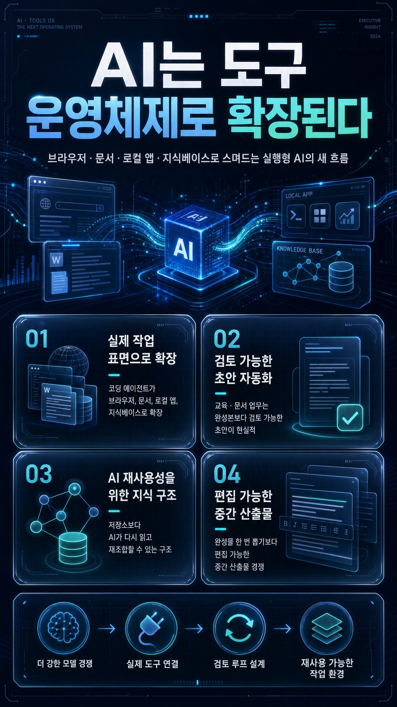

# 2026-07-11 · AI는 도구 운영체계로 확장된다 · 릴리스 40건

이번에 받은 <strong>「최근 AI·기술 동향 학습 큐레이션 40」</strong>은 얼핏 보면 영역이 꽤 넓다. Claude Code 영상 편집, OfficeCLI, claw-hwp, Orca, Obsidian 세컨드 브레인, 학교생활기록부 초안, 시험 감독표 자동 배정, GPT-Live, Lottie, Three.js, LLM Wiki, Korean Law MCP까지 한 묶음 안에 들어 있다.

이렇게 넓게 퍼진 자료는 자칫하면 “요즘 AI가 별걸 다 한다”는 감상으로 끝나기 쉽다. 그런데 이번 40개를 다시 읽고 남은 문장은 그보다 더 선명했다. 이제 AI의 진짜 변화는 더 똑똑한 답을 하는 데만 있지 않고, <strong>브라우저, 문서, 로컬 앱, 지식베이스 같은 실제 작업 표면으로 직접 확장되는 데</strong> 있다는 점이다.

## 먼저 결론

- 이번 40선의 중심은 코딩 에이전트가 단순 자동완성기를 넘어 <strong>도구 운영체계</strong>로 변하고 있다는 데 있었다.
- 교육·문서 자동화는 완성본 자동 생성보다 <strong>검토 가능한 초안</strong>을 빠르게 만드는 방향에서 가장 현실성이 컸다.
- Obsidian, NotebookLM, LLM Wiki 흐름은 노트를 많이 쌓는 문제보다 <strong>AI가 다시 읽고 재조합할 수 있는 구조</strong>가 더 중요하다는 쪽으로 이동하고 있었다.
- 콘텐츠 제작 도구도 한 번에 끝나는 결과보다 <strong>사람이 수정 가능한 중간 산출물</strong>을 빠르게 만드는 경쟁으로 보였다.
- 결국 이번 묶음은 “무슨 모델을 쓰나”보다 <strong>AI가 붙을 표면과 검토 루프를 어떻게 설계하나</strong>가 더 중요해졌다는 기록에 가깝다.

## 왜 이번 40선이 '도구 운영체계' 이야기처럼 읽혔나

이번 자료는 크게 다섯 갈래로 묶인다.

- AI 에이전트와 코딩 워크플로우
- 개인 지식 시스템과 학습 노트
- 문서·교육 업무 자동화
- 콘텐츠 제작과 인터페이스
- AI 모델·교육·사회 흐름

표면적으로는 각기 다른 분야처럼 보이지만, 실제로는 거의 같은 질문으로 모인다.

- AI가 어떤 앱과 파일 형식을 직접 다룰 수 있는가
- 그 과정에서 검토 가능한 초안을 얼마나 빨리 만들 수 있는가
- 지식과 문서를 다음 작업에서 다시 쓸 수 있게 구조화했는가
- 사람은 어디서 승인하고, 어디서 판단을 남겨야 하는가

그래서 이번 40선은 단순 도구 소개보다, <strong>AI가 실제 작업 환경 안으로 얼마나 깊게 들어오고 있나를 보여주는 운영 메모</strong>처럼 읽는 편이 더 맞았다.

## 이번 묶음에서 가장 크게 보인 네 가지 변화

### 1) 코딩 에이전트는 코드 작성기보다 도구 운영체계에 가까워진다

Claude Code Video Use, Obscura, OfficeCLI, claw-hwp, Orca, Hephaestus, Codex 플러그인, Korean Law MCP 자료를 한 줄로 읽으면 방향이 분명하다. 이제 코딩 에이전트는 코드 몇 줄 보조해 주는 존재가 아니라, 브라우저, 영상, 오피스 문서, 한글 문서, 법률 데이터까지 직접 건드리는 작업 계층으로 이동하고 있다.

중요한 질문도 달라진다.

- 어떤 모델이 더 강한가
- 어떤 권한과 도구를 연결했는가
- 검증 루프를 어떻게 넣었는가
- 사람이 어디서 멈춰 세우고 고치는가

즉 차이는 모델 감탄보다, <strong>AI가 실제 도구를 만지는 구조를 얼마나 안정적으로 설계했는가</strong>에서 난다.

### 2) 교육·문서 업무는 완성본보다 초안 자동화가 먼저 현실이 된다

엑셀 대시보드, 학교생활기록부 프롬프트 생성기, 시험 감독표 자동 배정, Docling 같은 자료는 공통적으로 “교사를 완전히 대체하는 자동화”를 말하지 않는다. 오히려 빠르고 검토 가능한 초안, 배정안, 대시보드, 구조화된 문서 변환처럼 사람이 마지막 판단을 하기 좋은 형태를 먼저 만든다.

이 흐름이 중요한 이유는 명확하다. 교육 현장과 행정 업무는 속도만큼 책임과 검토가 중요하기 때문이다. 그래서 AI가 가장 잘 붙는 지점도 완성본 생산보다, <strong>사람이 판단할 재료를 미리 정돈해 주는 초안 계층</strong>이다.

### 3) 개인 지식 시스템은 저장소가 아니라 재사용 가능한 작업 기반으로 바뀐다

Obsidian 딥리서치 플러그인, LLM Wiki, 세컨드 브레인, SOUL.md, TeamClaude, OpenWiki 자료는 노트를 모으는 법보다, 다음 작업에서 AI가 실제로 다시 읽고 연결할 수 있는 구조를 더 강조한다.

이제 노트는 예쁜 아카이브보다,

- 다시 검색되는 문맥
- 다음 작업의 기준 문서
- 에이전트가 참고할 운영 자산
- 사람과 AI가 함께 업데이트하는 설명서

에 가깝다.

그래서 개인 지식관리의 핵심도 “얼마나 많이 기록했나”보다, <strong>AI가 다시 꺼내 쓸 수 있게 얼마나 잘 연결했나</strong> 쪽으로 옮겨간다.

### 4) 콘텐츠 제작은 편집 가능한 중간 산출물 경쟁으로 보인다

Lottie, Google Omni 모션그래픽, FluidVoice, video-use, claude-real-video 자료를 함께 보면, 생성형 AI 경쟁이 완성작 한 방보다 수정 가능한 구조를 얼마나 빨리 만들 수 있느냐로 가고 있다는 점이 보인다.

이건 블로그, 수업 자료, 썸네일, 영상, 발표자료 모두에 그대로 연결된다.

- 나중에 다시 고칠 수 있는가
- 소스와 프롬프트가 남는가
- 사람이 편집할 여지가 있는가
- 다른 채널 포맷으로 쉽게 변형되는가

결국 생산성은 한 번의 멋진 결과보다, <strong>편집 가능한 중간 산출물을 얼마나 잘 남기느냐</strong>에서 더 크게 갈린다.

## 이번 40개로 바로 떠오르는 활용 장면

### 1) 교사 업무 자동화는 '초안 생성기'로 시작하는 편이 현실적이다

생활기록부, 감독표, 엑셀 보고서 자료를 같이 보면 학교 업무 자동화는 “끝난 문서”보다 “검토 가능한 초안”을 빠르게 내놓는 구조로 설계할 때 훨씬 도입 가능성이 높다.

### 2) 코딩 수업은 도구 사용법보다 작업 지시서와 검증 루프를 같이 가르쳐야 한다

Orca, Hephaestus, Codex 플러그인, OfficeCLI, video-use 자료를 보면 앞으로의 수업은 문법만 익히는 것보다, 에이전트에게 무엇을 맡기고 어떻게 검증할지 설계하는 능력을 함께 다뤄야 한다.

### 3) 개인 지식관리 워크숍은 '메모 앱 사용법'에서 끝나면 약하다

Obsidian, LLM Wiki, 세컨드 브레인 자료는 메모를 잘 쌓는 법보다 AI가 다시 검색하고 요약하고 재조합할 수 있는 구조를 먼저 보여줄 때 더 실전적이다.

### 4) 콘텐츠 제작은 결과보다 소스와 중간 파일을 남기는 습관이 중요해진다

Lottie, 모션그래픽, 영상 편집 자료를 보면 앞으로 경쟁력은 멋진 한 장보다, 수정 가능한 소스와 중간 산출물을 남겨 다른 채널로 확장할 수 있느냐에 더 가까워진다.

## 그래서 이번 40개는 어떻게 읽는 게 좋을까

처음부터 40개를 다 보기보다 아래 순서로 읽는 편이 흐름이 더 선명하다.

### 1단계: 에이전트가 실제로 무슨 표면을 다루는지 본다

- OfficeCLI
- claw-hwp
- Obscura
- Korean Law MCP
- Codex plugin for Claude Code

여기서 먼저 AI가 단순 채팅창이 아니라 실제 앱과 파일 형식으로 내려오는 흐름을 본다.

### 2단계: 검토 가능한 초안 자동화 사례를 본다

- 엑셀 대시보드
- 생활기록부 초안 생성기
- 시험 감독표 자동 배정
- Docling

이 구간에서는 완전 자동화보다 검토 가능한 초안이 더 현실적인 설계라는 점이 잘 보인다.

### 3단계: 지식 기반과 운영 문서를 붙여 본다

- Obsidian 딥리서치
- LLM Wiki
- 세컨드 브레인
- SOUL.md
- TeamClaude

이 흐름은 AI 품질이 여전히 지식베이스와 운영 문서 구조에 크게 기대고 있다는 점을 다시 확인시킨다.

### 4단계: 편집 가능한 콘텐츠 제작 쪽으로 넓힌다

- video-use
- claude-real-video
- FluidVoice
- Text to Lottie
- Google Omni 모션그래픽

이 구간은 결과물보다 편집 가능한 중간 산출물과 워크플로우 자산이 더 중요해지는 방향을 보여준다.

## 실제로 한 것

1. 40개 자료를 그대로 요약하지 않고, 도구 운영체계, 초안 자동화, 지식 기반, 편집 가능한 중간 산출물이라는 네 축으로 다시 묶었다.
2. 오늘 글의 한 문장을 `AI는 도구 운영체계로 확장된다`로 먼저 고정했다.
3. 그 문장을 기준으로, 어떤 자료가 실제 작업 표면과 연결되는지 중심으로 다시 읽었다.
4. 다시 공유하기 쉽도록 복사용 링크 표와 용어 정리표를 그대로 남겼다.

## 막혔던 지점

> 이번 묶음은 도구 종류가 너무 다양해서, 자칫하면 “요즘 AI 도구가 참 많다”는 수준에서 멈출 위험이 있었다.

그래서 이번 글에서는 기능 나열보다, <strong>이 자료들이 공통으로 어디를 향하고 있나</strong>를 먼저 잡는 게 중요했다. 가장 잘 맞는 문장은 `AI는 도구 운영체계로 확장된다`였다.

## 다음에 바로 쓸 체크리스트

<ul class="note-list">
  <li>새 AI 도구를 볼 때는 기능 수보다 어떤 앱과 파일 표면에 붙는지 먼저 본다.</li>
  <li>교육·행정 자동화는 완성본보다 검토 가능한 초안 생성기로 설계한다.</li>
  <li>노트와 문서는 저장보다 AI 재사용성을 기준으로 구조화한다.</li>
  <li>콘텐츠 제작에서는 결과물뿐 아니라 소스, 프롬프트, 중간 파일을 함께 남긴다.</li>
  <li>에이전트 수업은 도구 사용법만이 아니라 명세, 검증, 리뷰 기준까지 같이 다룬다.</li>
  <li>큐레이션 글에서는 링크 양보다 이번 묶음의 방향을 한 문장으로 먼저 세운다.</li>
</ul>

## 남겨둘 판단

이번 40선을 다시 읽고 남는 판단은 분명하다. 이제 AI 활용의 격차는 더 강한 모델 하나를 먼저 쓰는 데서만 나지 않는다. <strong>AI가 실제로 붙을 도구 표면, 사람이 검토할 초안 계층, 다시 참조할 지식 기반, 계속 수정할 중간 산출물을 먼저 설계할 수 있느냐</strong>에서 더 크게 난다.

그래서 앞으로 비슷한 자료를 읽을 때도 “이 도구가 얼마나 대단한가”보다, <strong>이 자료가 내 작업 환경을 어디서 더 실질적으로 바꾸게 만드는가</strong>를 먼저 보는 쪽이 훨씬 오래 남는다.

## 복사용 링크 표

| 카테고리 | 주제 | 제목 | 원본 링크 | 릴리스 공개 링크 |
|---|---|---|---|---|
| AI 에이전트와 코딩 워크플로우 | video-use 소개 | Claude Code Video Use | https://github.com/browser-use/video-use | https://lilys.ai/digest/10491908/12261913?s=1&noteVersionId=8832316 |
| AI 도구와 생산성 사례 | 5분 만에 로그인·회원가입 기능을 구현하는 바이브코딩 가이드 | Better Auth: 5분 만에 로그인/회원가입 기능 구현(네이버, 카카오 등 한국형 소셜 로그인 기본 지원) | 텍스트 노트 | https://lilys.ai/digest/10475753/12240064?s=1&noteVersionId=8809661 |
| AI 도구와 생산성 사례 | 엘릭서 (Elixir) 소개 및 웹 개발의 모순 | liftIO 2022 : 웹 개발의 모순과 Elixir가 특효약인 이유 - 한국축산데이터 CTO Max(이재철) - YouTube | https://www.youtube.com/watch?v=lAaD-6OQSHE | https://lilys.ai/digest/10470996/12234803?s=1&noteVersionId=8803645 |
| AI 에이전트와 코딩 워크플로우 | AI 에이전트와 코딩 워크플로우 | Obscura: 웹 스크래핑 및 AI 에이전트 자동화를 위해 Rust로 구축된 오픈소스 헤드리스 브라우저 엔진 | https://github.com/h4ckf0r0day/obscura | https://lilys.ai/digest/10470585/12234519?s=1&noteVersionId=8803335 |
| AI 모델·교육·사회 흐름 | GPT-Live 소개: AI와의 대화를 더욱 자연스럽고 지능적으로 혁신하다 | Introducing GPT-Live \| OpenAI | https://openai.com/index/introducing-gpt-live/ | https://lilys.ai/digest/10457601/12219116?s=1&noteVersionId=8787382 |
| AI 에이전트와 코딩 워크플로우 | OfficeCLI 소개: AI 에이전트가 Office 문서를 제어하는 오픈소스 도구 | OfficeCLI/README_ko.md at main · iOfficeAI/OfficeCLI · GitHub | https://github.com/iOfficeAI/OfficeCLI/blob/main/README_ko.md | https://lilys.ai/digest/10456220/12217058?s=1&noteVersionId=8785251 |
| AI 에이전트와 코딩 워크플로우 | 클로드 아티팩트를 활용한 형성평가 제작의 필요성 및 장점 | 클로드, 너 이런것도 돼? \| 클로드 아티팩트로 채점까지 되는 5분컷 형성평가 만들기! | https://www.youtube.com/watch?v=Z5_ZX8RKFVI | https://lilys.ai/digest/10454223/12214557?s=1&noteVersionId=8782605 |
| 개인 지식 시스템과 학습 노트 | 옵시디언 AI 딥리서치 자동화 플러그인 'Really Good Research' 소개 | 옵시디언에서 AI 딥리서치 자동화?! notebookLM + Tavily 무료 플러그인 공개 🔥 | https://www.youtube.com/watch?v=cVkf43CCdYc | https://lilys.ai/digest/10454137/12214442?s=1&noteVersionId=8782482 |
| AI 에이전트와 코딩 워크플로우 | claw- hwp 개요 | claw-hwp: 한컴오피스 없어도 AI가 직접 문서를 처리하고 결과물은 한컴오피스에서 완벽 호환 | https://github.com/DoHyun468/claw-hwp | https://lilys.ai/digest/10452782/12212814?s=1&noteVersionId=8780773 |
| AI 모델·교육·사회 흐름 | AI 시대의 도래와 교육 패러다임의 변화 | [시론] AI 시대의 교육 지혜, ‘논어’에 답 있다 \| 중앙일보 | https://www.joongang.co.kr/article/25442922 | https://lilys.ai/digest/10452569/12212523?s=1&noteVersionId=8780473 |
| AI 에이전트와 코딩 워크플로우 | claude-real-video 개요: LLM이 영상을 '진정으로' 이해하도록 돕는 도구 | Claude-Real-Video: LLM이 영상 내용을 이해하도록 돕는 도구 | https://github.com/HUANGCHIHHUNGLeo/claude-real-video | https://lilys.ai/digest/10441787/12198430?s=1&noteVersionId=8765870 |
| 문서·교육 업무 자동화 | 엑셀 보고서 자동화 및 실시간 웹 대시보드 구축 개요 | 엑셀 보고서 자동화, 이번 영상으로 종결합니다 \| 100% 무료로 만드는 실시간 웹 대시보드 | https://www.youtube.com/watch?v=vPR4eVtTqvo | https://lilys.ai/digest/10439286/12194585?s=1&noteVersionId=8761783 |
| 문서·교육 업무 자동화 | 학교생활기록부 초안 작성용 프롬프트 생성기 소개 | 학교생활기록부 초안 작성, 프롬프트 생성기로 쉽게 시작하기 | https://www.youtube.com/watch?v=GWG76u46f3k | https://lilys.ai/digest/10439275/12194571?s=1&noteVersionId=8761769 |
| AI 에이전트와 코딩 워크플로우 | Orca 개요 | Orca: AI Orchestrator | https://github.com/stablyai/orca | https://lilys.ai/digest/10437695/12192542?s=1&noteVersionId=8759597 |
| AI 도구와 생산성 사례 | cokacmux 개요 | cokacmux | https://github.com/kstost/cokacmux | https://lilys.ai/digest/10437524/12192344?s=1&noteVersionId=8759391 |
| AI 모델·교육·사회 흐름 | AI 모델·교육·사회 흐름 | 강력한 GLM-5.2 플러그인 한번에 완성된 쇼핑몰 클론하기 | https://www.youtube.com/watch?v=VRhosmir7wg | https://lilys.ai/digest/10434769/12188771?s=1&noteVersionId=8755639 |
| 개인 지식 시스템과 학습 노트 | 개인 지식 시스템과 학습 노트 | Obsidian LLM Wiki 못다한 이야기와 나의 AI 관련 팁 - 1부 | https://www.youtube.com/watch?v=ddTVa0NIhTY | https://lilys.ai/digest/10434747/12188748?s=1&noteVersionId=8755613 |
| 문서·교육 업무 자동화 | 시험 감독표 자동 배정 프로그램 소개 및 특징 | 시험 감독표, 엑셀 대신 이렇게 만드세요｜중학교용 자동 배정 프로그램 | https://www.youtube.com/watch?v=attZ6IHspEw | https://lilys.ai/digest/10433619/12187397?s=1&noteVersionId=8754211 |
| AI 도구와 생산성 사례 | 대한민국 대도약 3대 메가프로젝트 AI 대전환 용어집 발간사 | AI_대전환_용어집 | f2b25959-4661-4ce1-9cfa-96857a77aaa4 | https://lilys.ai/digest/10430057/12182668?s=1&noteVersionId=8749336 |
| AI 에이전트와 코딩 워크플로우 | AI 기반 세컨드 브레인 구축 및 활용 방법 | 궁극의 AI 세컨드 브레인 구축 방법 (클로드 코드 + 옵시디언) | https://www.youtube.com/watch?v=C6b1bX1HNg8 | https://lilys.ai/digest/10425790/12177178?s=1&noteVersionId=8743656 |
| AI 에이전트와 코딩 워크플로우 | 에이전트의 핵심, SOUL.md 파일 | [Roach Labs] 에이전트의 SOUL.md 가 중요한 이유 | https://www.youtube.com/watch?v=-VN1mDkLL2E | https://lilys.ai/digest/10425782/12177168?s=1&noteVersionId=8743645 |
| AI 에이전트와 코딩 워크플로우 | 생산성 시스템의 문제점과 Obsidian AI 활용의 중요성 | 실제로 작동하는 옵시디언 AI 세컨드 브레인! (코덱스, 클로드 코드) | https://www.youtube.com/watch?v=slkO_QAkqlc | https://lilys.ai/digest/10425778/12177164?s=1&noteVersionId=8743641 |
| AI 에이전트와 코딩 워크플로우 | AI 에이전트와 코딩 워크플로우 | TeamClaude | https://github.com/jung-wan-kim/teamclaude | https://lilys.ai/digest/10423981/12174459?s=1&noteVersionId=8740695 |
| AI 도구와 생산성 사례 | AI 도구와 생산성 사례 | New Note | https://github.com/9beach/hanspell | https://lilys.ai/digest/10422427/12172458?s=1&noteVersionId=8738512 |
| AI 모델·교육·사회 흐름 | AI 반도체 시장의 장밋빛 전망과 잠재적 위험성 | 토큰 비용이 ‘10분의 1’…중국 AI 모델 무시 못할 이유 \| 중앙일보 | https://www.joongang.co.kr/article/25442306 | https://lilys.ai/digest/10409126/12154318?s=1&noteVersionId=8719695 |
| AI 에이전트와 코딩 워크플로우 | Hephaestus : 모델에 구애받지 않는 에이전트 운영 체제 | Hephaestus: 모델에 구애받지 않는 에이전트 운영체제 | https://github.com/agentlas-ai/Hephaestus | https://lilys.ai/digest/10409103/12154231?s=1&noteVersionId=8719606 |
| AI 에이전트와 코딩 워크플로우 | 시스템 프롬프트 유출 문서화 프로젝트 | 다양한 LLM Model 들의 시스템 프롬프트 분석 깃허브 자료 | https://github.com/asgeirtj/system_prompts_leaks | https://lilys.ai/digest/10409032/12154101?s=1&noteVersionId=8719473 |
| AI 에이전트와 코딩 워크플로우 | GitHub 및 Codex 앱 가이드 소개 | Github과 Codex 앱 가이드북 자료 분석 | 3c885870-cd89-4b20-8705-ac61609f180f | https://lilys.ai/digest/10408991/12154024?s=1&noteVersionId=8719394 |
| AI 에이전트와 코딩 워크플로우 | 공냥 프롬프트 킷 VOL.2 소개 | 공냥 프롬프트 키트: 막연한 요청을 GPT-Image-2 완성 프롬프트로 변환하는 클로드코드 스킬 | https://github.com/kimsh-1/gongnyang-prompt-kit | https://lilys.ai/digest/10408000/12152655?s=1&noteVersionId=8717964 |
| 콘텐츠 제작과 인터페이스 | 콘텐츠 제작과 인터페이스 | FluidVooce: macOS 전용 오픈소스 받아쓰기 앱 | https://github.com/altic-dev/FluidVoice | https://lilys.ai/digest/10407917/12152530?s=1&noteVersionId=8717833 |
| AI 에이전트와 코딩 워크플로우 | cccat : Claude Code의 대기 시간을 활용한 개발 영어 학습 도구 | cccat/README.ko.md at main · dkdannyboy/cccat · GitHub | https://github.com/dkdannyboy/cccat/blob/main/README.ko.md | https://lilys.ai/digest/10406960/12151206?s=1&noteVersionId=8716454 |
| AI 도구와 생산성 사례 | ima2-gen 개요 | img2-gen: 로컬 이미지 생성 스튜디오 | https://github.com/lidge-jun/ima2-gen | https://lilys.ai/digest/10401510/12144008?s=1&noteVersionId=8709039 |
| AI 도구와 생산성 사례 | Three.js r185 개요 | Three.js – JavaScript 3D Library | https://threejs.org/ | https://lilys.ai/digest/10401459/12143918?s=1&noteVersionId=8708948 |
| AI 에이전트와 코딩 워크플로우 | Claude Code용 Codex 플러그인 소개 | Codex plugin for Claude Code | https://github.com/openai/codex-plugin-cc | https://lilys.ai/digest/10401372/12143866?s=1&noteVersionId=8708895 |
| 콘텐츠 제작과 인터페이스 | Text-to- Lottie 개요 | Text to Lottie: 텍스트 명령만으로 Lottie 애니메이션을 생성 | https://github.com/diffusionstudio/lottie | https://lilys.ai/digest/10401019/12143408?s=1&noteVersionId=8708422 |
| AI 도구와 생산성 사례 | Taste Skill 개요 | Taste-Skill: AI가 생성하는 웹 인터페이스의 디자인 품질을 향상시키는 프론트엔드 프레임워크 | https://github.com/leonxlnx/taste-skill | https://lilys.ai/digest/10399086/12140790?s=1&noteVersionId=8705755 |
| AI 에이전트와 코딩 워크플로우 | 구글 옴니를 활용한 모션그래픽 영상 제작 워크플로우 개요 | Google Omni 모션그래픽 영상 만들기 워크플로우 | https://kimminwook.notion.site/Google-Omni-3928c53193a78026b720db80376f97e1 | https://lilys.ai/digest/10398049/12139381?s=1&noteVersionId=8704326 |
| 문서·교육 업무 자동화 | Docling 프로젝트 개요 | Docling: 다양한 문서 형식을 처리하고 Gen AI 생태계와 원활하게 통합 | https://github.com/docling-project/docling | https://lilys.ai/digest/10396258/12136326?s=1&noteVersionId=8701204 |
| AI 에이전트와 코딩 워크플로우 | Korean Law MCP 개요 | Korean Law MCP | https://github.com/chrisryugj/korean-law-mcp | https://lilys.ai/digest/10396240/12136313?s=1&noteVersionId=8701190 |
| 도구 연결과 개발 생산성 | inshellisense 개요 및 특징 | Microsoft inshellisense: 터미널 환경에서 IDE 스타일의 자동 완성 기능 제공 | https://github.com/microsoft/inshellisense | https://lilys.ai/digest/10396205/12136281?s=1&noteVersionId=8701156 |

## 용어 정리

| 용어 | 쉬운 설명 | 일상 예시 |
|---|---|---|
| AI 에이전트 | 목표를 받고 필요한 도구를 호출하며 여러 단계를 처리하는 AI 실행 단위입니다. | 자료 조사, 초안 작성, 검토를 차례로 맡기는 디지털 조교처럼 볼 수 있습니다. |
| MCP | AI가 외부 앱, 파일, 브라우저, 데이터에 표준 방식으로 연결되도록 돕는 규격입니다. | 여러 전자기기를 같은 충전 포트로 연결하는 것과 비슷합니다. |
| Codex | 코드베이스를 읽고 수정하며 테스트까지 수행하는 개발용 AI 에이전트 환경입니다. | 개발자 옆에서 저장소를 직접 열어 고치는 페어 프로그래머에 가깝습니다. |
| Claude Code | 터미널과 프로젝트 파일을 다루며 개발 작업을 수행하는 Anthropic의 코딩 에이전트 도구입니다. | 명령어로 대화하면서 코드 수정과 실행을 맡기는 개발 조수입니다. |
| 오케스트레이션 | 여러 도구나 에이전트가 충돌하지 않도록 순서와 역할을 조정하는 일입니다. | 한 수업에서 조사, 발표, 기록 담당을 나누고 결과를 합치는 과정과 비슷합니다. |
| 세컨드 브레인 | 아이디어, 자료, 작업 기록을 연결해 나중에 다시 사고에 활용하는 개인 지식 시스템입니다. | 잘 정리된 디지털 연구 노트이자 개인 참고서입니다. |
| RAG | AI가 답하기 전에 관련 문서를 검색해 근거로 삼는 방식입니다. | 답안을 쓰기 전에 책의 해당 쪽을 먼저 찾아 펴 놓는 과정입니다. |
| CLI | 그래픽 버튼 대신 명령어로 프로그램을 실행하고 제어하는 방식입니다. | 앱 화면을 누르는 대신 터미널에 '파일 변환해줘'라고 명령하는 방식입니다. |
| HWPX | 한글 문서를 XML 구조로 저장하는 형식입니다. | 겉보기에는 한글 파일이지만 내부는 문단, 표, 서식이 부품처럼 나뉘어 있습니다. |
| 로컬 AI | 외부 서버 대신 내 컴퓨터에서 실행되는 AI 모델이나 도구입니다. | 인터넷 서비스에 올리지 않고 내 노트북 안에서 이미지나 텍스트를 처리하는 방식입니다. |
| Lottie | 웹과 앱에서 가볍게 재생되는 벡터 애니메이션 형식입니다. | 큰 영상 파일 대신 작은 움직이는 스티커처럼 UI에 넣을 수 있습니다. |
| 토큰 | AI가 읽고 쓰는 텍스트 조각의 단위입니다. | 긴 글을 작은 단어 조각으로 쪼개 계산하는 과금·처리 단위라고 보면 됩니다. |
