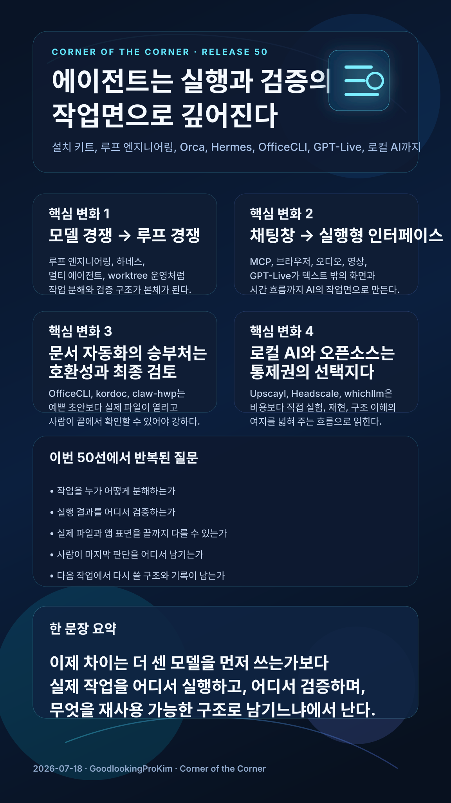

# 2026-07-18 · 에이전트는 실행과 검증의 작업면으로 깊어진다 · 릴리스 50건

이번에 받은 <strong>「최근 AI·기술 동향 학습 큐레이션 50」</strong>은 에이전트, 루프 엔지니어링, Orca, Hermes, OfficeCLI, claw-hwp, GPT-Live, Obsidian, Headscale, Upscayl, Better Auth, Buzz, StyleGallery까지 폭이 꽤 넓다.

이렇게 넓은 묶음은 자칫하면 "요즘 AI가 붙는 표면이 계속 늘고 있다"는 정도로만 읽히기 쉽다. 그런데 50개를 다시 훑고 남은 문장은 그보다 한 단계 더 깊었다. 이제 중요한 변화는 에이전트가 단순히 코드를 써주거나 답변을 잘하는 데서 멈추지 않고, **실행, 파일 호환, 검증, 멀티에이전트 협업까지 포함한 실제 작업면으로 깊어지고 있다**는 점이다.

## 먼저 결론

- 이번 50선의 중심은 에이전트가 더 똑똑해졌다는 감탄보다 **작업을 쪼개고 실행하고 검증하는 운영 구조**가 더 선명해졌다는 데 있었다.
- 루프 엔지니어링, 하네스 엔지니어링, Orca, Hermes 흐름은 이제 모델 선택보다 **작업 분해와 검증 루프 설계**가 실전 경쟁력이라는 점을 반복해서 보여줬다.
- 문서·교육 자동화는 생성 속도보다 **실제 파일이 열리고 서식이 유지되며 사람이 끝에서 확인할 수 있는가**가 품질을 가르는 기준으로 보였다.
- MCP, 브라우저, 음성, 영상, GPT-Live 계열은 AI의 입력과 출력이 텍스트 창 밖으로 나가 **시간과 화면을 직접 다루는 인터페이스**로 넓어지고 있음을 보여줬다.
- 로컬 AI와 오픈소스 개발환경 자료는 비용 절감 자체보다 **통제권, 재현성, 직접 실험 가능성**이 여전히 중요하다는 쪽을 강화했다.

## 왜 이번 50선은 '실행과 검증의 작업면' 이야기처럼 읽혔나

이번 자료는 크게 다섯 갈래로 묶인다.

- 에이전트 운영·개발 워크플로우
- 브라우저·MCP·멀티미디어
- 오픈소스·로컬 개발환경
- 문서·오피스·교육 자동화
- 지식관리·리서치

겉으로는 서로 다른 분야처럼 보여도 실제 질문은 꽤 비슷하다.

- 작업을 누가 어떻게 분해하는가
- 실행 결과를 어디서 검증하는가
- 실제 파일과 앱 표면을 얼마나 끝까지 다루는가
- 사람이 마지막에 어떤 기준으로 승인하는가
- 다음 작업에서 다시 쓸 수 있도록 무엇을 남기는가

그래서 이번 50선은 "새 도구 모음"보다는, **에이전트가 실제 일의 표면으로 얼마나 깊게 들어오고 있는가를 보여주는 운영 기록**으로 보는 편이 더 맞았다.

## 이번 묶음에서 크게 보인 네 가지 변화

### 1) 에이전트 경쟁은 모델 감탄보다 루프와 검증 설계로 옮겨간다

Claude Code 원클릭 키트, 루프 엔지니어링, 하네스 엔지니어링, Orca, Hermes 데스크톱/VPS 연결, Lazy Codex Skill, SkillOpt 자료를 한 줄로 읽으면 방향이 분명하다. 이제 중요한 차이는 "누가 더 잘 답하느냐"보다, **누가 더 안정적으로 일을 반복하고 검증하느냐** 쪽에서 난다.

이 흐름에서 핵심 질문도 달라진다.

- 어떤 모델이 더 좋나
- 어떤 역할로 작업을 나눴나
- 결과를 어디서 검사하나
- 실패했을 때 어떻게 다시 돌리나
- 그 과정을 다음에도 반복할 수 있나

즉 이제 에이전트 운영의 본체는 모델 자체보다, **루프와 검증을 포함한 작업 구조**에 더 가까워진다.

### 2) AI는 텍스트 창 밖으로 나가 화면과 시간 흐름을 다루기 시작한다

OpenClaw 창시자 인터뷰, Stitch × Antigravity MCP, Buzz, video-use, Obscura, GPT-Live 자료를 같이 보면 공통점이 보인다. AI는 더 이상 채팅창에 답을 남기는 존재로만 머물지 않고, **브라우저, 데스크톱, 오디오, 비디오, 실시간 대화 흐름**을 직접 다루는 쪽으로 나아간다.

이건 단순히 기능이 많아졌다는 뜻이 아니다. 입력과 출력의 단위가 바뀐다는 뜻이다.

- 텍스트만 읽는 게 아니라 화면을 본다
- 정적인 문서만 다루는 게 아니라 시간 축이 있는 영상과 음성을 다룬다
- 사용자의 질문만 기다리는 게 아니라 상호작용 흐름 자체를 설계한다

그래서 다음 실험의 핵심은 AI를 더 오래 말하게 만드는 데보다, **실행형 인터페이스와 대화형 AI를 어디서 자연스럽게 이어 붙일 수 있느냐**에 있을 가능성이 크다.

### 3) 문서·교육 자동화의 품질은 파일 호환과 최종 검토에서 갈린다

OfficeCLI, kordoc, claw-hwp, Excel Copilot, Better Auth, Claude 아티팩트 형성평가 자료는 생성 자체보다 **사용자가 실제로 열어보고 고치고 배포할 수 있는 결과물**을 더 중요하게 다룬다.

이 구간이 중요한 이유는 명확하다. 교육과 문서 업무에서는 결과가 그럴듯해 보이는 것만으로는 부족하기 때문이다.

- 파일이 실제로 열려야 한다
- 표, 서식, 로그인 흐름이 무너지지 않아야 한다
- 평가 기준과 업무 책임이 남아 있어야 한다
- 사람의 마지막 검토가 자연스럽게 들어가야 한다

그래서 이 흐름은 완전 자동화보다, **검토 가능한 초안과 호환 가능한 결과물**을 얼마나 안정적으로 뽑아내느냐 쪽이 훨씬 현실적이라는 점을 다시 보여준다.

### 4) 로컬 AI와 오픈소스는 비용보다 통제권과 실험 가능성의 문제다

Upscayl, Headscale, whichllm, Arduino + MariaDB, Elixir 자료는 특정 서비스에만 기대지 않고 내 장비와 오픈소스 위에서 직접 굴려보는 흐름을 강화한다.

이쪽의 매력은 단순히 싸다는 데만 있지 않다.

- 어디까지 내가 통제할 수 있는가
- 어떤 조건에서 재현 가능한가
- 실험한 결과를 다음 학습에 다시 연결할 수 있는가
- 내 환경에 맞게 구조를 바꿀 수 있는가

결국 로컬 AI와 오픈소스는 대기업 서비스의 대체재라기보다, **직접 실험하고 구조를 이해하려는 사람에게 남는 작업권**에 더 가깝다.

## 이번 50개로 바로 떠오르는 활용 장면

### 1) 코딩 에이전트 수업은 이제 '명세 + 루프 + 검증' 세트로 가르쳐야 한다

이번 자료를 보면 설치 키트, 에이전트 루프, 오케스트레이션, 데스크톱 연동이 다 한 방향으로 모인다. 따라서 수업에서도 프롬프트 몇 줄보다 **역할 분리, 작업 지시서, 검증 루프**를 같이 보여주는 편이 훨씬 실전적이다.

### 2) 학교 업무 자동화는 여전히 '완성본'보다 '검토 가능한 초안'이 안전하다

문서·교육 자동화 묶음은 사람을 빼는 자동화가 아니라, 사람이 더 빨리 판단할 수 있게 재료를 정리하는 자동화에 가깝다. 생활기록, 보고서, 평가, HWPX 문서는 특히 그렇다.

### 3) 지식관리 워크숍은 저장보다 회수와 재사용을 먼저 보여줘야 한다

Obsidian, Screenpipe, NotebookLM + Tavily 자료는 예쁘게 쌓아두는 노트보다 **나중에 다시 불러와 연결하고 검증할 수 있는 구조**가 더 중요하다는 점을 잘 보여준다.

### 4) 실습형 블로그나 연수 자료는 '실행형 사례' 중심으로 재구성하는 편이 좋다

이번 50선은 추상적 개념 설명보다 실제로 앱을 연결하고, 문서를 열고, 브라우저를 다루고, 오디오를 전사하고, 멀티에이전트를 돌리는 사례가 강했다. 따라서 다시 공유할 때도 개념 나열보다 **실행 장면**을 중심으로 묶는 편이 훨씬 오래 남는다.

## 그래서 이번 50개는 어떻게 읽는 게 좋을까

처음부터 50개를 다 보기보다 아래 순서로 읽으면 흐름이 더 선명하다.

### 1단계: 에이전트 운영 구조부터 본다

- 루프 엔지니어링
- 하네스 엔지니어링
- Orca
- Hermes 데스크톱/VPS 연동
- Lazy Codex Skill

여기서 먼저 모델 자체보다 운영 구조가 더 중요해지는 흐름을 잡는다.

### 2단계: 실행형 인터페이스 확장 쪽을 본다

- OpenClaw 창시자 인터뷰
- Stitch × Antigravity MCP
- Buzz
- video-use
- GPT-Live

이 구간에서는 AI가 텍스트 창 밖으로 어떻게 나가고 있는지 감이 잡힌다.

### 3단계: 문서와 교육 자동화 쪽을 본다

- OfficeCLI
- kordoc
- claw-hwp
- Excel Copilot
- Claude 아티팩트 형성평가

이 흐름은 "실제 결과물이 끝까지 열리고 검토 가능한가"라는 현실 기준을 보여준다.

### 4단계: 로컬과 오픈소스 선택지를 본다

- Upscayl
- Headscale
- whichllm
- Arduino + MariaDB
- Elixir

이 구간은 비용보다 통제권과 실험 가능성의 문제를 읽기 좋다.

## 실제로 한 것

1. 50개 자료를 그대로 옮기지 않고, 운영 구조, 실행형 인터페이스, 파일 호환 자동화, 로컬 실험이라는 네 축으로 다시 묶었다.
2. 오늘 글의 한 문장을 `에이전트는 실행과 검증의 작업면으로 깊어진다`로 먼저 고정했다.
3. 각 자료를 기능 소개보다 실제 작업 표면과 검증 구조 관점에서 다시 읽었다.
4. 다시 찾아보기 쉽도록 복사용 링크 표와 용어 정리표는 그대로 남겼다.

## 막혔던 지점

> 이번 묶음은 비슷한 도구가 여러 번 반복 등장하고, 범위도 에이전트부터 오디오 번역, 로컬 AI, 문서 자동화까지 넓어서 자칫 "유행 도구 모음"처럼 보일 위험이 있었다.

그래서 이번 글에서는 개별 도구의 화제성보다, **이 도구들이 공통으로 어떤 작업 구조를 밀고 있나**를 먼저 잡는 게 중요했다. 가장 잘 맞는 문장은 `에이전트는 실행과 검증의 작업면으로 깊어진다`였다.

## 다음에 바로 쓸 체크리스트

<ul class="note-list">
  <li>에이전트 도구를 볼 때는 모델 이름보다 작업 분해, 실행, 검증 구조를 먼저 본다.</li>
  <li>브라우저·오디오·영상 도구는 채팅 확장 기능이 아니라 실행형 인터페이스로 읽는다.</li>
  <li>문서 자동화는 결과가 그럴듯한지보다 실제 파일이 끝까지 열리고 검토되는지 확인한다.</li>
  <li>로컬 AI와 오픈소스는 비용보다 통제권과 재현성 기준으로 비교한다.</li>
  <li>큐레이션 글에서는 도구 나열보다 이번 묶음을 하나로 묶는 문장을 먼저 세운다.</li>
  <li>중복 등장하는 자료는 수를 세기보다 왜 같은 흐름이 반복되는지에 주목한다.</li>
</ul>

## 남겨둘 판단

이번 50선을 다시 읽고 남는 판단은 꽤 또렷하다. 이제 AI 활용의 차이는 더 똑똑한 모델 하나를 먼저 잡는 데서만 나지 않는다. **실제 작업을 어떻게 나누고, 어떤 표면에서 실행하며, 어디서 검증하고, 무엇을 다시 재사용 가능한 형태로 남기느냐**에서 더 크게 난다.

그래서 앞으로 비슷한 자료를 볼 때도 "이 도구가 얼마나 강한가"보다, **이 흐름이 내 작업면에서 실행과 검증을 어디까지 바꿔놓는가**를 먼저 보는 쪽이 훨씬 오래 남는다.

## 복사용 링크 표

| 카테고리 | 주제 | 제목 | 원본 링크 | 릴리스 공개 링크 |
|---|---|---|---|---|
| 에이전트 운영·개발 워크플로우 | Claude Code 원클릭 키트 소개 | Windows에서 클로드 코드(Claude Code)쉽게 설치하고 관리하는 키트 | [원본](https://github.com/sodam-ai/Claude-Code_One-Click_Kit/blob/main/README.en.md) | [공개 요약](https://lilys.ai/digest/10589373/12393189?s=1&noteVersionId=8969141) |
| 에이전트 운영·개발 워크플로우 | Claude & Codex 사용량 배터리 위젯 소개 | Claude Code, Codex 사용량 모니터링 위젯 | [원본](https://github.com/dennykim123/claude-codex-battery) | [공개 요약](https://lilys.ai/digest/10586177/12389244?s=1&noteVersionId=8965097) |
| 브라우저·MCP·멀티미디어 | AI 에이전트 활용의 새로운 병목 현상: 사람의 집중력 | [한영자막] OpenClaw 창시자 Peter Steinberger가 AI 에이전트를 굴리는 방법 | [원본](https://www.youtube.com/watch?v=CRmkxkzrFUA) | [공개 요약](https://lilys.ai/digest/10579247/12380032?s=1&noteVersionId=8955549) |
| 에이전트 운영·개발 워크플로우 | 루프 엔지니어링 환경 구축 및 설정 | 루프 엔지니어링 바로 구축하는 법 알려드림 \| 루프엔지니어링의 모든것 , 하나하나 설명해줌 | [원본](https://www.youtube.com/watch?v=nzOMsGpckoY) | [공개 요약](https://lilys.ai/digest/10575957/12375646?s=1&noteVersionId=8951022) |
| 에이전트 운영·개발 워크플로우 | 루프 엔지니어링의 등장 배경 및 개념 | 루프엔지니어링 제대로 낋여옴 \| 이해 안될 수가 없음 , 개념부터 실습까지 | [원본](https://www.youtube.com/watch?v=-6s3ogugP5o) | [공개 요약](https://lilys.ai/digest/10575950/12375638?s=1&noteVersionId=8951013) |
| 에이전트 운영·개발 워크플로우 | 개요 | 걍 따라만 하세요. 하네스 엔지니어링 구축하는 법 딱 정리해서 알려드립니다. | [원본](https://www.youtube.com/watch?v=A-3Jsuu4tHs) | [공개 요약](https://lilys.ai/digest/10575908/12375594?s=1&noteVersionId=8950969) |
| 에이전트 운영·개발 워크플로우 | Orca IDE 소개 및 주요 특징 | 무조건 쓰세요. 다른 터미널 툴을 압도하는 현존 최고의 IDE Orca의 특징은? | [원본](https://www.youtube.com/watch?v=T9mypKihAeY) | [공개 요약](https://lilys.ai/digest/10575880/12375521?s=1&noteVersionId=8950895) |
| 에이전트 운영·개발 워크플로우 | 헤르메스 에이전트 현업 활용을 위한 프로젝트 세팅 전략 | 헤르메스 에이전트를 실전에서 활용하는 법 - 실제로 일하는 헤르메스 | [원본](https://www.youtube.com/watch?v=CQy4wKuddtI) | [공개 요약](https://lilys.ai/digest/10575855/12375496?s=1&noteVersionId=8950870) |
| 에이전트 운영·개발 워크플로우 | AI 에이전트 팀이 사람 없이 웹사이트를 제작하다 | 자고 일어나 보니 Fable 5와 Sol이 웹사이트를 만들어 놓았습니다 — 멀티 에이전트 × 에이전트 루프 | [원본](https://www.youtube.com/watch?v=nu91mfvo6cI) | [공개 요약](https://lilys.ai/digest/10575824/12375475?s=1&noteVersionId=8950849) |
| 오픈소스·로컬 개발환경 | Upscayl 이미지 업스케일링 성능 비교 | upscayl/COMPARISONS.MD at main · upscayl/upscayl · GitHub | [원본](https://github.com/upscayl/COMPARISONS.MD) | [공개 요약](https://lilys.ai/digest/10575230/12374625?s=1&noteVersionId=8949983) |
| 브라우저·MCP·멀티미디어 | 코딩 없이 앱 개발: 구글 스티치와 안티그래비티 활용 | 코딩 몰라도 훌륭한 앱이 완성됩니다｜구글 Stitch × Antigravity MCP로 앱 만들기 | [원본](https://www.youtube.com/watch?v=WVDeU-prWXo) | [공개 요약](https://lilys.ai/digest/10572777/12371196?s=1&noteVersionId=8946363) |
| 브라우저·MCP·멀티미디어 | AI 기술 발전과 사용자 경험의 변화 | 챗GPT 보이스를 이용한 놀라운 경험들 | [원본](https://www.youtube.com/watch?v=jNvVPids344) | [공개 요약](https://lilys.ai/digest/10571063/12369178?s=1&noteVersionId=8944258) |
| 에이전트 운영·개발 워크플로우 | teach 디렉토리 개요 | Mattpocock/skills: Teach Skill를 통해 학습 경험 강화 | [원본](https://github.com/Mattpocock/skills) | [공개 요약](https://lilys.ai/digest/10566143/12362736?s=1&noteVersionId=8937564) |
| 에이전트 운영·개발 워크플로우 | 실제 엔지니어를 위한 에이전트 스킬 소개 | Matt Pocock: Agent Skills | [원본](https://www.aihero.dev/s/skills-newsletter) | [공개 요약](https://lilys.ai/digest/10566072/12362640?s=1&noteVersionId=8937466) |
| 문서·오피스·교육 자동화 | OfficeCLI: AI 에이전트를 위한 최초의 오픈소스 오피스 스위트 | OfficeCLI: 오피스 도구 편집 및 자동화 | [원본](https://github.com/iOfficeAI/OfficeCLI) | [공개 요약](https://lilys.ai/digest/10561014/12355959?s=1&noteVersionId=8930565) |
| 에이전트 운영·개발 워크플로우 | 우로보로스 Agent OS의 등장과 진화: 프롬프트 엔지니어링을 넘어선 AI 에이전트 시스템 | Agent OS로 AI 에이전트 활용이 달라진다: 우로보로스의 자동화·메모리 해법 | [원본](https://www.youtube.com/watch?v=7ews9Ri75Ss) | [공개 요약](https://lilys.ai/digest/10558601/12352636?s=1&noteVersionId=8927071) |
| 지식관리·리서치 | screenpipe/docs/mintlify/docs-mintlify-mig-tmp/obsidian.mdx at fef81a4516eac1170 | screenpipe/docs/mintlify/docs-mintlify-mig-tmp/obsidian.mdx at fef81a4516eac11705851c958f2915c483284 | [원본](https://github.com/screenpipe/docs) | [공개 요약 · 레거시](https://lilys.ai/digest/10556591?s=1) |
| 오픈소스·로컬 개발환경 | Headscale: 오픈소스 Tailscale 제어 서버 구현체 | Headscale: Talescale의 오픈소스 대안 | [원본](https://github.com/juanfont/headscale) | [공개 요약](https://lilys.ai/digest/10556043/12349722?s=1&noteVersionId=8923981) |
| 에이전트 운영·개발 워크플로우 | ADE 오르카 소개 및 핵심 기능 설명 | 요즘 핫한 ADE 오르카 소개 | [원본](https://www.youtube.com/watch?v=0ELc1pcfcQk) | [공개 요약](https://lilys.ai/digest/10555818/12349371?s=1&noteVersionId=8923604) |
| 에이전트 운영·개발 워크플로우 | Hermes Agent 데스크톱 앱과 VPS 연동의 필요성 | Hermes Agent, 데스크톱 앱에 이렇게 연결하면 완전히 달라집니다! | [원본](https://www.youtube.com/watch?v=Lkk2ubF1AZ8) | [공개 요약](https://lilys.ai/digest/10544111/12334134?s=1&noteVersionId=8907675) |
| 에이전트 운영·개발 워크플로우 | Orca IDE 소개 및 멀티 에이전트 오케스트레이션의 필요성 | Orca IDE 완전정복 \| Claude·Codex·Grok 동시에 돌리는 멀티 에이전트 오케스트레이션! | [원본](https://www.youtube.com/watch?v=8i0HYZq98VI) | [공개 요약](https://lilys.ai/digest/10541902/12330961?s=1&noteVersionId=8904368) |
| 에이전트 운영·개발 워크플로우 | StyleGallery는 디자인 패턴을 모아둔 보물창고야 | StyleGallery: 재사용 가능한 인터페이스 지식을 관리하는 갤러리 | [원본](https://github.com/changeroa/StyleGallery/blob/main/layout/index.md) | [공개 요약](https://lilys.ai/digest/10540263/12328736?s=1&noteVersionId=8902073) |
| 에이전트 운영·개발 워크플로우 | ir-search: 정부 지원사업 전수조사 Claude Code 스킬의 개요 | ir-search Skill: 모든 공고를 전수 검토 후 정보 제공 | [원본](https://github.com/djfksjd/ir-search) | [공개 요약](https://lilys.ai/digest/10540137/12328464?s=1&noteVersionId=8901798) |
| 문서·오피스·교육 자동화 | 오르카(Orca) 소개 | Orca 설명서 | PDF 업로드 | [공개 요약](https://lilys.ai/digest/10534731/12321070?s=1&noteVersionId=8894113) |
| 에이전트 운영·개발 워크플로우 | claude-lazycodex-skill 개요 | Claude에서 사용하는 Lazy Codex Skill | [원본](https://claude.com/claude-code) | [공개 요약](https://lilys.ai/digest/10534722/12321060?s=1&noteVersionId=8894100) |
| 에이전트 운영·개발 워크플로우 | SkillOpt 개요 및 기존 방식과의 차이점 | SkillOpt로 에이전트 스킬을 학습시키기: 자막 추출 오타 점검 예시 | [원본](https://github.com/microsoft/SkillOpt) | [공개 요약](https://lilys.ai/digest/10532140/12317737?s=1&noteVersionId=8890638) |
| 브라우저·MCP·멀티미디어 | Buzz 소개: 오프라인 오디오 전사 및 번역 도구 | Buzz: OpenAI의 Wisper 기반 오디오 및 비디오 전사와 번역 도구 | [원본](https://github.com/chidiwilliams/buzz) | [공개 요약](https://lilys.ai/digest/10530132/12315022?s=1&noteVersionId=8887802) |
| 문서·오피스·교육 자동화 | Excel Copilot을 활용한 데이터 정리 및 반복 업무 자동화 시작 순서 | Excel Copilot 데이터 정리 프롬프트, 반복 업무 자동화 시작 순서 - 실속생활백서 | [원본](https://livecoupang.com/) | [공개 요약](https://lilys.ai/digest/10530119/12315005?s=1&noteVersionId=8887785) |
| 에이전트 운영·개발 워크플로우 | Awesome LLM 앱스 소개 | Awesome LLM App: 앱 템플릿 | [원본](http://www.theunwindai.com/) | [공개 요약](https://lilys.ai/digest/10528509/12312956?s=1&noteVersionId=8885627) |
| 오픈소스·로컬 개발환경 | Upscayl 설치 전 확인 사항 | Upscayl: AI 기반 이미지 업스케일러 | [원본](https://flathub.org/apps/org.upscayl.Upscayl) | [공개 요약](https://lilys.ai/digest/10528453/12312895?s=1&noteVersionId=8885561) |
| 에이전트 운영·개발 워크플로우 | Orca ADE 소개 및 기존 IDE와의 차이점 | Orca ADE \| 병렬 AI 코딩 에이전트와 git worktree 오케스트레이션 \| CDB | [원본](https://neuralwatt.com/) | [공개 요약](https://lilys.ai/digest/10528343/12312752?s=1&noteVersionId=8885403) |
| 오픈소스·로컬 개발환경 | Headscale 소개: Tailscale 제어 서버의 오픈소스 자체 호스팅 구현체 | GitHub - juanfont/headscale: An open source, self-hosted implementation of the Tailscale control ser | [원본](https://github.com/juanfont/headscale) | [공개 요약](https://lilys.ai/digest/10527183/12311322?s=1&noteVersionId=8883832) |
| 오픈소스·로컬 개발환경 | whichllm 개요 | GitHub - Andyyyy64/whichllm: Find the local LLM that actually runs and performs best on your hardwar | [원본](https://github.com/Andyyyy64/whichllm) | [공개 요약](https://lilys.ai/digest/10526442/12310286?s=1&noteVersionId=8882728) |
| 오픈소스·로컬 개발환경 | 아두이노와 데이터베이스의 필요성 및 SQL 개념 이해 | 아두이노 우노 Q 하나로 데이터베이스까지? MariaDB 실습 정리 | [원본](https://www.youtube.com/watch?v=i662sIi0dMQ) | [공개 요약](https://lilys.ai/digest/10526393/12310211?s=1&noteVersionId=8882649) |
| 에이전트 운영·개발 워크플로우 | Claude 데스크탑 앱과 GitHub 데스크탑 앱 연동을 통한 AI 코드 배포 방법 소개 | Git Hub 데스크탑 앱 연동법 (+Claude 데스크탑 앱) | [원본](https://www.youtube.com/watch?v=6mYX7wI3hAQ) | [공개 요약](https://lilys.ai/digest/10524400/12307769?s=1&noteVersionId=8880036) |
| 에이전트 운영·개발 워크플로우 | Hermes Agent 데스크톱 앱과 VPS 연동의 필요성 | Hermes Agent, 데스크톱 앱에 이렇게 연결하면 완전히 달라집니다! | [원본](https://www.youtube.com/watch?v=Lkk2ubF1AZ8) | [공개 요약](https://lilys.ai/digest/10524244/12307589?s=1&noteVersionId=8879852) |
| 에이전트 운영·개발 워크플로우 | Orca IDE 소개 및 주요 특징 | 무조건 쓰세요. 다른 터미널 툴을 압도하는 현존 최고의 IDE Orca의 특징은? | [원본](https://www.youtube.com/watch?v=T9mypKihAeY) | [공개 요약](https://lilys.ai/digest/10524080/12307374?s=1&noteVersionId=8879619) |
| 문서·오피스·교육 자동화 | kordoc 소개 및 주요 기능 | kordoc: HWP/HWPX/PDF 파일을 마크다운으로 변환, 비교, 분석, 생성할 수 있는 오프소스 라이브러리 | [원본](https://github.com/chrisryugj/kordoc) | [공개 요약](https://lilys.ai/digest/10504884/12281506?s=1&noteVersionId=8852821) |
| 에이전트 운영·개발 워크플로우 | ir-search: 한국 정부 지원사업 전수조사 Claude Code 스킬 소개 | 한국 정부 지원사업을 효과적으로 찾게 도와주는 Claude Code Skill: ir-search | [원본](https://github.com/djfksjd/ir-search/blob/main/README.en.md) | [공개 요약](https://lilys.ai/digest/10504735/12281292?s=1&noteVersionId=8852598) |
| 문서·오피스·교육 자동화 | Supertonic 실무 사용 가이드 소개 | Supertonic 실무 사용 가이드 | 텍스트 노트 | [공개 요약](https://lilys.ai/digest/10503607/12279816?s=1&noteVersionId=8851066) |
| 에이전트 운영·개발 워크플로우 | 디자인 엔지니어를 위한 스킬 소개 | 디자인 엔지니어를 위한 스킬 모음 | [원본](https://animations.dev/) | [공개 요약](https://lilys.ai/digest/10499212/12272991?s=1&noteVersionId=8843661) |
| 브라우저·MCP·멀티미디어 | video-use 소개 | Claude Code Video Use | [원본](https://github.com/browser-use/video-use) | [공개 요약](https://lilys.ai/digest/10491908/12261913?s=1&noteVersionId=8832316) |
| 문서·오피스·교육 자동화 | 5분 만에 로그인·회원가입 기능을 구현하는 바이브코딩 가이드 | Better Auth: 5분 만에 로그인/회원가입 기능 구현(네이버, 카카오 등 한국형 소셜 로그인 기본 지원) | 텍스트 노트 | [공개 요약](https://lilys.ai/digest/10475753/12240064?s=1&noteVersionId=8809661) |
| 오픈소스·로컬 개발환경 | 엘릭서(Elixir) 소개 및 웹 개발의 모순 | liftIO 2022 : 웹 개발의 모순과 Elixir가 특효약인 이유 - 한국축산데이터 CTO Max(이재철) - YouTube | [원본](https://www.youtube.com/watch?v=lAaD-6OQSHE) | [공개 요약](https://lilys.ai/digest/10470996/12234803?s=1&noteVersionId=8803645) |
| 브라우저·MCP·멀티미디어 | Obscura 개요 및 headless Chrome과의 차이점 | Obscura: 웹 스크래핑 및 AI 에이전트 자동화를 위해 Rust로 구축된 오픈소스 헤드리스 브라우저 엔진 | [원본](https://github.com/h4ckf0r0day/obscura) | [공개 요약](https://lilys.ai/digest/10470585/12234527?s=1&noteVersionId=8803345) |
| 브라우저·MCP·멀티미디어 | GPT-Live 소개: AI와의 대화를 더욱 자연스럽고 지능적으로 혁신하다 | Introducing GPT-Live \| OpenAI | [원본](https://openai.com/index/introducing-gpt-live/) | [공개 요약](https://lilys.ai/digest/10457601/12219116?s=1&noteVersionId=8787382) |
| 문서·오피스·교육 자동화 | OfficeCLI 개요 | OfficeCLI/README_ko.md at main · iOfficeAI/OfficeCLI · GitHub | [원본](https://github.com/iOfficeAI/OfficeCLI/blob/main/README_ko.md) | [공개 요약](https://lilys.ai/digest/10456220/12217071?s=1&noteVersionId=8785264) |
| 문서·오피스·교육 자동화 | 클로드 아티팩트를 활용한 형성평가 제작의 필요성 및 장점 | 클로드, 너 이런것도 돼? \| 클로드 아티팩트로 채점까지 되는 5분컷 형성평가 만들기! | [원본](https://www.youtube.com/watch?v=Z5_ZX8RKFVI) | [공개 요약](https://lilys.ai/digest/10454223/12214557?s=1&noteVersionId=8782605) |
| 지식관리·리서치 | 옵시디언 AI 딥리서치 자동화 플러그인 'Really Good Research' 소개 | 옵시디언에서 AI 딥리서치 자동화?! notebookLM + Tavily 무료 플러그인 공개 🔥 | [원본](https://www.youtube.com/watch?v=cVkf43CCdYc) | [공개 요약](https://lilys.ai/digest/10454137/12214442?s=1&noteVersionId=8782482) |
| 문서·오피스·교육 자동화 | claw-hwp 개요 | claw-hwp: 한컴오피스 없어도 AI가 직접 문서를 처리하고 결과물은 한컴오피스에서 완벽 호환 | [원본](https://github.com/DoHyun468/claw-hwp) | [공개 요약](https://lilys.ai/digest/10452782/12212847?s=1&noteVersionId=8780808) |

## 용어 정리

| 용어 | 쉬운 설명 | 일상 예시 |
|---|---|---|
| AI 에이전트 | 목표를 받고 여러 단계를 스스로 처리하는 AI 도구입니다. | 여행지를 말하면 항공권, 숙소, 일정 후보를 차례로 알아봐 주는 비서와 비슷합니다. |
| 멀티 에이전트 | 여러 AI 에이전트가 역할을 나눠 동시에 또는 순서대로 일하는 방식입니다. | 한 명은 자료 조사, 한 명은 글쓰기, 한 명은 검수를 맡는 작은 프로젝트 팀처럼 보면 됩니다. |
| CLI | 마우스 대신 글자 명령어로 프로그램을 실행하고 제어하는 방식입니다. | 음식점 키오스크 버튼을 누르는 대신 직원에게 '김밥 두 줄 포장'이라고 말하는 것에 가깝습니다. |
| MCP | AI가 외부 도구나 데이터 소스와 약속된 방식으로 연결되도록 돕는 통신 규격입니다. | 여러 전자제품을 같은 충전 케이블로 꽂을 수 있게 맞춘 표준 포트처럼 이해하면 쉽습니다. |
| RAG | AI가 답을 만들기 전에 관련 문서나 자료를 먼저 찾아 참고하게 하는 방식입니다. | 시험 답안을 쓰기 전에 책장에서 관련 페이지를 찾아 펴 놓고 쓰는 것과 비슷합니다. |
| NotebookLM | 사용자가 넣은 문서와 자료를 기준으로 요약, 질문 답변, 학습 자료 생성을 돕는 노트형 AI 도구입니다. | 내가 준 교재만 보고 설명해 주는 개인 과외 선생님에 가깝습니다. |
| Obsidian | 마크다운 노트를 서로 연결해 개인 지식 베이스를 만드는 노트 앱입니다. | 각 메모가 끈으로 이어진 카드 상자처럼, 생각과 자료를 서로 연결해 둘 수 있습니다. |
| HWPX | 한글 문서의 내용을 XML 기반 구조로 저장하는 문서 형식입니다. | 겉으로는 한글 문서지만 안쪽은 정리된 부품 상자처럼 문장, 표, 서식이 나뉘어 있는 형태입니다. |
| 슬래시 명령어 | 대화창에서 `/`로 시작해 특정 기능을 바로 실행하는 짧은 명령입니다. | 카메라 앱에서 촬영 모드를 메뉴 깊숙이 찾지 않고 바로가기 버튼으로 바꾸는 것과 비슷합니다. |
| 컨텍스트 | AI가 답변할 때 참고하는 대화 내용, 문서, 코드 같은 작업 기억입니다. | 회의 중 칠판에 적어 둔 결정사항과 참고 메모를 보며 다음 말을 이어가는 상황입니다. |
| 오케스트레이션 | 여러 도구나 에이전트의 실행 순서와 역할을 조율하는 일입니다. | 주방장이 여러 요리사에게 재료 손질, 굽기, 플레이팅을 나눠 지시하는 장면과 같습니다. |
| LLM | 글을 이해하고 생성하도록 학습된 대규모 언어 AI 모델입니다. | 수많은 책과 문서를 읽고 문맥에 맞춰 답을 만들어 내는 아주 큰 자동완성 엔진처럼 볼 수 있습니다. |
| 로컬 AI | 클라우드 서버가 아니라 내 컴퓨터에서 직접 실행하는 AI 환경입니다. | 음악을 스트리밍하지 않고 휴대폰에 저장해 오프라인으로 듣는 것과 비슷합니다. |
| WWDC | 애플이 매년 개발자와 사용자에게 새 운영체제와 기술 방향을 발표하는 행사입니다. | 학교가 새 학기 시작 전에 올해 바뀌는 수업 방식과 규칙을 한 번에 발표하는 자리처럼 이해하면 쉽습니다. |
| GitHub | 코드와 문서를 저장하고 협업하는 개발자용 온라인 작업 공간입니다. | 여러 사람이 같은 문서함을 보며 수정 이력과 담당 작업을 관리하는 공유 캐비닛과 비슷합니다. |
| 바이브코딩 | AI와 대화하며 빠르게 방향을 잡고 코드를 만들어 가는 개발 방식입니다. | 요리책을 한 줄씩 따라가기보다 셰프에게 원하는 맛을 말하며 즉석에서 레시피를 조정하는 방식입니다. |
