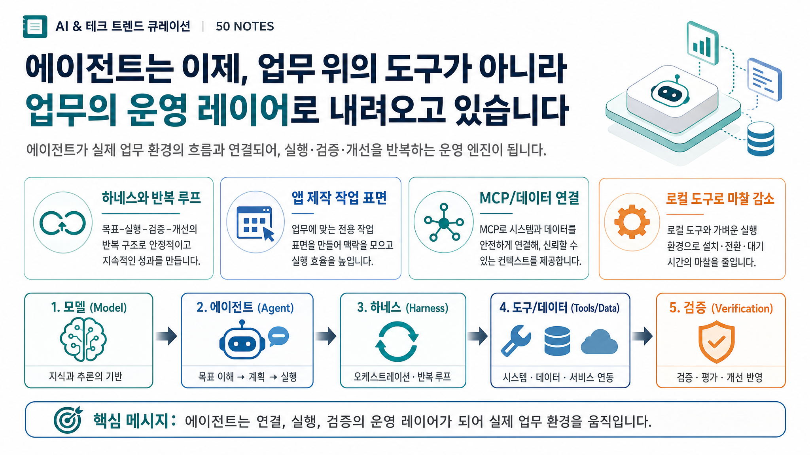

# 2026-07-26 · 에이전트는 작업 위가 아니라 운영 계층으로 내려온다 · 릴리스 50건

이번에 받은 <strong>「LilysAI 최근 50개 노트 큐레이션」</strong>은 겉으로 보면 Orca, Hermes, FlutterFlow, Dioxus, Pireel, MCP, 로컬 PDF 도구, 법률 MCP, 공공데이터 MCP처럼 분야가 꽤 흩어져 있다.

그런데 50개를 다시 훑고 남는 인상은 생각보다 선명했다. 이번 변화의 핵심은 모델이 하나 더 나왔다는 소식보다, **에이전트를 실제 작업 환경에 어떻게 붙이고, 어떤 운영 계층으로 굴릴 것인가**가 더 본체가 되고 있다는 점이다.

예전에는 AI를 화면 위에 올려둔 보조 도구처럼 읽었다면, 이번 자료에서는 AI가 작업 환경 아래로 스며든다. 메모리, 권한, 하네스, 워크트리, 원격 제어, 파일 호환, 도구 연결, 검증 절차까지 포함한 **운영 계층**으로 내려오는 느낌이 더 강했다.

## 먼저 결론

- 이번 50선의 중심은 새 모델 감탄보다 **에이전트를 실제 일의 운영 계층으로 배치하는 방법**에 있었다.
- Orca, Hermes, Osaurus, OpenWorker, Raven, Herdr 같은 자료는 이제 경쟁력이 모델 이름보다 **작업 분해, 메모리, 연결, 검증 구조** 쪽에 있다는 점을 반복해서 보여줬다.
- FlutterFlow, Dioxus, Pireel, local-pdf-organizer처럼 진입 장벽을 낮추는 도구들은 생성 능력보다 **실제 결과물까지 닿는 작업 흐름**을 더 중요하게 만들고 있다.
- MCP 계열은 단순 연결 기술이 아니라, 에이전트가 법률, 공공데이터, 다른 AI 도구, 데이터베이스 같은 바깥 세계와 **안전하게 손을 맞잡는 방식**으로 읽는 편이 맞았다.
- 이번 묶음은 결국 "무엇을 만들어줄까"보다 **어떤 자료, 어떤 도구, 어떤 승인과 검증 절차를 연결할까**를 먼저 설계하라고 말하고 있었다.

## 왜 이번 흐름은 '운영 계층' 이야기처럼 보였나

이번 50개는 크게 다섯 갈래로 나뉜다.

- 에이전트·하네스·멀티에이전트 운영
- AI 개발·앱 빌드 워크플로
- 문서·교육·사회·공공 읽기
- MCP·데이터·도구 연결
- 로컬·macOS·개발환경

겉으로는 다 다른 이야기처럼 보여도 실제 질문은 거의 같다.

- 이 일을 누가 맡고 어떻게 나눌까
- 어떤 메모리와 문맥을 오래 가져갈까
- 어떤 도구와 데이터를 연결할까
- 결과는 어디서 확인하고 누가 승인할까
- 다음에도 다시 쓸 수 있게 무엇을 남길까

그래서 이번 50선은 "좋은 툴 모음집"이라기보다, **에이전트를 일회성 대화창에서 꺼내 실제 작업 환경의 운영층으로 옮기는 기록**에 더 가까웠다.

## 이번 묶음에서 크게 보인 네 가지 변화

### 1) 에이전트의 본체가 모델에서 하네스와 루프로 옮겨간다

Mavlo, Osaurus, Orca, Hermes, OpenWorker, Raven, Herdr 자료를 한 줄로 읽으면 흐름이 분명하다. 이제 중요한 차이는 어떤 모델을 붙였느냐보다, **에이전트를 어떤 하네스 안에서 어떤 루프로 굴리느냐** 쪽에서 난다.

특히 Osaurus는 macOS 네이티브 하네스, Hermes는 데스크톱과 팀 운영, Orca는 워크트리 기반 병렬 제어, Raven은 메모리-우선 자기 개선, Herdr는 터미널 안의 멀티플렉서라는 식으로 서로 다른 층을 보여준다. 이름은 달라도 공통 질문은 같다. "AI를 어디에 두고, 어떻게 계속 일하게 할 것인가"다.

이건 꽤 큰 변화다. 예전에는 더 똑똑한 답을 고르는 경쟁이었다면, 지금은 **에이전트가 실패하지 않고 반복해서 일할 구조를 어떻게 설계할 것인가**가 더 중요해지고 있다.

### 2) 앱 빌드도 코드를 쓰는 일보다 작업면을 조율하는 일에 가까워진다

FlutterFlow의 Claude Code·Codex 연동, Dioxus, Rust + WASM, Pireel, Amicro, SpaceTime DB, 메이플 캐릭터 제작 자료를 같이 보면, 빌드의 무게중심이 점점 바뀐다.

이제 개발은 "빈 파일에서 코드를 다 친다"보다, **어떤 플랫폼을 쓰고, 어떤 에이전트가 어떤 조각을 맡고, 어느 화면까지를 결과물로 볼 것인가**를 먼저 정하는 일에 가까워진다.

FlutterFlow 자료가 흥미로운 것도 여기 있다. AI 에이전트가 플러그인처럼 붙는 순간, 앱 빌드는 단순 구현 작업이 아니라 화면 설계, 로그 확인, 기존 프로젝트 연결, 수정 요청, 반복 개선까지 포함한 **운영형 편집 작업**으로 바뀐다.

### 3) MCP는 더 이상 부가기능이 아니라 연결 구조의 본체가 된다

Khala, OS Ecosystem, Korean Law MCP, Korea Public Data Catalog MCP, DBX 같은 자료는 모두 "연결" 이야기다. 그런데 이번에는 연결이 단지 편의 기능처럼 보이지 않는다.

이 자료들이 보여주는 건, 에이전트가 혼자 똑똑한 것보다 **무엇과 연결되어 있느냐**가 훨씬 중요해지는 국면이다.

- 법률을 다루려면 한국 법령 구조를 잘 읽는 MCP가 필요하고
- 공공데이터 아이디어를 구체화하려면 메타데이터 탐색 계층이 필요하고
- DB를 다루려면 SQL 생성뿐 아니라 실제 스키마와 쿼리 작업면이 필요하고
- 여러 AI 도구 사이 맥락을 옮기려면 Khala 같은 인수인계 통로가 필요하다

결국 MCP는 "도구 하나 더 붙이기"가 아니라, **에이전트가 밖의 세계를 어떻게 안전하게 만나는가**에 대한 설계 문제로 보게 된다.

### 4) 로컬 도구의 의미는 비용보다 통제권과 마찰 감소에 있다

local-pdf-organizer, oh-my-opensnap, lazy-starter-kit, World Monitor, Pireel 같은 자료는 얼핏 소소한 유틸처럼 보이지만 실제로는 다 같은 방향을 가리킨다.

좋은 도구는 대단한 모델을 얹지 않아도 된다. 대신 사용자가 실제로 부딪히는 마찰을 줄인다.

- PDF를 서버에 올리지 않고 브라우저 안에서 정리한다
- 화면 캡처를 픽셀 단위로 빠르게 끝낸다
- 새 컴퓨터를 개발환경으로 한 번에 맞춘다
- 백엔드 없이 로컬에서 영상 편집을 끝낸다

이런 흐름이 중요한 이유는 명확하다. 사용자는 결국 멋진 데모보다 **작업 마찰이 줄어드는 순간**을 더 오래 기억하기 때문이다.

## 이번 50개로 바로 떠오르는 실전 활용 장면

### 1) 코딩 에이전트 교육은 이제 '모델 비교'보다 '운영 구조 비교'가 더 중요하다

Orca, Hermes, Osaurus, GPT Pro Architect Loop, Raven을 나란히 보면 학생이나 실무자에게 던질 질문도 달라진다.

- 어떤 모델이 더 낫나
- 어떤 역할로 나눴나
- 문맥은 어디에 남기나
- 실패하면 어디서 다시 시작하나
- 사람은 어느 단계에서 승인하나

이 질문들이 이제는 모델 벤치마크보다 실전적이다.

### 2) 비개발자용 앱 빌드 자료도 이제는 '시작 장벽'보다 '수정 장벽'을 낮추는 쪽이 중요하다

FlutterFlow, Dioxus, 메이플 캐릭터 제작, Pireel, Amicro 자료는 입문 장벽을 낮추는 데 도움이 된다. 그런데 실제로 더 중요한 건 첫 결과물을 만들고 난 다음이다.

사용자는 결국 이렇게 묻게 된다.

- 이걸 다음 버전으로 쉽게 고칠 수 있나
- 파일이나 프로젝트 문맥을 계속 이어갈 수 있나
- 화면과 상호작용을 다시 설명하지 않아도 되나

즉 생성보다 **반복 수정과 유지**가 더 큰 기준이 된다.

### 3) 교사나 행정 실무자에겐 파일 호환과 공공 데이터 연결이 더 현실적인 AI 활용처다

이번 묶음에는 PDF, 공공데이터, 법률 MCP, 문서 신구대비표 같은 한국형 실무 자료가 함께 들어 있다. 이건 꽤 중요하다.

실무에서는 "놀라운 생성"보다 아래가 더 중요하다.

- 기존 파일을 망가뜨리지 않는가
- 외부 업로드 없이 처리 가능한가
- 출처와 법령을 다시 확인할 수 있는가
- 공공 데이터를 서비스 아이디어로 바로 연결할 수 있는가

그래서 이 구간은 화려하진 않아도 오래 남는다.

### 4) 콘텐츠 제작도 생성 도구보다 작업 표면 전체를 다루는 편집기가 강해진다

Pireel, 캐릭터 시트, GPT Image 2 프롬프트 라이브러리, Thinking Orbs는 모두 결과물을 예쁘게 만드는 도구처럼 보이지만, 실제로는 **작업 표면을 다루는 감각**과 연결된다.

예를 들어 인포그래픽이나 영상 작업도 이제는 프롬프트 한 번보다

- 어떤 구도를 먼저 고정할지
- 텍스트 가독성을 어떻게 확보할지
- 브라우저 안에서 어디까지 편집할지
- 결과물을 블로그나 발표 자료에 어떻게 얹을지

이런 질문이 더 중요하다.

## 그래서 이번 50개는 어떻게 읽는 게 좋을까

처음부터 50개를 다 보는 것보다 아래 순서가 좋다.

### 1단계: 에이전트 운영 계층부터 본다

- Mavlo
- Osaurus
- Orca
- Hermes
- OpenWorker
- Raven

여기서 먼저 "AI를 어디에 둘 것인가"라는 질문을 잡는다.

### 2단계: 앱 빌드와 실행형 작업면으로 넘어간다

- FlutterFlow 에이전트 연동
- Dioxus
- Rust + WASM
- Pireel
- SpaceTime DB

이 구간에서는 AI가 실제 결과물 작업면과 어떻게 붙는지 감이 잡힌다.

### 3단계: MCP와 데이터 연결을 본다

- Khala
- Korean Law MCP
- Korea Public Data Catalog MCP
- DBX

이 흐름은 에이전트가 밖의 세계와 만나는 접점을 보여준다.

### 4단계: 로컬 도구와 실무 마찰 해소 쪽을 본다

- local-pdf-organizer
- oh-my-opensnap
- lazy-starter-kit
- World Monitor
- 문서 신구대비실

여기서는 "작은 마찰을 줄이는 도구가 왜 오래 남는가"가 보인다.

## 실제로 한 것

1. 50개 자료를 그대로 옮기지 않고, 에이전트 운영 계층, 앱 빌드 작업면, MCP 연결, 로컬 마찰 해소라는 네 축으로 다시 묶었다.
2. 단순 모델 소개나 툴 소개보다, 자료들이 공통으로 어떤 운영 질문을 던지는지 먼저 읽었다.
3. 실무자와 교사가 바로 자기 작업에 대입할 수 있도록 활용 장면을 함께 붙였다.

## 남겨둘 판단

이번 묶음을 한 문장으로 줄이면 이렇다.

> 이제 에이전트 경쟁은 더 좋은 답변을 만드는 경쟁이 아니라, 실제 작업 환경 아래에 어떤 운영 계층을 깔 수 있는가의 경쟁에 가까워진다.

그래서 다음에 비슷한 자료를 다시 받으면, 새 모델이 나왔는지보다 먼저 아래를 봐야 한다.

- 메모리는 어디에 남는가
- 어떤 도구와 어떻게 연결되는가
- 실패와 검증은 어디서 처리되는가
- 사람이 승인할 지점은 남아 있는가

이 네 가지가 보이면, 그 자료는 그냥 흥미로운 소식이 아니라 실제로 써먹을 수 있는 쪽에 더 가깝다.

## 복사용 링크 표

| 번호 | 주제 | 원본 | 공개 요약 |
|---:|---|---|---|
| 1 | 에이전트·하네스·멀티에이전트 운영 | [YouTube iframe source](https://www.youtube.com/watch?v=vsWPkl8hzq4) | [공개 링크](https://lilys.ai/digest/10696575/12536714?s=1&noteVersionId=9118183) |
| 2 | 에이전트·하네스·멀티에이전트 운영 | [Osaurus](https://github.com/osaurus-ai/osaurus) | [공개 링크](https://lilys.ai/digest/10696498/12536623?s=1&noteVersionId=9118091) |
| 3 | AI 개발·앱 빌드 워크플로 | [@subhanhq/amicro](https://github.com/Subhan-code/Amicro--Micro-transitions-) | [공개 링크](https://lilys.ai/digest/10696435/12536541?s=1&noteVersionId=9118008) |
| 4 | 문서·교육·사회·공공 읽기 | 없음(PDF 업로드) | [공개 링크](https://lilys.ai/digest/10696324/12536409?s=1&noteVersionId=9117875) |
| 5 | 에이전트·하네스·멀티에이전트 운영 | [YouTube iframe source](https://www.youtube.com/watch?v=6IlJ0BpKCLY) | [공개 링크](https://lilys.ai/digest/10696301/12536369?s=1&noteVersionId=9117835) |
| 6 | AI 개발·앱 빌드 워크플로 | [YouTube iframe source](https://www.youtube.com/watch?v=bDwr_7n1AZg) | [공개 링크](https://lilys.ai/digest/10696295/12536360?s=1&noteVersionId=9117826) |
| 7 | 에이전트·하네스·멀티에이전트 운영 | [YouTube iframe source](https://www.youtube.com/watch?v=fPohzjDpf4Q) | [공개 링크](https://lilys.ai/digest/10696286/12536350?s=1&noteVersionId=9117816) |
| 8 | AI 개발·앱 빌드 워크플로 | [YouTube iframe source](https://www.youtube.com/watch?v=yeeEmnAnAVs) | [공개 링크](https://lilys.ai/digest/10696249/12536315?s=1&noteVersionId=9117781) |
| 9 | 에이전트·하네스·멀티에이전트 운영 | [YouTube iframe source](https://www.youtube.com/watch?v=ArIlSal-jFI) | [공개 링크](https://lilys.ai/digest/10696239/12536304?s=1&noteVersionId=9117769) |
| 10 | AI 개발·앱 빌드 워크플로 | [YouTube iframe source](https://www.youtube.com/watch?v=ZkWozXbC6VM) | [공개 링크](https://lilys.ai/digest/10696146/12536102?s=1&noteVersionId=9117557) |
| 11 | MCP·데이터·도구 연결 | [Stop being the messenger between your AI tools](https://khala.to/) | [공개 링크](https://lilys.ai/digest/10693611/12532330?s=1&noteVersionId=9113676) |
| 12 | 에이전트·하네스·멀티에이전트 운영 | [YouTube iframe source](https://www.youtube.com/watch?v=WEu29vteoO4) | [공개 링크](https://lilys.ai/digest/10693402/12532015?s=1&noteVersionId=9113358) |
| 13 | 에이전트·하네스·멀티에이전트 운영 | [YouTube iframe source](https://www.youtube.com/watch?v=kpfEGF_-FWA) | [공개 링크](https://lilys.ai/digest/10693351/12531947?s=1&noteVersionId=9113284) |
| 14 | 에이전트·하네스·멀티에이전트 운영 | [09. 제2권. LLM 에이전트의 작동 원리](https://wikidocs.net/346794) | [공개 링크](https://lilys.ai/digest/10692313/12530491?s=1&noteVersionId=9111791) |
| 15 | 에이전트·하네스·멀티에이전트 운영 | [YouTube iframe source](https://www.youtube.com/watch?v=cw5tAzx-scM) | [공개 링크](https://lilys.ai/digest/10692270/12530423?s=1&noteVersionId=9111720) |
| 16 | 로컬·macOS·개발환경 | [PDF 정리함](https://github.com/obundh/local-pdf-organizer) | [공개 링크](https://lilys.ai/digest/10685275/12520660?s=1&noteVersionId=9101653) |
| 17 | MCP·데이터·도구 연결 | [OS Ecosystem](https://github.com/CSY8515/OS-Ecosystem) | [공개 링크](https://lilys.ai/digest/10685180/12520507?s=1&noteVersionId=9101497) |
| 18 | 문서·교육·사회·공공 읽기 | 없음(PDF 업로드) | [공개 링크](https://lilys.ai/digest/10685070/12520360?s=1&noteVersionId=9101345) |
| 19 | 로컬·macOS·개발환경 | [oh-my-opensnap 📸](https://github.com/Canine89/oh-my-opensnap) | [공개 링크](https://lilys.ai/digest/10685044/12520304?s=1&noteVersionId=9101287) |
| 20 | 에이전트·하네스·멀티에이전트 운영 | [YouTube iframe source](https://www.youtube.com/watch?v=FBsqQfkrsSY) | [공개 링크](https://lilys.ai/digest/10684465/12519477?s=1&noteVersionId=9100436) |
| 21 | 에이전트·하네스·멀티에이전트 운영 | [GPT Pro Architect Loop](https://github.com/youngchangjo/gpt-pro-architect-loop) | [공개 링크](https://lilys.ai/digest/10681719/12515754?s=1&noteVersionId=9096591) |
| 22 | 로컬·macOS·개발환경 | [Pireel Studio](https://github.com/pireel/pireel) | [공개 링크](https://lilys.ai/digest/10679117/12512689?s=1&noteVersionId=9093393) |
| 23 | AI 개발·앱 빌드 워크플로 | 미확정(멀티 자료) | [공개 링크](https://lilys.ai/digest/10678734/12512618?s=1&noteVersionId=9093319) |
| 24 | 콘텐츠·이미지·영상 제작 | [YouTube iframe source](https://www.youtube.com/watch?v=7300P3d1ZF4) | [공개 링크](https://lilys.ai/digest/10678627/12511987?s=1&noteVersionId=9092663) |
| 25 | 에이전트·하네스·멀티에이전트 운영 | [YouTube iframe source](https://www.youtube.com/watch?v=zK8neqREUHc) | [공개 링크](https://lilys.ai/digest/10678582/12511947?s=1&noteVersionId=9092622) |
| 26 | MCP·데이터·도구 연결 | [Korean Law MCP](https://github.com/chrisryugj/korean-law-mcp) | [공개 링크](https://lilys.ai/digest/10677991/12511084?s=1&noteVersionId=9091722) |
| 27 | 로컬·macOS·개발환경 | [Heoooooon/lazy-starter-kit](https://github.com/Heoooooon/lazy-starter-kit) | [공개 링크](https://lilys.ai/digest/10677875/12510900?s=1&noteVersionId=9091534) |
| 28 | AI 개발·앱 빌드 워크플로 | [YouTube iframe source](https://www.youtube.com/watch?v=qzF45r98pR4) | [공개 링크](https://lilys.ai/digest/10672114/12502855?s=1&noteVersionId=9083285) |
| 29 | 에이전트·하네스·멀티에이전트 운영 | [AI that gets your everyday tasks done.](https://openworker.com/) | [공개 링크](https://lilys.ai/digest/10671802/12502428?s=1&noteVersionId=9082845) |
| 30 | 문서·교육·사회·공공 읽기 | [ShouqiaoW/erdos](https://github.com/ShouqiaoW/erdos) | [공개 링크](https://lilys.ai/digest/10666345/12494928?s=1&noteVersionId=9074970) |
| 31 | 에이전트·하네스·멀티에이전트 운영 | [t8y2/dbx](https://github.com/t8y2/dbx) | [공개 링크](https://lilys.ai/digest/10664699/12492646?s=1&noteVersionId=9072585) |
| 32 | MCP·데이터·도구 연결 | [Korea Public Data Catalog MCP](https://github.com/obundh/korea-public-data-catalog-mcp) | [공개 링크](https://lilys.ai/digest/10659886/12486357?s=1&noteVersionId=9066034) |
| 33 | 에이전트·하네스·멀티에이전트 운영 | [Buzz 🐝](https://github.com/block/buzz) | [공개 링크](https://lilys.ai/digest/10659823/12486281?s=1&noteVersionId=9065955) |
| 34 | 문서·교육·사회·공공 읽기 | [모래와 단백질의 경쟁](https://www.joongang.co.kr/article/25446623) | [공개 링크](https://lilys.ai/digest/10659601/12485982?s=1&noteVersionId=9065639) |
| 35 | 에이전트·하네스·멀티에이전트 운영 | [YouTube iframe source](https://www.youtube.com/watch?v=ZCK-zL3c2vA) | [공개 링크](https://lilys.ai/digest/10658528/12484536?s=1&noteVersionId=9064126) |
| 36 | 에이전트·하네스·멀티에이전트 운영 | [baoyu-skills](https://github.com/JimLiu/baoyu-skills) | [공개 링크](https://lilys.ai/digest/10658392/12484370?s=1&noteVersionId=9063947) |
| 37 | 에이전트·하네스·멀티에이전트 운영 | [thinking-orbs](https://github.com/Jakubantalik/thinking-orbs) | [공개 링크](https://lilys.ai/digest/10658312/12484245?s=1&noteVersionId=9063819) |
| 38 | 문서·교육·사회·공공 읽기 | [문서 신구대비실](https://github.com/obundh/korean-munseo-diff) | [공개 링크](https://lilys.ai/digest/10656847/12482451?s=1&noteVersionId=9061965) |
| 39 | 에이전트·하네스·멀티에이전트 운영 | [ogulcancelik/herdr](https://github.com/ogulcancelik/herdr) | [공개 링크](https://lilys.ai/digest/10656836/12482437?s=1&noteVersionId=9061949) |
| 40 | 에이전트·하네스·멀티에이전트 운영 | [YouTube iframe source](https://www.youtube.com/watch?v=hcDz6yGT59M) | [공개 링크](https://lilys.ai/digest/10655146/12480195?s=1&noteVersionId=9059509) |
| 41 | 에이전트·하네스·멀티에이전트 운영 | [YouTube iframe source](https://www.youtube.com/watch?v=W-24dV5SlVE) | [공개 링크](https://lilys.ai/digest/10654659/12479583?s=1&noteVersionId=9058769) |
| 42 | 에이전트·하네스·멀티에이전트 운영 | [EverMind-AI/Raven](https://github.com/EverMind-AI/Raven) | [공개 링크](https://lilys.ai/digest/10653224/12477677?s=1&noteVersionId=9056559) |
| 43 | 콘텐츠·이미지·영상 제작 | [🚀 Awesome GPT Image 2 Prompts](https://github.com/YouMind-OpenLab/awesome-gpt-image-2) | [공개 링크](https://lilys.ai/digest/10653163/12477597?s=1&noteVersionId=9056476) |
| 44 | 에이전트·하네스·멀티에이전트 운영 | [AstrBotDevs/AstrBot](https://github.com/AstrBotDevs/AstrBot) | [공개 링크](https://lilys.ai/digest/10653111/12477506?s=1&noteVersionId=9056383) |
| 45 | 에이전트·하네스·멀티에이전트 운영 | [YouTube iframe source](https://www.youtube.com/watch?v=HWjcA51vHH8) | [공개 링크](https://lilys.ai/digest/10650479/12473782?s=1&noteVersionId=9052389) |
| 46 | 로컬·macOS·개발환경 | [World Monitor](https://github.com/koala73/worldmonitor) | [공개 링크](https://lilys.ai/digest/10650294/12473499?s=1&noteVersionId=9052098) |
| 47 | 문서·교육·사회·공공 읽기 | [YouTube iframe source](https://www.youtube.com/watch?v=WkBPX-oDMnA) | [공개 링크](https://lilys.ai/digest/10649907/12472907?s=1&noteVersionId=9051489) |
| 48 | 문서·교육·사회·공공 읽기 | [YouTube iframe source](https://www.youtube.com/watch?v=Oye4ia5yXY4) | [공개 링크](https://lilys.ai/digest/10649153/12471879?s=1&noteVersionId=9050438) |
| 49 | 에이전트·하네스·멀티에이전트 운영 | [YouTube iframe source](https://www.youtube.com/watch?v=7XW_O_lS6C4) | [공개 링크](https://lilys.ai/digest/10649105/12471797?s=1&noteVersionId=9050354) |
| 50 | 콘텐츠·이미지·영상 제작 | [YouTube iframe source](https://www.youtube.com/watch?v=hdEweGeZpuE) | [공개 링크](https://lilys.ai/digest/10649099/12471784?s=1&noteVersionId=9050341) |
