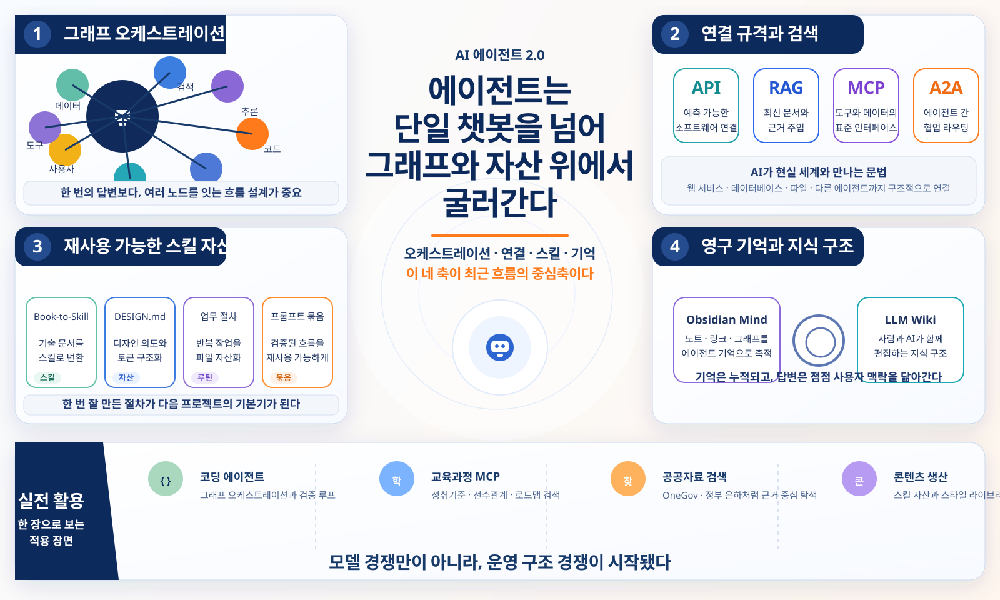

# 2026-08-01 · 에이전트는 그래프와 스킬 자산 위에서 굴러간다 · 릴리스 40건

이번에 받은 <strong>「최근 40개 노트 큐레이션: AI 에이전트·개발·지식 시스템」</strong>은 겉으로 보면 꽤 넓다. Orca, Hermes, Agentlas, Book-to-Skill, Design.md, Obsidian Mind, API·RAG·MCP·A2A, 교육과정 MCP, OneGov, NotebookLM 스타일 라이브러리, LongCat-Video까지 한 묶음 안에 같이 들어 있다.

그런데 40개를 다시 읽고 남는 인상은 의외로 한쪽으로 모였다. 이번 흐름의 핵심은 새 모델 감탄보다, <strong>에이전트를 어떤 구조 위에서 실제로 굴릴 것인가</strong>에 있다. 이제 에이전트는 대화창 안의 똑똑한 답변기가 아니라, 그래프, 루프, 연결 규격, 재사용 가능한 스킬 문서, 영구 기억 구조를 먹고 도는 실행 시스템에 더 가까워지고 있다.

## 먼저 결론

- 이번 40선의 중심은 새 모델 발표보다 <strong>에이전트를 운영하는 구조를 설계하는 법</strong>에 있었다.
- Orca, Agentlas, Hermes, OpenMMO 자료는 에이전트를 한 명의 비서보다 <strong>그래프와 역할 분담을 가진 실행 주체</strong>로 다루는 흐름을 보여줬다.
- API, RAG, MCP, A2A 자료는 AI를 더 똑똑하게 만드는 비법보다 <strong>바깥 세계와 안전하게 연결하는 문법</strong>이 더 중요해지고 있음을 말한다.
- Book-to-Skill, Design.md, Agents Skills, Obsidian Mind는 지식과 취향과 절차를 <strong>한 번 쓰고 사라지는 프롬프트가 아니라 다시 쓰는 자산</strong>으로 바꾸는 방향을 보여준다.
- 교육과 공공자료 쪽 MCP와 OneGov 자료는 한국형 실전 활용이 점점 “모델 선택”보다 <strong>검색 가능 구조와 신뢰 가능한 근거 연결</strong> 쪽으로 이동하고 있음을 드러낸다.

## 왜 이번 40선은 '그래프와 자산' 이야기처럼 읽혔나

이번 자료는 크게 여섯 갈래로 나뉜다.

- 에이전트 오케스트레이션과 실행
- AI 서비스와 개발 워크플로
- 코딩 에이전트와 스킬
- AI 연결 규격과 검색
- 콘텐츠 제작과 생산성
- 개인 지식 시스템과 교육·공공자료 AI

겉으로는 분야가 넓지만, 실제로는 거의 다 같은 질문으로 수렴한다.

- 이 일을 한 에이전트가 맡을까, 여러 노드로 나눌까
- 문맥은 한 번 쓰고 버릴까, 다시 불러올 자산으로 만들까
- 바깥 데이터와 도구는 어떤 규격으로 연결할까
- 결과는 누가 검토하고 어떤 근거를 남길까
- 다음 프로젝트에서도 그대로 꺼내 쓸 수 있게 무엇을 문서화할까

그래서 이번 40선은 “요즘 재미있는 AI 도구 모음”이라기보다, <strong>에이전트를 실제 운영 가능한 구조로 끌어내리는 기록</strong>처럼 읽는 편이 더 맞았다.

## 이번 묶음에서 가장 크게 보인 네 가지 변화

### 1) 에이전트의 단위가 '한 번의 대화'에서 '그래프'로 넓어진다

Orca 그래프 엔지니어링, 하네스·루프·그래프 설명, 디스코드 멀티 에이전트, Agentlas OS, OpenMMO 자료를 같이 보면 공통점이 분명하다. 이제 중요한 건 한 번에 잘 답하는가보다, <strong>여러 작업 노드를 어떤 순서와 분기 구조로 엮을 것인가</strong>다.

이건 단순히 용어가 바뀐 정도가 아니다. 그래프라는 말이 힘을 얻는 이유는 실제 작업이 점점 복잡해졌기 때문이다. 조사, 검색, 생성, 검토, 재시도, 승인, 배포를 한 줄로 세우기엔 흐름이 복잡해졌고, 그래서 노드와 간선으로 설계하고 중간에 멈추고 다시 잇는 감각이 더 중요해졌다.

예전에는 “루프를 얼마나 잘 돌리나”가 포인트였다면, 지금은 <strong>어떤 노드를 두고 어떻게 라우팅하느냐</strong>가 실력 차이를 더 크게 만든다.

### 2) 연결 규격은 부가기능이 아니라 에이전트 운영의 문법이 된다

API vs RAG vs MCP vs A2A, OpenGateway, opencodex, 교육과정 MCP들, OneGov 자료를 나란히 놓으면 메시지가 선명하다. 이제 에이전트를 잘 쓰려면 모델 프롬프트보다 먼저 <strong>무엇을 어떤 규격으로 연결할 것인지</strong>를 알아야 한다.

- API는 예측 가능한 요청과 응답을 만든다.
- RAG는 최신 문서와 근거를 가져온다.
- MCP는 도구와 데이터에 표준 방식으로 손을 뻗게 한다.
- A2A는 서로 다른 에이전트끼리 협업하게 만든다.

이 구분을 이해하는 순간, AI는 막연한 마법이 아니라 구조를 가진 시스템으로 보이기 시작한다. 그래서 이번 묶음에서는 연결 규격이 기술 해설이 아니라, <strong>에이전트가 현실 세계와 맞닿는 문법</strong>처럼 읽힌다.

### 3) 스킬과 문서는 프롬프트가 아니라 재사용 자산으로 굳어진다

Book-to-Skill, Design.md, Agents Skills, Claude Video, Obsidian Mind, K-12 teacher skills 자료는 한 방향을 가리킨다. 좋은 결과를 한 번 얻는 것보다, <strong>좋은 절차와 문맥을 파일로 남겨 다음에도 같은 품질을 재현하는 것</strong>이 더 중요해지고 있다.

특히 인상적인 건 지식의 포맷이 달라지고 있다는 점이다.

- 기술 서적은 스킬로 변환되고
- 디자인 취향은 DESIGN.md로 구조화되고
- 업무 절차는 portable skill 폴더가 되고
- 대화 맥락은 Obsidian Mind 같은 영구 기억 저장소로 넘어간다

결국 경쟁력은 “프롬프트를 잘 친다”가 아니라 <strong>업무 방식 자체를 자산으로 저장할 수 있느냐</strong> 쪽으로 이동하고 있다.

### 4) 개인 지식 시스템과 공공자료 검색도 에이전트 친화적으로 다시 짜인다

LLM Wiki와 RAG 비교, Layer0 튜토리얼, 초등·중등 교육과정 MCP, OneGov, 정부 은하 자료를 같이 읽으면 지식 관리도 같은 변화를 겪고 있다는 게 보인다.

이제 중요한 건 자료를 많이 모으는가가 아니다.

- AI가 바로 읽을 수 있는가
- 개념 간 연결이 보이는가
- 검색 결과가 근거와 함께 돌아오는가
- 공공 정보와 교육과정처럼 신뢰가 필요한 자료를 구조적으로 조회할 수 있는가

특히 교육과 공공자료 쪽은 화려하진 않아도 오래 남는다. 이런 구조가 있어야 교사, 연구자, 행정 실무자 같은 사람들이 AI를 “재밌는 실험”이 아니라 <strong>실제로 믿고 쓰는 작업 파트너</strong>로 보기 시작하기 때문이다.

## 이번 40개로 바로 떠오르는 실전 활용 장면

### 1) 코딩 에이전트 교육은 이제 모델 비교보다 작업 그래프 설계가 더 중요하다

Orca, Hermes, Agentlas, 하네스·루프·그래프 설명 자료를 같이 보면 학생이나 실무자에게 먼저 던질 질문이 달라진다.

- 어떤 모델이 더 세나
- 이 작업을 어떤 노드로 나눌 수 있나
- 어느 단계에서 검토를 끼워 넣을까
- 실패하면 어디서 다시 시작할까

이 질문들이 이제는 벤치마크 점수보다 훨씬 실전적이다.

### 2) 지식 기반 AI는 프롬프트보다 저장 구조가 결과 품질을 바꾼다

Book-to-Skill, Obsidian Mind, LLM Wiki, Layer0 자료를 같이 쓰면 “더 좋은 질문”보다 “더 좋은 저장 구조”를 먼저 가르칠 수 있다. 같은 자료라도 스킬, 위키, 노트, 검색 그래프 형태로 다시 정리하면 AI의 답변 품질이 눈에 띄게 달라진다.

### 3) 교육과 공공자료 AI는 한국형 MCP가 실전 진입점을 만든다

초등·중등 교육과정 MCP, OneGov, 정부 은하 같은 자료는 한국어 실무에서 바로 써먹을 여지가 크다. 성취기준 검색, 선수관계 확인, 정부 보도자료 탐색, 정책 자료 찾기처럼 원래 사람이 오래 걸리던 검색을 에이전트가 대신 정리해 줄 수 있기 때문이다.

### 4) 콘텐츠 제작도 이제는 한 번 생성보다 운영 가능한 생산 체계가 중요하다

NotebookLM Slide Style Library, LongCat-Video, 유튜브 강의 제작, SKILL 운영 노하우 자료를 같이 보면 콘텐츠 제작도 방향이 비슷하다. 예쁜 결과물 하나보다, <strong>같은 품질을 계속 뽑는 포맷과 스킬 묶음</strong>이 더 큰 차이를 만든다.

## 그래서 이번 40개는 어떻게 읽는 게 좋을까

처음부터 40개를 다 보지 말고 아래 순서로 읽는 편이 훨씬 선명하다.

### 1단계: 그래프와 오케스트레이션부터 본다

- Orca 그래프 엔지니어링
- 하네스·루프·그래프 설명
- 디스코드 멀티 에이전트
- Agentlas OS
- Hermes AI 비서와 모바일 제어

여기서 먼저 “에이전트를 어떻게 배치할 것인가”를 잡는다.

### 2단계: 연결 규격을 본다

- API vs RAG vs MCP vs A2A
- OpenGateway
- opencodex
- 교육과정 MCP
- OneGov

이 구간은 에이전트가 밖의 세계와 만나는 규칙을 잡아준다.

### 3단계: 스킬과 영구 기억 구조를 본다

- Book-to-Skill
- Design.md
- Agents Skills
- Obsidian Mind
- K-12 teacher skills

여기서는 좋은 결과를 반복 가능하게 만드는 자산화 감각이 생긴다.

### 4단계: 생산성과 실제 작업면 쪽으로 넘어간다

- NotebookLM Slide Style Library
- 유튜브 강의 제작 노하우
- LongCat-Video
- OpenDisplay 보조 모니터
- Markdowner

이 구간은 실제로 결과물을 만들고 다듬는 작업 표면이 어떻게 바뀌는지 보여준다.

## 실제로 한 것

1. 40개 자료를 원래 분류대로만 보지 않고, 그래프 오케스트레이션, 연결 규격, 스킬 자산화, 지식 구조라는 네 축으로 다시 묶었다.
2. 개별 툴 소개보다 “에이전트를 실제로 굴리려면 무엇이 필요해졌나”라는 질문을 먼저 고정했다.
3. 교육, 공공자료, 콘텐츠 제작 자료도 같은 흐름 안에서 읽히도록 운영 관점으로 다시 정리했다.

## 남겨둘 판단

이번 40개를 한 문장으로 줄이면 이렇다.

> 이제 에이전트 경쟁은 누가 더 그럴듯하게 답하느냐보다, 누가 더 나은 그래프와 연결 규격, 스킬 자산, 영구 기억 구조 위에서 일을 굴릴 수 있느냐의 경쟁에 가까워진다.

그래서 다음에 비슷한 큐레이션을 다시 받으면 새 모델 이름보다 먼저 아래를 보면 된다.

- 작업을 어떤 그래프로 나눌 수 있는가
- 어떤 규격으로 도구와 자료를 연결하는가
- 좋은 절차를 파일 자산으로 남길 수 있는가
- 기억과 근거를 다음 작업에 다시 불러올 수 있는가

이 네 가지가 선명하면, 그 자료는 그냥 흥미로운 소식이 아니라 실제로 써먹을 수 있는 쪽에 더 가깝다.

## 복사용 링크 표

| 번호 | 분류 | 주제 | 제목 | 원문 | 공개 요약 |
|---:|---|---|---|---|---|
| 1 | 에이전트·개발 | 에이전트 오케스트레이션과 실행 | orca로 멀티 에이전트 graph 만드는 방법은? | [원문](https://www.youtube.com/watch?v=-pk2umNC-18) | [공개 요약](https://lilys.ai/digest/10777823/12648283?s=1&noteVersionId=9233868) |
| 2 | 에이전트·개발 | AI 서비스와 개발 워크플로 | 헤르메스 에이전트로 언제 어디서든 나와 함께하는 AI비서 만들기 | [원문](https://www.youtube.com/watch?v=LMBX5qZ-DuA) | [공개 요약](https://lilys.ai/digest/10771484/12639794?s=1&noteVersionId=9225132) |
| 3 | 에이전트·개발 | 코딩 에이전트와 스킬 | Book-to-Skill: 기술 서적이나 문서를 AI 에이전트 스킬로 변환하여 정보 활용하게 도와주는 도구 | [원문](https://github.com/virgiliojr94/book-to-skill) | [공개 요약](https://lilys.ai/digest/10766466/12632434?s=1&noteVersionId=9217498) |
| 4 | 에이전트·개발 | AI 연결 규격과 검색 | API vs RAG vs MCP vs A2A Explained in 19 Minutes. | [원문](https://www.youtube.com/watch?v=pcEovm0v4pc) | [공개 요약](https://lilys.ai/digest/10766224/12632112?s=1&noteVersionId=9217169) |
| 5 | 콘텐츠·생산성 | 콘텐츠 제작과 생산성 | [시즌 3] 유튜브 강의 강의(촬영 도구, 프로그램 세팅, OBS 필터, 프레젠테이션 제작) | [원문](https://www.youtube.com/watch?v=Q1FO16fltvQ) | [공개 요약](https://lilys.ai/digest/10766203/12632088?s=1&noteVersionId=9217145) |
| 6 | 콘텐츠·생산성 | 콘텐츠 제작과 생산성 | "AI 시대 이게 더 귀해집니다" \| 네이버,카카오 대기업 가르치고 깨달은 AI 시대 생존공식 | [원문](https://www.youtube.com/watch?v=E7EvP9WOXDw) | [공개 요약](https://lilys.ai/digest/10766192/12632065?s=1&noteVersionId=9217121) |
| 7 | 콘텐츠·생산성 | 콘텐츠 제작과 생산성 | AI 활용 수준을 바꾸는 SKILL을 상위 1%처럼 쓰는 나만의 노하우 모음 (w. 콘텐츠 시스템) | [원문](https://www.youtube.com/watch?v=8P_U-9GaNYA) | [공개 요약](https://lilys.ai/digest/10766176/12632049?s=1&noteVersionId=9217104) |
| 8 | 에이전트·개발 | 코딩 에이전트와 스킬 | Design.md | [원문](https://github.com/google-labs-code/design.md) | [공개 요약](https://lilys.ai/digest/10765458/12631092?s=1&noteVersionId=9216131) |
| 9 | 에이전트·개발 | AI 연결 규격과 검색 | OpenGateway: 모든 LLM을 하나의 API로 통합 솔루션 | [원문](https://opengateway.ai/models) | [공개 요약](https://lilys.ai/digest/10761813/12626015?s=1&noteVersionId=9210875) |
| 10 | 에이전트·개발 | AI 연결 규격과 검색 | Codex에서 Grok, Kimi3도 쓸 수 있다고? \| Composer 2.5의 미친속도! | [원문](https://github.com/lidge-jun/opencodex/blob/main/README.md) | [공개 요약](https://lilys.ai/digest/10759699/12623334?s=1&noteVersionId=9208057) |
| 11 | 에이전트·개발 | 에이전트 오케스트레이션과 실행 | Open MMORPG 송재경 고문님 | [원문](https://github.com/Julian-adv/OpenMMO) | [공개 요약](https://lilys.ai/digest/10758439/12621745?s=1&noteVersionId=9206402) |
| 12 | 에이전트·개발 | AI 서비스와 개발 워크플로 | 하네스? 루프? 이번엔 또 그래프라고? | [원문](https://www.youtube.com/watch?v=dMuGx0DzWak) | [공개 요약](https://lilys.ai/digest/10751083/12611372?s=1&noteVersionId=9195753) |
| 13 | 에이전트·개발 | AI 연결 규격과 검색 | 입문자를 위한 API, MCP 완전정복 \| 날씨앱 + 날씨챗봇 + 날씨영상까지 직접 만들어보기 | [원문](https://www.youtube.com/watch?v=wz8v-Ud5Nmk) | [공개 요약](https://lilys.ai/digest/10751008/12611222?s=1&noteVersionId=9195601) |
| 14 | 에이전트·개발 | AI 서비스와 개발 워크플로 | 실무자가 진짜 쓰는 AI 스킬 플러그인 5가지 | [원문](https://www.youtube.com/watch?v=6aVZWFvLPj4) | [공개 요약](https://lilys.ai/digest/10750974/12611146?s=1&noteVersionId=9195524) |
| 15 | 콘텐츠·생산성 | 콘텐츠 제작과 생산성 | LongCat-Video: 긴 비디오 생성 툴 | [원문](https://github.com/meituan-longcat/LongCat-Video) | [공개 요약](https://lilys.ai/digest/10750876/12611049?s=1&noteVersionId=9195423) |
| 16 | 지식·학습 | 개인 지식 시스템 | NotebookLM Slide Style Library | [원문](https://notebooklm-slide-gallery.shirakippt.chatgpt.site/#gallery) | [공개 요약](https://lilys.ai/digest/10750858/12611020?s=1&noteVersionId=9195394) |
| 17 | 에이전트·개발 | 코딩 에이전트와 스킬 | Markdowner: 코딩 에이전트와 함께하는 경량 Markdown 편집기 | [원문](https://github.com/channprj/markdowner/releases/latest) | [공개 요약](https://lilys.ai/digest/10748412/12607418?s=1&noteVersionId=9191666) |
| 18 | 에이전트·개발 | AI 연결 규격과 검색 | CodeIsland: MacBook 노치에 실시간으로 AI 코딩 에이전트 상태 표시 | [원문](https://github.com/wxtsky/CodeIsland) | [공개 요약](https://lilys.ai/digest/10748383/12607383?s=1&noteVersionId=9191629) |
| 19 | 에이전트·개발 | 코딩 에이전트와 스킬 | Claude Video: AI가 비디오 시청하고 분석할 수 있는 도구 | [원문](https://github.com/bradautomates/claude-video) | [공개 요약](https://lilys.ai/digest/10748351/12607350?s=1&noteVersionId=9191594) |
| 20 | 에이전트·개발 | AI 연결 규격과 검색 | LLM wiki랑 RAG랑 뭐가 다른건지 알려드려요. 옵시디언+클로드 코드 조합은 필수입니다. (브레인 트리니티 브라이언님) | [원문](https://www.youtube.com/watch?v=t4XEda3CB3Q) | [공개 요약](https://lilys.ai/digest/10748343/12607339?s=1&noteVersionId=9191581) |
| 21 | 에이전트·개발 | 에이전트 오케스트레이션과 실행 | Agentlas OS: Agent 운영 | [원문](https://github.com/agentlas-ai/Agentlas-OS) | [공개 요약](https://lilys.ai/digest/10748310/12607293?s=1&noteVersionId=9191533) |
| 22 | 에이전트·개발 | AI 연결 규격과 검색 | Korean-Secondary-Learning-MCP: 한국 중등 2022 개정 교육과정 학습 그래프를 AI가 조회하게 해주는 MCP 서버 | [원문](https://github.com/raphysicst-create/korean-secondary-learning-map-mcp) | [공개 요약](https://lilys.ai/digest/10748245/12607219?s=1&noteVersionId=9191454) |
| 23 | 오픈소스 | 오픈소스와 개발 도구 | Buzz: 인간과 AI 에이전트의 동일한 공간에서의 협업 | [원문](https://github.com/block/buzz) | [공개 요약](https://lilys.ai/digest/10744057/12601605?s=1&noteVersionId=9185563) |
| 24 | 지식·학습 | 개인 지식 시스템 | 실습자료 배포) 세컨브레인 따라할 엄두가 안난 비개발자 보세요 \| 딥트윈 Layer0 총 10단계 튜토리얼 | [원문](https://www.youtube.com/watch?v=4SqOTrVoH8g) | [공개 요약](https://lilys.ai/digest/10744028/12601563?s=1&noteVersionId=9185519) |
| 25 | 에이전트·개발 | 에이전트 오케스트레이션과 실행 | 디스코드 하네스 멀티 에이전트 — 클로드·코덱스·제미나이를 API 없이 구독만으로 | [원문](https://www.youtube.com/watch?v=XOYFwXejbvc) | [공개 요약](https://lilys.ai/digest/10744015/12601541?s=1&noteVersionId=9185496) |
| 26 | 에이전트·개발 | 에이전트 오케스트레이션과 실행 | [시즌 3] Orca(오르카) 모바일 세팅 가이드 | [원문](https://www.youtube.com/watch?v=ioUqHOftdPU) | [공개 요약](https://lilys.ai/digest/10743998/12601523?s=1&noteVersionId=9185477) |
| 27 | 오픈소스 | 오픈소스와 개발 도구 | 비개발자를 위한 에이전트와 깃 이용하기 강좌 | [원문](https://www.youtube.com/watch?v=c5EP2Y4H-n4) | [공개 요약](https://lilys.ai/digest/10743988/12601507?s=1&noteVersionId=9185460) |
| 28 | 콘텐츠·생산성 | 콘텐츠 제작과 생산성 | 루프 나온지도 얼마 안 됐는데 그래프 엔지니어링? 5분만에 쉽게 설명해드림. | [원문](https://www.youtube.com/watch?v=BtM2JZCMtL8) | [공개 요약](https://lilys.ai/digest/10743983/12601494?s=1&noteVersionId=9185446) |
| 29 | 에이전트·개발 | AI 서비스와 개발 워크플로 | 이제 AI가 스마트폰을 직접 씁니다… ‘오픈미니스’ 최초 공개 | [원문](https://www.youtube.com/watch?v=_V5H_e3530A) | [공개 요약](https://lilys.ai/digest/10743968/12601474?s=1&noteVersionId=9185424) |
| 30 | 에이전트·개발 | AI 서비스와 개발 워크플로 | 무료로 대변신🔥 안쓰던 구형도 OK! 아이패드로 멀티 보조 모니터 만들기 | [원문](https://www.youtube.com/watch?v=V9UGKtltq5U) | [공개 요약](https://lilys.ai/digest/10743958/12601464?s=1&noteVersionId=9185414) |
| 31 | 지식·학습 | 개인 지식 시스템 | XY: 파이썬 차트 라이브러리: 대규모 데이터셋도 빠르게 시각화 | [원문](https://github.com/reflex-dev/xy) | [공개 요약](https://lilys.ai/digest/10743889/12601372?s=1&noteVersionId=9185317) |
| 32 | 에이전트·개발 | 코딩 에이전트와 스킬 | Obsidian Mind: AI Agent에게 영구적인 기억력 부여 | [원문](https://github.com/breferrari/obsidian-mind) | [공개 요약](https://lilys.ai/digest/10743854/12601311?s=1&noteVersionId=9185255) |
| 33 | 에이전트·개발 | AI 연결 규격과 검색 | 한국 초등 2022 개정 교육과정 학습 그래프 MCP 서버 | [원문](https://github.com/taehyeonglim/korean-elementary-learning-map-mcp) | [공개 요약](https://lilys.ai/digest/10743827/12601287?s=1&noteVersionId=9185228) |
| 34 | 지식·학습 | 개인 지식 시스템 | HanMark - Obsidian Plugin | [원문](https://community.obsidian.md/plugins/hanmark) | [공개 요약](https://lilys.ai/digest/10743798/12601242?s=1&noteVersionId=9185181) |
| 35 | 에이전트·개발 | 에이전트 오케스트레이션과 실행 | Claude AI Agent Skill for K-12 | [원문](https://github.com/anthropics/k12-teacher-skills) | [공개 요약](https://lilys.ai/digest/10738909/12594719?s=1&noteVersionId=9178430) |
| 36 | 지식·학습 | 교육·공공자료 AI | 정부 은하 · 대한민국 중앙행정기관 문서 온톨로지 | [원문](https://chris.gomdori.app/onegov) | [공개 요약](https://lilys.ai/digest/10722781/12572286?s=1&noteVersionId=9155046) |
| 37 | 에이전트·개발 | AI 연결 규격과 검색 | OneGov — 정부 공개자료 통합검색 | [원문](https://korea-onegov.vercel.app/) | [공개 요약](https://lilys.ai/digest/10722747/12572224?s=1&noteVersionId=9154984) |
| 38 | 에이전트·개발 | 코딩 에이전트와 스킬 | ChatGPT Work + Codex Tutorial: My Complete System at OpenAI \| Jason Liu | [원문](https://www.youtube.com/watch?v=ydTeb_I0b94) | [공개 요약](https://lilys.ai/digest/10722053/12571328?s=1&noteVersionId=9154046) |
| 39 | 에이전트·개발 | AI 연결 규격과 검색 | PDF EPUB 변환기 - 무료 PDF 전자책 변환 프로그램 | [원문](https://uploadless.app/ko/ebook-converter) | [공개 요약](https://lilys.ai/digest/10721025/12569813?s=1&noteVersionId=9152483) |
| 40 | 에이전트·개발 | 코딩 에이전트와 스킬 | Agents Skills: 재사용 가능한 스킬 모음 | [원문](https://github.com/MengTo/Skills) | [공개 요약](https://lilys.ai/digest/10720984/12569759?s=1&noteVersionId=9152425) |
