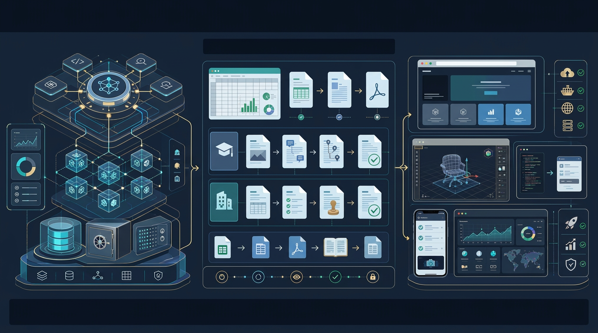

# 2026-08-15 · 에이전트는 운영체계가 되고 산출물은 바로 실행된다 · 릴리스 40건

<section class="release-hero">
  

    
  

  

    
Release 40 Snapshot

    <h2>이번 40선은 새 기능 나열보다 일의 구조를 다시 짜는 흐름에 가깝다</h2>
    
왼쪽의 에이전트 레이어가 스킬, 메모리, 라우팅, 보안 같은 운영 구조를 보여준다면, 가운데 문서 파이프라인은 교실과 사무 현장의 실제 파일 흐름을 뜻한다. 오른쪽 대시보드와 웹 화면은 결과가 더 이상 읽는 문서에서 끝나지 않고, 곧바로 실행하고 공유할 수 있는 표면으로 이동하고 있음을 보여준다.

    <ul class="release-hero__points">
      <li><strong>운영체계화</strong> 모델보다 스킬, 브리지, 서브 에이전트 구성이 더 중요해진다.</li>
      <li><strong>현장 파일화</strong> 구글시트, HWP, PDF, 학생부 같은 실무 문서가 자동화 중심으로 들어온다.</li>
      <li><strong>실행면화</strong> 웹사이트, 대시보드, 3D 인터랙션처럼 바로 열어 보여줄 결과물이 늘어난다.</li>
      <li><strong>인간 판단층</strong> 마지막 경쟁력은 질문, 구조화, 검토, 문체 다듬기에 남는다.</li>
    </ul>
  

</section>

이번에 받은 <strong>「최근 AI·기술 동향 학습 큐레이션 40」</strong>은 겉으로 보면 꽤 넓다. book-to-skill, claude-scaffold, Grok Bot, CodexBar, Prime Agent, 구글시트 대시보드, 학생부 스킬, GSG HWP, NotebookLM 2.0, ChatGPT Sites, scroll-world, Tapflow, Fish Audio, Logo Creator, Graph Engineering까지 한 묶음 안에 다 들어 있다.

그런데 40개를 다시 훑고 남는 인상은 생각보다 선명하다. 이번 흐름의 중심은 새 모델이나 새 서비스 감탄보다, <strong>에이전트를 어떻게 운영체계처럼 굴릴 것인가, 그리고 문서·웹·미디어 산출물을 얼마나 바로 실행 가능한 결과물로 만들 것인가</strong>에 있다.

예전에는 AI를 질문에 답하는 화면으로 많이 봤다면, 이번 40개에서는 그 무게중심이 분명히 내려왔다. 스킬, 서브 에이전트, 모델 브리지, 대시보드, 문서 자동화, 웹 배포, 원격 제어, QA, 전자책 생성처럼 <strong>실제 일의 표면을 묶는 구조</strong>가 더 본체가 되고 있다.

## 먼저 결론

- 이번 40선의 중심은 개별 챗봇 사용보다 <strong>에이전트를 반복 가능한 운영체계로 만드는 방법</strong>에 있었다.
- 문서·교육 자료 쪽에서는 구글시트, 학생부, HWP, PDF, NotebookLM처럼 <strong>교실과 사무 현장에서 바로 부딪히는 파일과 절차</strong>가 자동화의 중심으로 들어왔다.
- 웹·앱 제작 쪽에서는 ChatGPT Sites, 3D 랜딩, WebGL, 모바일 QA처럼 <strong>읽는 결과물</strong>보다 <strong>바로 실행하고 보여줄 결과물</strong>이 늘고 있다.
- AI 시대 역량 논의도 도구 사용법보다 <strong>질문 만들기, 문제 구조화, 검토, 글쓰기 티 줄이기, 그래프형 사고</strong> 같은 인간 판단 능력으로 모이고 있다.
- 결국 이번 묶음은 더 센 모델 경쟁보다, <strong>AI를 어떤 구조 위에 올리고 어떤 산출물까지 연결할 것인가</strong>를 먼저 설계하는 사람이 유리해지는 흐름을 보여준다.

## 왜 이번 40선은 '운영체계와 실행면' 이야기처럼 읽혔나

이번 자료는 크게 다섯 갈래로 읽힌다.

- 에이전트 스킬과 코딩 워크플로우
- AI 모델 선택과 서비스 운영
- 문서·교육·지식 작업 자동화
- 웹·앱 제작과 인터랙티브 결과물
- AI 시대 역량과 사고법

분류는 나뉘어 있어도 실제 질문은 거의 비슷하다.

- AI를 한 번 쓰고 끝낼까, 반복 가능한 구조로 만들까
- 어떤 파일과 도구를 AI 작업면 안으로 끌어올까
- 결과를 텍스트로 끝낼까, 바로 실행되는 화면으로 만들까
- 사람이 마지막에 어디서 판단하고 검토할까
- 내 방식이 다음에도 다시 재사용되게 무엇을 남길까

그래서 이번 40선은 재미있는 도구 소개글 묶음이라기보다, <strong>AI를 도구에서 운영체계로, 결과물을 문서에서 실행면으로 이동시키는 기록</strong>처럼 읽는 편이 더 맞았다.

## 이번 묶음에서 가장 크게 보인 네 가지 변화

### 1) 에이전트의 본체가 모델 이름보다 운영 구조 쪽으로 이동한다

book-to-skill, claude-scaffold, Grok Bot, CodexBar, The Agency, cc-model-bridge, Prime Agent, Agent Skills, 디스코드 하네스 멀티 에이전트, Buzz를 한 줄로 보면 공통점이 뚜렷하다. 이제 중요한 건 어떤 모델을 쓰느냐 하나보다, <strong>그 모델을 어떤 스킬과 하네스, 어떤 브리지와 서브 에이전트 구조 안에서 굴리느냐</strong>다.

특히 이번 묶음에서는 이 구조화가 꽤 현실적인 층까지 내려왔다.

- 책이나 문서를 스킬로 바꾸는 흐름
- AI가 규칙을 아는 팀원처럼 움직이게 하는 부트스트랩
- 저렴한 모델을 서브 에이전트에 붙이는 브리지
- 사용량과 세션 상태를 메뉴바나 대시보드에서 보는 관리 도구
- 여러 AI를 한 채널 안에서 팀처럼 묶는 협업 구조

예전에는 에이전트를 하나의 똑똑한 대화창처럼 봤다면, 이제는 <strong>메모리, 라우팅, 역할 분담, 검증, 사용량 관리까지 포함한 운영 묶음</strong>처럼 보는 쪽이 더 정확하다.

### 2) 문서 자동화는 이제 예쁜 데모가 아니라 현장 파일을 직접 건드리는 단계로 들어온다

구글시트 대시보드, Gemini Spark, 학생부 초안 생성 스킬, GSG HWP, bookforge, anydoc, NotebookLM 2.0을 같이 보면, 문서 자동화의 대상이 아주 현실적이다.

- 재고와 영수증을 관리하는 구글시트
- 학생부와 세특 초안
- 윈도우즈 한글 문서
- PDF 책 요약
- 상업 도서급 전자책 PDF
- PPT와 쇼츠까지 확장되는 NotebookLM

이건 중요하다. 자동화가 더 이상 “멋진 실험”에 머물지 않고, <strong>교실과 사무실에서 매일 만지는 파일</strong> 쪽으로 들어왔다는 뜻이기 때문이다.

특히 교육 현장에서는 이 변화가 바로 와닿는다. 교사 입장에서는 AI를 잘 쓰는 기준이 거창한 모델 이름이 아니라, <strong>학생부, 활동지, 한글 문서, 요약 자료, 발표 자료를 얼마나 덜 힘들게 만들고 다시 검토할 수 있느냐</strong>로 바뀌기 쉽다.

### 3) 웹 결과물은 이제 문서의 끝이 아니라 바로 움직이는 실행 화면이 된다

ChatGPT Sites, scroll-world, finger-frame-effect-ai, moon-rover, Diagram Design Skill, Tapflow, Mint, html-slide-remote를 같이 보면 방향이 선명하다. AI는 더 이상 글과 보고서만 만드는 데 머물지 않고, <strong>브라우저에서 바로 열고 조작하고 보여줄 수 있는 결과물</strong>을 만든다.

이 변화는 꽤 크다.

- 급하게 웹사이트를 만들어 공개하는 흐름
- 스크롤 기반 3D 랜딩을 자동 생성하는 흐름
- 브라우저 탭에서 바로 돌아가는 WebGL 게임
- 모바일 시뮬레이터를 브라우저에서 제어하는 흐름
- 노트북 HTML 장표를 휴대폰으로 원격 제어하는 발표 흐름

즉 산출물의 기본값이 `문서 파일`에서 `실행 가능한 표면`으로 이동하고 있다. 이건 블로그 운영, 수업 자료, 홍보 페이지, 데모 제작까지 다 바꾼다.

### 4) 사람에게 남는 경쟁력은 질문, 구조화, 검토 같은 판단층으로 모인다

머니투데이의 AI 시대 인재상 기사, AI 티 지우기, Graph Engineering 자료는 얼핏 주변 이야기처럼 보이지만 이번 묶음의 결론에 가깝다. 도구가 많아질수록 사람에게 남는 일은 더 선명해진다.

- 어떤 질문을 던질까
- 문제를 어떤 구조로 나눌까
- AI 결과를 어디서 의심하고 고칠까
- 글을 얼마나 사람답게 다듬을까
- 하나의 프롬프트가 아니라 그래프형 절차로 설계할까

그래서 이번 40개는 “도구를 많이 아는 사람”보다 <strong>문제를 구조화하고 AI 작업면을 설계하며 결과를 검토하는 사람</strong>이 더 중요해지는 쪽으로 읽힌다.

## 이번 40개로 바로 떠오르는 실전 활용 장면

### 1) 학교에서는 'AI 기능 체험'보다 '문서 자동화와 검토 수업'이 더 실용적일 수 있다

학생부 스킬, GSG HWP, NotebookLM 2.0, 구글시트 대시보드, Gemini Spark를 같이 보면, 학교 현장에서는 AI를 멋진 답변 기계로 보여주는 것보다 <strong>실제 자료를 만들고 검토하는 흐름</strong>으로 가져가는 편이 훨씬 실용적이다.

예를 들면 바로 이런 식이다.

- 수업 자료를 요약하고 발표 자료로 바꾸기
- 학생부 초안을 만든 뒤 근거와 표현을 다시 검토하기
- 구글시트 데이터를 대시보드로 바꿔 보기
- HWP/HWPX 문서를 읽고 수정 흐름 이해하기

핵심은 “AI가 대신 썼다”가 아니라, <strong>AI를 끼운 상태에서 사람이 어디서 판단해야 하는가</strong>를 훈련하는 데 있다.

### 2) 개발자는 모델 선택보다 에이전트 묶음과 출력 표면을 더 많이 설계하게 된다

claude-scaffold, cc-model-bridge, Prime Agent, Agent Skills, CodexBar, Buzz, ChatGPT Sites, Tapflow 같은 자료를 같이 보면 개발자 실전 질문은 조금 달라진다.

- 주 모델과 서브 에이전트를 어떻게 나눌까
- 어떤 작업은 저렴한 모델에 맡기고 어떤 작업은 비싼 모델에 맡길까
- 사용량 한도와 세션 상태를 어떻게 관리할까
- 결과를 코드로 끝낼까, 사이트나 대시보드처럼 바로 보여줄까

즉 “AI 잘 쓰는 개발자”는 점점 “AI 조합, 작업 라우팅, 출력 표면”을 함께 설계하는 사람 쪽으로 이동한다.

### 3) 개인 생산성도 큰 모델보다 작은 연결 도구가 실제 체감 효율을 만든다

UNIM 입력기, html-slide-remote, CodexBar, anydoc 같은 자료는 화려하지 않지만 실제로 자주 쓰일 가능성이 높다. 큰 모델 하나보다 <strong>반복 작업을 줄이는 작은 연결 도구</strong>가 일상 생산성을 더 크게 바꾸는 경우가 많다는 뜻이다.

이건 이번 묶음이 꽤 잘 보여준 장면이다. AI 시대 생산성은 거대한 모델 성능표뿐 아니라, <strong>입력, 변환, 제어, 모니터링 같은 작은 마찰을 얼마나 줄이느냐</strong>에서 갈린다.

## 그래서 이번 40개는 어떻게 읽는 게 좋을까

처음부터 순서대로 다 읽기보다 아래 흐름으로 보면 더 선명하다.

### 1단계: 에이전트 운영 구조 자료부터 본다

- book-to-skill
- claude-scaffold
- Grok Bot
- cc-model-bridge
- Prime Agent
- Agent Skills
- 디스코드 하네스 멀티 에이전트
- Buzz

여기서는 AI 활용의 중심이 도구 사용법에서 운영 구조로 옮겨가고 있음을 먼저 잡을 수 있다.

### 2단계: 문서·교육 자동화 자료를 붙인다

- 구글시트 대시보드
- Gemini Spark
- 학생부 스킬
- GSG HWP
- bookforge
- anydoc
- NotebookLM 2.0

이 구간에서는 자동화의 대상이 실제 현장 파일과 절차로 내려왔다는 감각이 생긴다.

### 3단계: 웹·앱 결과물 자료로 넘어간다

- ChatGPT Sites
- scroll-world
- moon-rover
- Tapflow
- html-slide-remote

여기서는 AI 결과물이 문서 파일을 넘어 바로 실행되는 표면으로 가고 있다는 변화를 볼 수 있다.

### 4단계: 마지막에 인간 역량 자료를 본다

- AI 시대 인재상 기사
- AI 티 지우기
- Graph Engineering

이 구간은 앞의 모든 자료를 어떻게 사람 역량 문제로 다시 읽을지 정리해준다.

## 실제로 한 것

1. 이번 40개를 단순한 카테고리 묶음으로 두지 않고, 에이전트 운영체계화, 문서 자동화의 현장화, 웹 결과물의 실행면화, 인간 판단층의 중요성이라는 네 축으로 다시 묶었다.
2. 모델이나 서비스 이름보다 스킬, 브리지, 하네스, 대시보드, 파일 호환, 결과물 실행 표면 같은 구조를 먼저 읽었다.
3. 교육 자료와 개발 자료, 웹·미디어 자료를 따로 떼지 않고 하나의 흐름 안에서 연결해 봤다.
4. 마지막에는 다시 찾아보기 쉽도록 복사용 링크 표를 그대로 남겼다.

## 남겨둘 판단

이번 40개를 한 문장으로 줄이면 이렇다.

> 이제 AI 활용의 승부처는 도구를 하나 더 아는 데보다, 에이전트를 운영체계처럼 설계하고 문서와 웹 결과물을 바로 실행 가능한 표면으로 연결하는 능력에 더 가깝다.

그래서 다음에 비슷한 큐레이션을 다시 받을 때는 새 모델 이름보다 먼저 아래를 보면 된다.

- 이 도구가 단발 사용인지 운영 구조인지
- 결과가 문서에서 끝나는지 실행 화면으로 이어지는지
- 현장 파일과 절차를 실제로 덜어주는지
- 사람이 어디서 질문하고 구조화하고 검토해야 하는지

이 네 가지가 선명하면, 그 자료는 그냥 흥미로운 소개글이 아니라 실제로 오래 남을 흐름일 가능성이 크다.

## 복사용 링크 표

| 카테고리 | 주제 | 제목 | 원본 링크 | 릴리스 공개 링크 |
|---|---|---|---|---|
| 에이전트 스킬과 코딩 워크플로우 | AI 에이전트와 코딩 워크플로우 | book-to-skill | [원본](https://github.com/virgiliojr94/book-to-skill) | [공개 요약](https://lilys.ai/digest/10960473/12895147?s=1&noteVersionId=9486755) |
| 에이전트 스킬과 코딩 워크플로우 | claude-scaffold 개요 | Claude Code가 마치 규칙을 아는 팀원 처럼 작동하도록 돕는다. | [원본](https://github.com/LeeYudok/claude-scaffold) | [공개 요약](https://lilys.ai/digest/10960453/12895122?s=1&noteVersionId=9486730) |
| 에이전트 스킬과 코딩 워크플로우 | Grok Bot의 주요 특징 및 장점 | Grok Bot 너무 좋습니다. Hermes, Openclaw 다 지웠어요. | [원본](https://www.youtube.com/watch?v=MzObKXUaSbc) | [공개 요약](https://lilys.ai/digest/10960404/12895055?s=1&noteVersionId=9486660) |
| 문서·교육·지식 작업 자동화 | 구글 시트와 무료 Gemini를 활용한 실시간 대시보드 구축 | 와.. 이제 구글시트가 앱이 됩니다! \| 무료 Gemini로 실시간 대시보드 만드는 법 | [원본](https://www.youtube.com/watch?v=XSsKjS1z7Yg) | [공개 요약](https://lilys.ai/digest/10960394/12895044?s=1&noteVersionId=9486645) |
| 에이전트 스킬과 코딩 워크플로우 | Claude AI 스킬 선정 기준 및 스킬 탐색 방법 | 진짜 매일 쓰는 Claude Skill 3개 (꾸준히 쓰는 이유) | [원본](https://www.youtube.com/watch?v=VABNRP-S124) | [공개 요약](https://lilys.ai/digest/10960389/12895037?s=1&noteVersionId=9486637) |
| AI 모델 선택과 서비스 운영 | Grok 4.6의 뛰어난 성능과 압도적인 가격 경쟁력 | Grok 4.6 너무 저렴한데 이정도로 잘한다고? | [원본](https://www.youtube.com/watch?v=QzOzVIMuFhk) | [공개 요약](https://lilys.ai/digest/10960382/12895029?s=1&noteVersionId=9486629) |
| 문서·교육·지식 작업 자동화 | Gemini Spark 소개 및 활용 필요성 | 교육자분들을 위한 Gemini Spark 활용법 (출시는 조금 늦었지만, 역시나 저력이 있는 Gemini) | [원본](https://www.youtube.com/watch?v=YJ8G1h23THg) | [공개 요약](https://lilys.ai/digest/10960372/12895016?s=1&noteVersionId=9486616) |
| 미디어 생성과 콘텐츠 제작 | Fish Audio의 다양한 기능 소개 | 목소리 생성형 AI \| Fish Audio | [원본](https://www.youtube.com/watch?v=vFEcvha9el8) | [공개 요약](https://lilys.ai/digest/10960358/12894998?s=1&noteVersionId=9486598) |
| 웹·앱 제작과 인터랙티브 결과물 | 웹 제작과 인터랙티브 콘텐츠 | [시즌 03] 급하게 웹 사이트를 만들어야 한다면? 챗GPT Sites | [원본](https://www.youtube.com/watch?v=Hz0mcSqyuR0) | [공개 요약](https://lilys.ai/digest/10960352/12894991?s=1&noteVersionId=9486591) |
| 에이전트 스킬과 코딩 워크플로우 | CodexBar 개요: AI 코딩 도구 사용량 관리를 위한 macOS 앱 | GitHub - steipete/CodexBar: Show usage stats for OpenAI Codex and Claude Code, without having to log | [원본](https://github.com/steipete/CodexBar) | [공개 요약](https://lilys.ai/digest/10959965/12894496?s=1&noteVersionId=9486087) |
| 웹·앱 제작과 인터랙티브 결과물 | scroll-world 개요 및 기능 | GitHub - oso95/scroll-world: A skill that turn any brand into a scrollable 3D world landing page · G | [원본](https://github.com/oso95/scroll-world) | [공개 요약](https://lilys.ai/digest/10959851/12894344?s=1&noteVersionId=9485923) |
| 웹·앱 제작과 인터랙티브 결과물 | 손가락 프레임 AI: 애니메이션 세계로의 창 | 손가락 프레임 애니메이션 효과 | [원본](https://github.com/sophiamyang/finger-frame-effect-ai) | [공개 요약](https://lilys.ai/digest/10930307/12856940?s=1&noteVersionId=9447767) |
| 에이전트 스킬과 코딩 워크플로우 | 그록봇(Grokbot) 소개 및 등장 배경 | [시즌 3] 24/7 켜져 있는 컴퓨터 1대와 에이전트를 몽땅 제공하는 그록봇(Grokbot) | [원본](https://www.youtube.com/watch?v=x_9x8ZAgdR8) | [공개 요약](https://lilys.ai/digest/10929901/12856476?s=1&noteVersionId=9447294) |
| 웹·앱 제작과 인터랙티브 결과물 | 챗GPT SITES 기능으로 웹사이트를 무료로 만들고 운영하는 방법 | 챗GPT 하나면 홈페이지·호스팅·SSL까지 다 공짜 (SITES 신규 업데이트) | [원본](https://www.youtube.com/watch?v=TJccfwPKm9M) | [공개 요약](https://lilys.ai/digest/10929891/12856463?s=1&noteVersionId=9447281) |
| 문서·교육·지식 작업 자동화 | ALLWEONE® AI 프레젠테이션 생성기 개요 | PPT 생성기(Gamma 대안) | [원본](https://github.com/allweonedev/presentation-ai) | [공개 요약](https://lilys.ai/digest/10929854/12856420?s=1&noteVersionId=9447238) |
| 문서·교육·지식 작업 자동화 | AI 기반 PDF 책 분석 및 요약 스크립트 개요 | PDF 책을 페이지별로 분석해서 핵심 지싣을 추출 후 요약본을 생성하는 도구 | [원본](https://github.com/echohive42/AI-reads-books-page-by-page) | [공개 요약](https://lilys.ai/digest/10929779/12856349?s=1&noteVersionId=9447166) |
| 웹·앱 제작과 인터랙티브 결과물 | REGOLITH : 브라우저에서 실행되는 달 탐사 로버 게임 | three.js로 만든 WebGL2 기반의 3D 달탐사 로버 게임 | [원본](https://github.com/winchxyz/moon-rover) | [공개 요약](https://lilys.ai/digest/10929450/12855956?s=1&noteVersionId=9446753) |
| 문서·교육·지식 작업 자동화 | 한국어 학교생활기록부 도구 개요 | 학교생활기록부(학생부, 생기부) 초안 생성, 세특 작성 스킬 | [원본](https://github.com/blueshadow62/korean-school-records-toolkit) | [공개 요약](https://lilys.ai/digest/10929282/12855734?s=1&noteVersionId=9446528) |
| 웹·앱 제작과 인터랙티브 결과물 | 다이어그램 디자인: 디자이너가 만족할 만한 편집 다이어그램 | Diagram Design Skill | [원본](https://github.com/cathrynlavery/diagram-design) | [공개 요약](https://lilys.ai/digest/10929126/12855564?s=1&noteVersionId=9446354) |
| AI 시대 역량과 사고법 | AI 시대, 인재상의 근본적인 변화와 새로운 요구 역량 | "AI시대 인재는…질문·문제인식·구조화의 스페셜리스트" - 머니투데이 | [원본](https://www.mt.co.kr/industry/2026/08/11/2026080616441670147) | [공개 요약](https://lilys.ai/digest/10916502/12838917?s=1&noteVersionId=9429353) |
| 미디어 생성과 콘텐츠 제작 | LogoCreator 개요 | Logo Creator | [원본](https://github.com/Nutlope/logocreator) | [공개 요약](https://lilys.ai/digest/10904084/12822484?s=1&noteVersionId=9412512) |
| 에이전트 스킬과 코딩 워크플로우 | The Agency: AI 전문가를 통한 워크플로우 혁신 | The Agency: 다양한 분야 전문 AI 에이전트 모음 | [원본](https://github.com/msitarzewski/agency-agents) | [공개 요약](https://lilys.ai/digest/10894053/12809138?s=1&noteVersionId=9398868) |
| 에이전트 스킬과 코딩 워크플로우 | 개요 | Claude Code의 서브 에이전트를 DeepSeek나 Kimi 로 구동하는 도구 | [원본](https://github.com/gaebalai/cc-model-bridge) | [공개 요약](https://lilys.ai/digest/10893882/12808956?s=1&noteVersionId=9398681) |
| 문서·교육·지식 작업 자동화 | GSG HWP 개요 | GSG HWP: Codex, Claude Code 같은 AI 에이전트 앱이 윈도우즈 한글 문서를 네이티브 방식으로 조회하고 편집 및 검수하도록 연결하는 로컬 MCP | [원본](https://github.com/innae1121-bit/gsghwp) | [공개 요약](https://lilys.ai/digest/10893555/12808511?s=1&noteVersionId=9398228) |
| 문서·교육·지식 작업 자동화 | Bookforge 개요: 한 줄 주제로 상업 도서급 전자책 PDF 자동 생성 | bookforge: 주제를 입력하거나 자신의 자료를 첨부하면 상업 도서급 한국어 전자책 PDF를 자동으로 생성해주는 에이전트 스킬 | [원본](https://github.com/gongnyang/bookforge) | [공개 요약](https://lilys.ai/digest/10893440/12808367?s=1&noteVersionId=9398076) |
| 에이전트 스킬과 코딩 워크플로우 | OMO AI Beta 설치 가이드 소개 | OMO AI Beta | [원본](https://share.note.sx/2i5qwpyk) | [공개 요약](https://lilys.ai/digest/10893159/12807964?s=1&noteVersionId=9397665) |
| 미디어 생성과 콘텐츠 제작 | AI 에이전트와 코딩 워크플로우 | AI 영상 자동화 — Claude Code가 자동차 광고 컷 10개를 뽑았습니다 | [원본](https://www.youtube.com/watch?v=eiMYL6byyFo) | [공개 요약](https://lilys.ai/digest/10889784/12803391?s=1&noteVersionId=9392961) |
| 에이전트 스킬과 코딩 워크플로우 | Prime Agent: 자기 개선형 RLM 에이전트 소개 | Prime Agent: 자기개선형 AI 에이전트 | [원본](https://github.com/PrimeIntellect-ai/prime-agent) | [공개 요약](https://lilys.ai/digest/10889778/12803384?s=1&noteVersionId=9392954) |
| 에이전트 스킬과 코딩 워크플로우 | AI 에이전트와 코딩 워크플로우 | Agent Skillls: 소프트웨어 개발 단계의 모든 것 지원 | [원본](https://github.com/addyosmani/agent-skills) | [공개 요약](https://lilys.ai/digest/10889777/12803383?s=1&noteVersionId=9392953) |
| 도구 연결과 사용자 생산성 | UNIM : Rust 기반 한국어 입력기 소개 | UNIM 입력기: 한영 오타를 자동으로 고쳐줌 | [원본](https://github.com/from104/unim) | [공개 요약](https://lilys.ai/digest/10889769/12803372?s=1&noteVersionId=9392942) |
| 웹·앱 제작과 인터랙티브 결과물 | Tapflow 개요 | Tapflow: 모바일 QA팀을 위한 자체 호스팅 iOS 및 Android 시뮬레이터 스트리밍 솔루션, Xcode나 Android Studio 설치 없이 브라우저에서 시뮬레이터를 실행 및 제어 | [원본](https://github.com/jo-duchan/tapflow) | [공개 요약](https://lilys.ai/digest/10889754/12803354?s=1&noteVersionId=9392924) |
| 문서·교육·지식 작업 자동화 | anydoc 소개 및 주요 특징 | anydoc: 다양한 문서 형식을 GitHub Flavored Markdown | [원본](https://github.com/firecrawl/anydoc) | [공개 요약](https://lilys.ai/digest/10889747/12803347?s=1&noteVersionId=9392917) |
| 웹·앱 제작과 인터랙티브 결과물 | AI 에이전트를 활용한 3D 에셋 생성 | Mint — The easiest way to create anything in 3D | [원본](https://mint.gg/) | [공개 요약](https://lilys.ai/digest/10886726/12799171?s=1&noteVersionId=9388646) |
| 에이전트 스킬과 코딩 워크플로우 | 디스코드 하네스 멀티 에이전트 시스템의 새로운 기능 소개 | 디스코드 하네스 멀티 에이전트 — 대시보드 · 컨텍스트 관리 · 작업 폴더 봇, 이제 디스코드 하나로 다 됩니다 | [원본](https://www.youtube.com/watch?v=v40AFadpg4w) | [공개 요약](https://lilys.ai/digest/10886638/12799044?s=1&noteVersionId=9388514) |
| 문서·교육·지식 작업 자동화 | 노트북 LM 2.0의 주요 업데이트 및 활용법 소개 | 완전히 새로워진 노트북 LM 2.0, 무료인데 성능은 미쳤습니다 \| 핵심 기능 7가지 총정리 (최신 가이드) | [원본](https://www.youtube.com/watch?v=CFGyFW9Z6ug) | [공개 요약](https://lilys.ai/digest/10886625/12799026?s=1&noteVersionId=9388496) |
| 에이전트 스킬과 코딩 워크플로우 | 챗GPT와 코덱스 통합의 주요 변화와 워크플로우 개선 | 코덱스 최신 업데이트 총정리: Sites·울트라·사이드챗 l 코덱스 앰버서더 한서우(AI 팟캐스트 #92) | [원본](https://www.youtube.com/watch?v=bfevQSV9Euc) | [공개 요약](https://lilys.ai/digest/10886601/12798990?s=1&noteVersionId=9388459) |
| AI 시대 역량과 사고법 | AI 도구와 생산성 사례 | 왜 AI 로 쓴 글을 한번에 알아볼 수 있는가? AI가 쓴 티 지우는 방법 | [원본](https://www.youtube.com/watch?v=KMwAvsDRxVk) | [공개 요약](https://lilys.ai/digest/10886577/12798971?s=1&noteVersionId=9388439) |
| AI 시대 역량과 사고법 | AI 엔지니어링 패러다임의 변화: 프롬프트에서 그래프까지 | 또다른 트렌드 Graph Engineering 알려드림 | [원본](https://www.youtube.com/watch?v=SBLDc4R1d_E) | [공개 요약](https://lilys.ai/digest/10886560/12798956?s=1&noteVersionId=9388424) |
| 에이전트 스킬과 코딩 워크플로우 | AI 작업 결과 파편화 문제와 Buzz의 등장 | 요즘 가장 핫한 AI툴 Buzz, 클로드코드·코덱스를 한 팀으로 쓰는 법! | [원본](https://www.youtube.com/watch?v=3RApTxBeE7E) | [공개 요약](https://lilys.ai/digest/10886550/12798945?s=1&noteVersionId=9388413) |
| 도구 연결과 사용자 생산성 | html-slide-remote 프로젝트 개요 | html-slide-remote: 노트북에 html을 휴대폰으로 제어 | [원본](https://github.com/truth0530/html-slide-remote) | [공개 요약](https://lilys.ai/digest/10885381/12797184?s=1&noteVersionId=9386599) |
