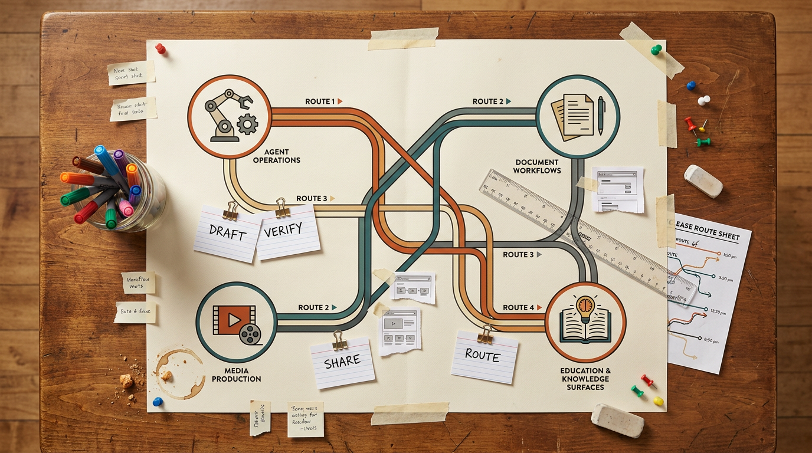

# 2026-08-21 · 공개 전환이 덜 끝나도 작업 흐름은 또렷해진다 · 릴리스 40건

<section class="release-infographic">
  <figure class="release-infographic__figure">
    
    <figcaption>이번 40선은 대시보드 한 장보다, 여러 작업 흐름을 한 장의 노선도처럼 다시 꺼내 쓰고 검토하고 공유하는 편집 데스크 감각이 중요해지고 있음을 보여준다.</figcaption>
  </figure>
  

    
Release 40 Route Desk

    
이번 인포그래픽은 종이 위의 노선도처럼 에이전트 운영, 문서 자동화, 미디어 제작, 교육·지식화 흐름이 서로 교차하고 다시 합류하는 장면으로 다시 설계했다. 지난 글의 스택형 구조가 아니라, 사람이 직접 표시하고 검토하며 공유 경로를 잡는 편집 데스크형 구도다.

    <ul class="release-infographic__points">
      <li><strong>노선도형 구조</strong> 이번 흐름의 핵심은 하나의 중앙 허브가 아니라, 여러 작업축이 교차하며 다시 이어지는 재사용 경로다.</li>
      <li><strong>아날로그 편집 감각</strong> 카드, 클립, 자, 핀, 메모 조각이 함께 보여서 큐레이션이 실제 손을 타는 작업 자산처럼 읽힌다.</li>
      <li><strong>교차 지점 강조</strong> 에이전트 운영, 문서 워크플로, 미디어 제작, 교육·지식면이 따로 노는 게 아니라 중간 경유지를 공유한다는 점이 드러난다.</li>
      <li><strong>공유 경로 시점</strong> 중요한 것은 모델 이름보다 어떤 경로를 먼저 검토하고, 무엇을 다음에 공유할지 정하는 순서다.</li>
    </ul>
  

</section>

이번에 받은 <strong>「최근 AI·기술 동향 학습 큐레이션 40」</strong>은 단순한 링크 꾸러미가 아니었다. 40개를 훑어보면 “새 모델이 또 나왔다”는 수준보다, <strong>AI를 실제 업무 흐름에 어떻게 붙이고 다시 쓰게 만들 것인가</strong>라는 질문이 훨씬 강하게 반복된다. 에이전트는 채팅창을 넘어 운영 구조로 가고 있고, 문서 자동화는 한글 실무 파일 안쪽으로 들어오고 있으며, 미디어 생성은 결과물 한 장보다 제작 파이프라인 쪽으로 이동하고 있다.

이 글에서 더 중요한 것은, 이런 변화가 각기 따로 일어나는 것이 아니라는 점이다. 에이전트 운영, 문서 검색, 음성·영상 제작, 교육용 지식면 구축이 결국 하나의 흐름으로 연결된다. <strong>자료를 모으고, 구조화하고, 다시 실행 가능한 형태로 돌려쓰는 것</strong>. 이번 40선은 바로 그 작업 방식이 요즘 AI 활용의 중심으로 올라오고 있음을 보여준다.

그래서 이번 글은 “요즘 뜨는 링크 40개”보다, <strong>최근 흐름을 읽고 다음에 다시 꺼내 쓸 수 있는 링크 자산을 어떻게 구분할 것인가</strong>에 초점을 맞춰 읽는 편이 맞다. 마지막의 원본 링크와 LilysAI 공개 링크 표도 단순 부록이 아니라, 이 흐름을 실제로 다시 사용할 수 있게 붙여둔 실행판으로 봐야 한다.

## 먼저 결론

- 이번 40선의 핵심은 새 AI 이름이 아니라 <strong>연결 구조와 재사용 구조</strong>다.
- 가장 강하게 커진 축은 `에이전트 운영`, `실무 문서 자동화`, `미디어 제작 파이프라인`, `교육·개인지식면` 네 갈래다.
- 좋은 자료를 많이 모으는 것보다, <strong>무엇을 지금 바로 공유할 수 있고 무엇은 아직 검증 대기인지</strong>를 분리해 두는 운영 감각이 더 중요해졌다.
- 그래서 마지막 링크 표는 단순 저장소가 아니라, <strong>본문에서 읽은 흐름을 바로 다시 따라가게 만드는 실행 레이어</strong>여야 한다.

## 이번 40선에서 먼저 읽히는 최근 흐름

### 1) 에이전트 경쟁은 모델 경쟁보다 운영 구조 경쟁으로 옮겨가고 있다

Auto Research, Oh My Hermes, Grok Bot, Claude Skill, Graph Engineering, Meta MCP, claude-scaffold, book-to-skill 같은 항목을 함께 놓고 보면 공통점이 뚜렷하다. 관심의 중심이 “어느 모델이 더 똑똑하냐”에서 “어떻게 연결하고, 분업시키고, 재사용하게 만들 것이냐”로 이동했다.

- 단일 채팅창보다 멀티에이전트 운영
- 프롬프트 한 번보다 스킬과 MCP
- 모델 성능 비교보다 하네스, 라우팅, 역할 분리

이건 꽤 큰 변화다. 이제 에이전트는 답변기라기보다 <strong>작업을 굴리는 운영면</strong>으로 읽힌다. 그래서 이번 카테고리의 좋은 링크는 “기능 소개 영상”보다 “어떻게 연결되는지 보여주는 자료”일수록 가치가 크다.

### 2) 문서 자동화는 요약보다 한국어 실무 파일 병목을 줄이는 쪽으로 내려온다

kayatext, Korean Law MCP, 세컨드브레인 구축, 강의영상·한글 파일 검색, 정부 공공데이터 활용, 구글시트 대시보드, 알한글 같은 링크는 서로 달라 보여도 한 방향을 가리킨다. AI가 멋있게 정리해주는지를 넘어서, <strong>실제 파일을 다시 찾고 다시 쓰는 비용을 줄이는가</strong>가 더 중요해졌다.

- 한글 문서에서 텍스트를 꺼내기
- 법령과 계약서 검토 흐름에 AI를 붙이기
- 영상·강의·문서·영수증을 검색 가능한 상태로 만들기
- 공공데이터를 바로 업무용 대시보드로 연결하기

즉 문서 자동화의 무게중심은 “예쁘게 요약”이 아니라 <strong>실무 파일 안쪽의 검색·정리·재활용 병목 제거</strong> 쪽으로 옮겨가고 있다.

### 3) 미디어 생성은 단발 결과물보다 제작 파이프라인을 자산화하는 방향으로 간다

나레이션 붙는 숏폼, 무료 GPU 음성 생성, 화이트보드 애니메이션 자동화, Fish Audio, ElevenLabs MCP 계열은 모두 텍스트 생성의 바깥으로 나가 있다. 지금 중요한 것은 이미지 한 장이 아니라, <strong>목소리·자막·장면·배포까지 이어지는 제작 순서</strong>를 얼마나 안정적으로 반복할 수 있는가다.

그래서 이 묶음에서 진짜 눈여겨볼 것은 “결과가 신기하다”는 감탄보다, <strong>내 컴퓨터가 아닌 외부 GPU를 쓰는 방식</strong>, <strong>음성과 자막을 어떻게 붙였는지</strong>, <strong>어떤 자동화 순서로 영상을 뽑았는지</strong> 같은 작업 절차다. 앞으로는 이 절차를 가진 사람이 더 오래 앞서간다.

### 4) 교육용 AI와 세컨드 브레인은 결국 ‘질문 가능한 개인 지식면’으로 합쳐진다

Gemini Spark, Google Drive 소스 자동 추가, 세컨드브레인, 강의영상 검색, 한글 파일 검색은 따로 보면 교육 도구와 생산성 도구처럼 나뉘어 보인다. 그런데 실제로는 하나의 질문으로 합쳐진다. <strong>내 자료를 AI가 다시 설명하고 연결할 수 있는 상태로 바꿀 수 있는가</strong>.

- 자료를 모은다
- 텍스트화한다
- 질문 가능한 상태로 만든다
- 수업이나 업무에 다시 붙인다

이 흐름은 교육자에게만 중요한 게 아니다. 앞으로는 개인 자료를 검색 가능한 지식면으로 만드는 사람이 AI를 더 깊게 쓴다.

## 카테고리별로 다시 보면 무엇을 먼저 챙겨야 하나

### 에이전트 운영

먼저 볼 만한 것은 Auto Research, Oh My Hermes, Graph Engineering, Meta MCP, claude-scaffold다. 이 그룹은 새 툴을 소개하는 데서 끝나지 않고, <strong>에이전트를 어떤 구조로 굴릴 것인가</strong>를 보여준다.

### 문서·실무 자동화

kayatext, Korean Law MCP, 세컨드브레인, 공공데이터, 구글시트, 알한글이 핵심 축이다. 이 그룹은 “실제 현장 파일을 다루는 AI”라는 공통점으로 묶어 읽어야 흐름이 선명하다.

### 미디어 제작 파이프라인

무료 GPU 음성 생성, 숏폼 나레이션, 화이트보드 애니메이션, ElevenLabs MCP, Fish Audio 계열을 함께 봐야 한다. 이 묶음은 <strong>생성 결과보다 제작 루프</strong>를 읽는 데 가치가 있다.

### 교육·개인지식면

Gemini Spark, Notebook 소스 연결, 강의영상 검색, 세컨드브레인 구축은 “지식 저장”이 아니라 “질문 가능한 수업·업무 환경”으로 읽어야 한다.

## 마지막 링크 표는 어떻게 읽어야 하나

여기서 마지막 표는 단순 참고자료가 아니다. 본문에서 읽은 흐름을 실제 링크로 다시 따라가게 만드는 실행판이다. 먼저 에이전트 운영과 문서 자동화 축에서 관심 있는 항목을 고르고, 그다음 미디어 제작이나 교육·지식화 쪽으로 넓혀 보는 순서가 자연스럽다.

### 먼저 보면 좋은 링크

- 에이전트 운영: Auto Research, Oh My Hermes, Graph Engineering, Meta MCP, claude-scaffold
- 문서·실무 자동화: kayatext, Korean Law MCP, 세컨드브레인, 공공데이터, 구글시트
- 미디어 제작: 무료 GPU 음성 생성, 숏폼 나레이션, 화이트보드 애니메이션, ElevenLabs MCP
- 교육·개인지식면: Gemini Spark, 강의영상 검색, Notebook 소스 연결, 세컨드브레인

이 기준으로 표를 보면 “어떤 링크를 나중에 다시 써야 하는가”가 훨씬 빨리 잡힌다.

## 복사용 링크 표

| 분야 | 주제 | 제목 | 원본 링크 | 릴리스 공개 링크 |
|---|---|---|---|---|
| 에이전트 운영 | 1. 안드레 카파시의 Auto Research AI Agent 소개 [1] | 자는 동안에도 최고의 모델을 찾아내는 Agent 만들기 \| Auto Research | [원본](https://www.youtube.com/watch?v=KlzWWGIdlZs) | [릴리스AI 요약](https://lilys.ai/digest/11048798/13006598?s=1) |
| 에이전트 운영 | 1. 챗GPT와 코덱스의 차이점 및 챗GPT 코딩의 한계 [1] | 챗GPT 알뜰하게 본전 뽑는 방법 \| 바이브코딩 | [원본](https://www.youtube.com/watch?v=dKQQs-z_E64) | [릴리스AI 요약](https://lilys.ai/digest/11048526/13006277?s=1) |
| 에이전트 운영 | 1. 개요 | Oh My Hermes 사용법: Hermes Agent 메모리·스킬·모델 라우팅 전부 딸깍! | [원본](https://www.youtube.com/watch?v=wNZkp9fvW0E) | - |
| 에이전트 운영 | 1. AI 에이전트 시대의 도래와 주요 에이전트 소개 [1] | 이제 AI 에이전트가 대신하는 시대! Grok Bot vs Buzz vs Hermes 비교! | [원본](https://www.youtube.com/watch?v=UMDSNYu7iNU) | - |
| 문서·실무 자동화 | kayatext | GitHub - kjh0523/kayatext: 한글(HWP)·엑셀·워드 문서에서 AI 가 읽을 텍스트를 뽑습니다. | [원본](https://github.com/kjh0523/kayatext) | [릴리스AI 요약](https://lilys.ai/digest/11037231/12991429?s=1) |
| 미디어 제작 | 목소리에 착 붙는 숏폼,오늘 하나 만들어 봅니다 | 나레이션 붙는 숏폼 | [원본](https://remotion-shorts-guide.vercel.app/) | - |
| 웹·앱 제작 | 1. 개발 지식 없이 클로드로 예약 시스템 구축하기 [1] | 개발 1도 몰라도 됩니다. 예약 시스템 무료로 만드는 법 \| 클로드 웹사이트 2탄 | [원본](https://www.youtube.com/watch?v=lCJ5_vWCVpg) | [릴리스AI 요약](https://lilys.ai/digest/11026169/12977235?s=1) |
| 문서·실무 자동화 | 1. 클로드(Claude)와 코리안 로우 MCP(Korean Law MCP)를 활용한 법률 업무 효율화 [1] | 클로드 계약서 검토부터 내용증명 까지 \| Claude code 한국 법령 MCP 실전 활용 \| Korean Law MCP | [원본](https://www.youtube.com/watch?v=z-cxE0yus4g) | - |
| 에이전트 운영 | 1. AI 스킬의 등장 배경 및 필요성 [1] | 요즘 AI 바이브코딩 고수들이 스킬을 쓰는 이유 | [원본](https://www.youtube.com/watch?v=dsP4AR6lFUQ) | [릴리스AI 요약](https://lilys.ai/digest/11025412/12976339?s=1) |
| 교육·개인지식면 | 1. 세컨드 브레인, 만들고 나서 무엇을 해야 하는가 [1] | 세컨드브레인 만들기 \| 클로드 코드로 한글파일·강의영상까지 검색 (코딩 없이 4분) | [원본](https://www.youtube.com/watch?v=MoYGM-HZc2I) | - |
| 미디어 제작 | 1. 유료 AI 음성 서비스의 한계와 대안의 필요성 [1] | 내 목소리 AI, 제 컴퓨터에 설치했습니다 (무료·무제한·상업이용 OK) | [원본](https://www.youtube.com/watch?v=UzzTPBvOmaA) | - |
| 미디어 제작 | 1. 내 컴퓨터가 아닌 외부 GPU로 AI 음성 생성하기 [1] | 클로드 코드한테 시켰더니 무료 GPU로 제 목소리를 뽑아왔습니다 | [원본](https://www.youtube.com/watch?v=aTtnuVokUNk) | [릴리스AI 요약](https://lilys.ai/digest/11025290/12976198?s=1) |
| 문서·실무 자동화 | 1. AI가 답하지 못하는 질문, 공공데이터로 해결하다 [1] | 정부가 공짜로 푸는 데이터 11,915개, 뭘 할 수 있는지 직접 만들어봤습니다 | [원본](https://www.youtube.com/watch?v=Ifq0Yt7Thzc) | [릴리스AI 요약](https://lilys.ai/digest/11025056/12975861?s=1) |
| 에이전트 운영 | 1. AI 엔지니어링 패러다임의 진화 소개 [1] | Graph 엔지니어링 쉽게 설명해드림 - AI 엔지니어링 패러다임의 진화 🚀 | [원본](https://www.youtube.com/watch?v=MRTFz8Bust0) | - |
| 보안·운영 | 1. AI 앱 보안 사고의 심각성 및 주요 원인 [1] | AI로 만들 앱이 털릴 수 밖에 없는 이유 | [원본](https://www.youtube.com/watch?v=UzsLfQjpXJw) | - |
| 웹·앱 제작 | 1. AI 시대의 바이브 코딩과 레버리지 [1] | 3시간 순삭) 55개 기술 의사결정, 소스코드 해설까지! 현존 바이브코딩 기본 강의 중 가장 실전적인 강의 | [원본](https://www.youtube.com/watch?v=K6Rsy-pHBi0) | [릴리스AI 요약](https://lilys.ai/digest/11024716/12975424?s=1) |
| 교육·개인지식면 | 1. AI 지능 활용 방식의 변화: '빌려 쓰는 지능'에서 '나만의 AGI' 구축으로 [2] | 상위 0.1% 직행! AI에 내 지식을 쌓는 방법 현장 강의 (시연, 개념 전체 포함) | [원본](https://www.youtube.com/watch?v=21qi89gSy-A) | [릴리스AI 요약](https://lilys.ai/digest/11024634/12975336?s=1) |
| 교육·개인지식면 | 1. 인공지능 시대, 출발선이 다시 제로가 되다 [1] | [시즌 3] 인공지능 시대에는 어떻게 공부를 해야 할까? 사람은 정말로 필요 없는 걸까? | [원본](https://www.youtube.com/watch?v=IiKkUFQTFvQ) | [릴리스AI 요약](https://lilys.ai/digest/11024539/12975220?s=1) |
| 웹·앱 제작 | 1. AI를 활용한 RPG 게임 개발 소개 [1] | [시즌 3] 클로드 코드 + 코덱스로 RPG 게임 만들기 | [원본](https://www.youtube.com/watch?v=_IyVJ7ZD9H4) | - |
| 미디어 제작 | 1. AI 화이트보드 애니메이션 영상 자동화 소개 [1] | 코덱스로 AI 화이트보드 애니메이션 영상 자동화 만들기(무료 오픈소스 대공개) | [원본](https://www.youtube.com/watch?v=aelyPpDGiZQ) | - |
| 에이전트 운영 | 🕷️ ScrapeGraphAI: You Only Scrape Once | GitHub - ScrapeGraphAI/Scrapegraph-ai: Python scraper based on AI · GitHub | [원본](https://github.com/ScrapeGraphAI/Scrapegraph-ai) | [릴리스AI 요약](https://lilys.ai/digest/11024017/12974585?s=1) |
| 미디어 제작 | 목소리에 착 붙는 숏폼,오늘 하나 만들어 봅니다 | 나레이션 붙는 숏폼 | [원본](https://remotion-shorts-guide.vercel.app/) | - |
| 미디어 제작 | /watch | Claude Video | [원본](https://github.com/bradautomates/claude-video) | - |
| 미디어 제작 | 1. ElevenLabs MCP, Claude에 통합: 음성 및 채팅 에이전트 관리의 새로운 시대 [1] | Introducing the ElevenLabs MCP, now available in Claude. | [원본](https://www.youtube.com/watch?v=wHTkD5eagGU) | - |
| 교육·개인지식면 | 1. Google Workspace Studio를 활용한 Gemini Notebook 소스 자동 추가 기능 [1] | Automatically Add Google Drive Sources to Gemini Notebook | [원본](https://www.youtube.com/watch?v=wz2QRwV0lVQ) | - |
| 에이전트 운영 | Connect AI Agents to Meta with MCP | Connect AI Agents to Meta with MCP \| Developer Documentation | [원본](https://developers.facebook.com/documentation/mcp) | [릴리스AI 요약](https://lilys.ai/digest/10992155/12936318?s=1) |
| 마케팅 자동화 | 1. AI 시대, 마케터의 역할 변화와 생산성 혁신 [1] | "AI는 실행하고, 마케터는 결정합니다" 15년차 퍼포먼스 마케터가 공개한 12단계 자동화 (김형태 대표, 데일리그로스) | [원본](https://www.youtube.com/watch?v=FZzxy_0FT0o) | - |
| 교육·개인지식면 | 1. AI 활용의 변화와 실제 시간 및 비용 절약 사례 [1] | 2026 최신 AI 사용법｜ChatGPT·Gemini, 제가 실제로 잘 쓰는 기능 10가지 | [원본](https://www.youtube.com/watch?v=7TbZ6KweVFs) | - |
| 에이전트 운영 | 1. Grokbot 소개: AI 에이전트의 새로운 지평 [1] | Cursor에서 방금 출시한 Grok Bot (매우 쉬운 AI 에이전트) | [원본](https://www.youtube.com/watch?v=QTcZPI-g7is) | - |
| 웹·앱 제작 | 1. 개요 | Claude Opus 5로 수준 높은 Three.js 웹사이트를 구축하는 방법 | [원본](https://www.youtube.com/watch?v=G-F5Qvy-7KM) | [릴리스AI 요약](https://lilys.ai/digest/10984632/12933699?s=1) |
| 문서·실무 자동화 | 서초바탕 (Seocho Batang) | 서초바탕체: 법원 판결문에 사용하는 글자체를 오마주하여 만듦 | [원본](https://github.com/iwantanid/SeochoBatang-Font) | [릴리스AI 요약](https://lilys.ai/digest/10983394/12924972?s=1) |
| 문서·실무 자동화 | Alhangeul | 알한글: macOS에서 HWP 시용하는 오픈소스 앱 | [원본](https://github.com/postmelee/alhangeul-macos) | - |
| 교육·개인지식면 | 1. AI 기반 학습 도구 및 게임 개발 현황 공유 [1] | 8월15일 줌세미나 영상(코너속의코너, Seedance2.5, Three.js+WebGL2, Fish audio, 회원님들의 게임제작현황) | [원본](https://www.youtube.com/watch?v=0s-orFa2oRw) | [릴리스AI 요약](https://lilys.ai/digest/10972641/12911061?s=1) |
| 에이전트 운영 | book-to-skill | book-to-skill | [원본](https://github.com/virgiliojr94/book-to-skill) | [릴리스AI 요약](https://lilys.ai/digest/10960473/12895147?s=1) |
| 에이전트 운영 | claude-scaffold | Claude Code가 마치 규칙을 아는 팀원 처럼 작동하도록 돕는다. | [원본](https://github.com/LeeYudok/claude-scaffold) | [릴리스AI 요약](https://lilys.ai/digest/10960453/12895122?s=1) |
| 에이전트 운영 | 1. Grok Bot의 주요 특징 및 장점 [1] | Grok Bot 너무 좋습니다. Hermes, Openclaw 다 지웠어요. | [원본](https://www.youtube.com/watch?v=MzObKXUaSbc) | [릴리스AI 요약](https://lilys.ai/digest/10960404/12895055?s=1) |
| 문서·실무 자동화 | 1. 구글 시트와 무료 Gemini를 활용한 실시간 대시보드 구축 [1] | 와.. 이제 구글시트가 앱이 됩니다! \| 무료 Gemini로 실시간 대시보드 만드는 법 | [원본](https://www.youtube.com/watch?v=XSsKjS1z7Yg) | [릴리스AI 요약](https://lilys.ai/digest/10960394/12895044?s=1) |
| 에이전트 운영 | PolarBears's Story | 진짜 매일 쓰는 Claude Skill 3개 (꾸준히 쓰는 이유) | [원본](https://www.youtube.com/watch?v=VABNRP-S124) | - |
| 에이전트 운영 | 코드팩토리 | Grok 4.6 너무 저렴한데 이정도로 잘한다고? | [원본](https://www.youtube.com/watch?v=QzOzVIMuFhk) | - |
| 교육·개인지식면 | 필로소피 AI 교육 | 교육자분들을 위한 Gemini Spark 활용법 (출시는 조금 늦었지만, 역시나 저력이 있는 Gemini) | [원본](https://www.youtube.com/watch?v=YJ8G1h23THg) | - |

## 마무리

이번 40개를 한 문장으로 줄이면 이렇다.

> 이제 중요한 건 새 AI 도구를 빨리 아는가보다, 그 도구를 실제 작업 구조와 자료 흐름 속에서 얼마나 다시 쓰이게 만들 수 있느냐에 더 가깝다.

그래서 이 글은 링크를 많이 모아두는 데서 끝나지 않고, <strong>어떤 흐름이 커지고 있는지</strong>, <strong>어떤 자료가 실무에 바로 닿는지</strong>, <strong>어떤 제작 루프가 자산이 되는지</strong>를 읽어내는 쪽에서 가치가 있다. 마지막 표의 원본 링크와 릴리스AI 공개 링크도 그런 흐름을 다시 따라가기 위한 출발점으로 보면 된다.
