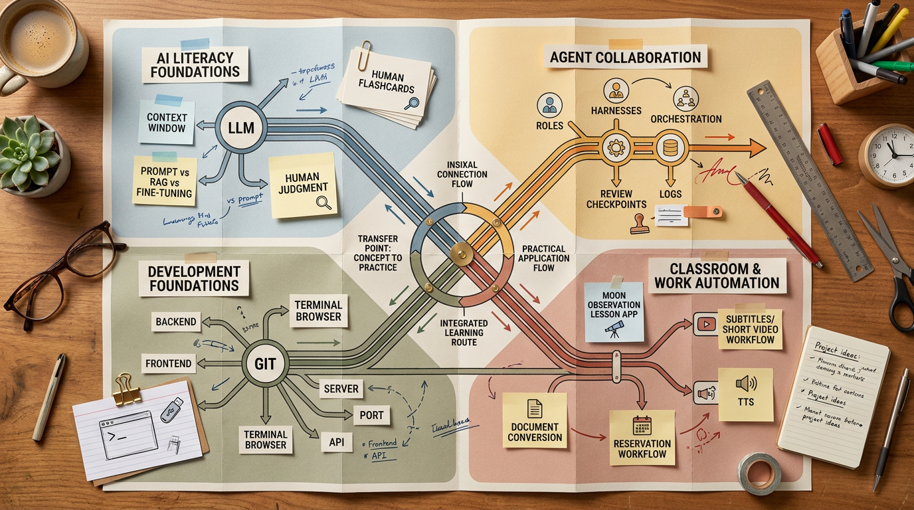

# 2026-08-29 · 개념 이해는 협업 구조와 교실 자동화로 이어진다 · 릴리스 40건

<section class="release-infographic">
  <figure class="release-infographic__figure">
    
    <figcaption>이번 40선은 새 도구를 많이 아는 경쟁보다, 개념을 이해하고 협업 구조를 세우고 현장 자동화까지 이어 붙이는 학습 경로를 한 장의 노선도처럼 관리하는 감각이 중요해졌음을 보여준다.</figcaption>
  </figure>
  

    
Release 40 Learning Routes

    
이번 인포그래픽은 교사 책상 위의 학습 노선도처럼 <code>AI 개념 이해</code>, <code>에이전트 협업</code>, <code>개발 기반</code>, <code>수업·업무 자동화</code>가 순서대로만 흐르지 않고 중간중간 환승하며 다시 연결되는 장면으로 설계했다. 같은 <code>종이 노선도형 편집 데스크</code> 계열이지만, 이번 글의 내용에 맞춰 교실과 작업면이 함께 보이는 학습 경로형 구도로 다시 잡았다.

    <ul class="release-infographic__points">
      <li><strong>개념 출발역</strong> 이번 흐름의 첫 칸은 모델 이름이 아니라 LLM, 컨텍스트, 인간 판단 같은 기초 문해력이다.</li>
      <li><strong>협업 환승 지점</strong> 에이전트와 하네스는 마법 기능이 아니라 역할 분담, 검수, 기록 설계의 문제로 이어진다.</li>
      <li><strong>기반 선로</strong> Git, 브라우저, 서버, 백엔드, 프론트엔드 개념이 있어야 바이브코딩이 안전한 결과물로 내려온다.</li>
      <li><strong>현장 종착역</strong> 수업 웹앱, 자막 영상, 문서 변환, 예약 시스템 같은 실제 마찰 감소가 마지막 판단의 기준이 된다.</li>
    </ul>
  

</section>

이번에 받은 <strong>「최근 40개 노트 학습팩」</strong>은 단순한 AI 도구 목록보다 훨씬 교육적이었다. 처음 몇 개를 보면 LLM의 학습 원리, 프롬프트와 RAG와 파인튜닝의 차이, AI 시대에도 남는 인간의 판단이 먼저 나오고, 그 다음에는 에이전트 협업과 하네스, Git과 터미널 브라우저, 서버와 포트, 마지막에는 달 관찰 수업 웹앱과 자막 영상, 예약 시스템 같은 현장 자동화 사례로 내려간다.

즉 이번 40선은 “무엇이 새로 나왔나”보다 <strong>어떻게 배우면 실제 문제 해결까지 끊기지 않나</strong>를 보여주는 묶음에 가깝다. 개념을 먼저 이해하고, 협업 구조를 보고, 만드는 사람의 기반을 익히고, 마지막에 교실과 업무의 반복 마찰을 줄이는 곳까지 내려가는 순서가 또렷하다.

그래서 이번 글은 링크를 분야별로 단순 분류하기보다, <strong>교사와 비개발자가 AI를 배워서 바로 써먹는 학습 경로</strong>로 읽는 편이 맞다. 마지막의 원본 링크와 LilysAI 공개 링크 표도 그냥 저장용 표가 아니라, 이 경로를 다시 따라가게 만드는 실행판으로 봐야 한다.

## 먼저 결론

- 이번 40선의 핵심은 새 툴 수집보다 <strong>기초 개념에서 현장 자동화까지 이어지는 학습 경로</strong>다.
- 가장 선명한 축은 `AI 리터러시`, `에이전트 협업`, `바이브코딩 기반`, `수업·업무 자동화` 네 갈래다.
- 에이전트와 바이브코딩이 중요해 보여도, 실제로는 <strong>Git·서버·검수·인간 판단</strong> 같은 바닥 개념이 함께 올라와야 결과가 안정된다.
- 마지막 링크 표는 많이 모은 자료 창고가 아니라, <strong>배움의 순서를 다시 따라가게 하는 실행 레이어</strong>여야 한다.

## 이번 40선에서 먼저 읽히는 최근 흐름

### 1) AI 학습은 이제 도구 소개보다 개념 선택 기준을 먼저 묻는다

이번 묶음의 출발점이 LLM 원리, 컨텍스트 윈도우, 인간성, 질문 전 사고 습관이라는 점은 꽤 중요하다. 이건 단순한 입문론이 아니라, 앞으로 어떤 도구를 골라도 흔들리지 않는 기준을 먼저 세우자는 흐름에 가깝다.

- 프롬프트로 충분한가
- RAG가 필요한가
- 반복 행동과 비용 최적화 때문에 파인튜닝이 필요한가
- AI 답을 받기 전에 사람이 먼저 생각해야 할 질문은 무엇인가

즉 이번 카테고리는 “AI를 잘 쓰는 법”보다 <strong>어떤 문제에 어떤 접근을 택할 것인가</strong>를 배우는 쪽으로 무게가 실려 있다.

### 2) 에이전트는 자동화 쇼보다 역할 분담과 기록 구조로 읽혀야 한다

Buzz, Hermes Bot Mode, Deepseek Harness, Oh My Hermes, Auto Research, Grok Bot 비교, Korean Law MCP를 한 줄에 놓아 보면 공통점이 드러난다. 핵심은 AI가 똑똑해졌다는 감탄보다, <strong>누가 조사하고 누가 실행하고 누가 검수할지를 어떻게 나누느냐</strong>다.

- 협업 툴은 대화창이 아니라 역할 분리판이다
- 하네스는 모델 몸통이 아니라 통제 가능한 작업 환경이다
- 기록과 검수 없이는 자동화가 늘수록 책임이 흐려진다

그래서 이번 묶음의 에이전트 자료는 “무엇을 대신해 준다”보다 “어떻게 안전하게 맡길 것인가”를 보여주는 자료일수록 더 오래 남는다.

### 3) 바이브코딩은 감각이 아니라 Git·브라우저·서버 이해 위에서 안정된다

이번 40선에는 Git 입문, terminal-browser, manifest, DURU, paperthin, 서버와 포트, 백엔드와 프론트엔드 개념, SaaS 제작기, 로컬 코딩 에이전트, 예약 시스템 구축까지 한 덩어리로 들어 있다. 이 묶음이 말하는 건 단순하다. <strong>AI가 코드를 많이 써줘도, 사람 쪽 기반 개념이 없으면 결과를 다룰 수 없다</strong>.

- Git은 되돌릴 수 있는 작업 안전장치다
- 브라우저와 터미널 도구는 실행 결과를 바로 확인하는 창이다
- 서버·포트·백엔드·프론트엔드는 화면 뒤에서 무슨 일이 벌어지는지 설명하는 언어다

이 흐름 덕분에 바이브코딩이 “신기한 생성”에서 “작게라도 유지 가능한 제작” 쪽으로 내려온다.

### 4) 수업·콘텐츠·업무 자동화는 결국 교사의 판단을 남기는 형태로 수렴한다

달 관찰 수업 웹앱, AppSheet 팁, Airy Studio, MoneyPrinterTurbo, 화이트보드 자막 애니메이션, 나레이션 숏폼, 장애인 주간활동 관리, 예약 시스템 같은 항목은 서로 멀어 보이지만 공통 메시지가 있다. 자동화의 끝은 화려한 생성물이 아니라, <strong>반복되는 준비와 전달과 정리의 마찰을 줄이고 마지막 판단은 사람에게 남기는 것</strong>이다.

- 수업 자료는 학생 참여와 과제 수합까지 이어질 때 힘이 생긴다
- 영상 자동화는 자막·음성·장면·배포 순서를 줄일 때 가치가 커진다
- 업무 자동화는 보고서, 예약, 알림, 기록처럼 누적되는 반복에서 가장 먼저 빛난다

그래서 이번 40선은 AI가 교사를 대체한다기보다, <strong>교사의 시간을 더 판단적인 일에 남겨두는 방향</strong>으로 읽어야 맞다.

## 카테고리별로 다시 보면 무엇을 먼저 챙겨야 하나

### LLM·AI 리터러시와 교육

LLM 원리 강의, 질문 전 사고 습관, 인간성, 컨텍스트 윈도우를 먼저 보면 이후 도구 선택의 기준이 선다. 이 축은 전체 40선을 읽는 해설 키에 가깝다.

### AI 에이전트·협업·오케스트레이션

Buzz, Hermes Bot Mode, Deepseek Harness, Oh My Hermes, Auto Research, Grok Bot 비교, Korean Law MCP가 핵심이다. 이 그룹은 에이전트를 기능이 아니라 협업 구조로 읽게 만든다.

### 바이브코딩·Git·개발 워크플로와 인프라

Git, manifest, terminal-browser, DURU, paperthin, 서버·백엔드·프론트엔드 개념을 함께 봐야 한다. 이 그룹은 비개발자도 작은 결과물을 안정적으로 다루게 만드는 바닥 공사에 가깝다.

### 수업·콘텐츠·업무 자동화

달 관찰 수업 웹앱, TTS, AppSheet, 자막 애니메이션, 숏폼, 예약 시스템, 보고서 자동화가 이 축의 핵심이다. 이 그룹은 “AI로 무엇을 만들 수 있나”보다 “현장의 반복 마찰을 어디서 먼저 줄일 수 있나”를 보여준다.

### 생활·기기 관리

아이클라우드 관리처럼 다소 옆으로 보이는 항목도 있다. 하지만 이런 자료는 결국 AI를 더 사는 방향보다 <strong>이미 가진 기기와 저장 공간을 정리해 실제 생활의 마찰을 줄이는 흐름</strong>을 보여준다는 점에서 보조 축으로 의미가 있다.

## 마지막 링크 표는 어떻게 읽어야 하나

여기서 마지막 표는 단순 참고자료가 아니다. 먼저 `LLM·AI 리터러시`에서 기준을 세우고, 그다음 `에이전트 협업`과 `바이브코딩 기반`으로 넘어간 뒤, 마지막에 `수업·업무 자동화` 쪽으로 내려오는 순서로 보면 이번 학습팩의 의도가 더 또렷해진다.

### 먼저 보면 좋은 링크

- 기준 세우기: LLM 원리 강의, 질문 전 사고 습관, 컨텍스트 윈도우, 인간성
- 협업 구조 읽기: Buzz, Hermes Bot Mode, Deepseek Harness, Oh My Hermes, Auto Research
- 기반 다지기: Git과 GitHub, terminal-browser, manifest, 서버와 포트, 백엔드 3요소, 프론트엔드 로드맵
- 현장 적용 보기: 달 관찰 수업 웹앱, AppSheet, 나레이션 숏폼, 예약 시스템, 화이트보드 자막 애니메이션

이 순서로 표를 보면 “이번 40선을 어떻게 공부해야 하나”가 링크 목록보다 훨씬 빠르게 잡힌다.

## 복사용 링크 표

| 카테고리 | 주제 | 제목 | 원본 링크 | 릴리스 공개 링크 |
|---|---|---|---|---|
| LLM·AI 리터러시와 교육 | LLM | LLM 신경망 학습부터 추론 원리 전체를 비개발자 15명에게 설명하는 강의 | [원본](https://www.youtube.com/watch?v=geY4UO23QA8) | [릴리스AI 요약](https://lilys.ai/digest/11145832/13132508?s=1) |
| AI 에이전트·협업·오케스트레이션 | AI 에이전트 | 슬랙을 오픈소스로 풀어버린 Buzz. AI와 휴먼의 협업 툴 | [원본](https://www.youtube.com/watch?v=m3JEiSQcagg) | [릴리스AI 요약](https://lilys.ai/digest/11145590/13132192?s=1) |
| 바이브코딩·Git·개발 워크플로 | 바이브코딩 | learnstead/guides/git-for-vibe-coders/README.md at main · kyungseo/learnstead · GitHub | [원본](https://github.com/kyungseo/learnstead/blob/main/guides/git-for-vibe-coders/README.md) | [릴리스AI 요약](https://lilys.ai/digest/11133224/13115753?s=1) |
| 바이브코딩·Git·개발 워크플로 | 바이브코딩 | GitHub - mnfst/manifest: Connect Your Agents And Harnesses With Any Provider 🦚 · GitHub | [원본](https://github.com/mnfst/manifest) | [릴리스AI 요약](https://lilys.ai/digest/11129293/13110304?s=1) |
| 바이브코딩·Git·개발 워크플로 | 바이브코딩 | GitHub - zenbu-labs/terminal-browser: A browser inside your terminal · GitHub | [원본](https://github.com/zenbu-labs/terminal-browser) | [릴리스AI 요약](https://lilys.ai/digest/11128216/13108716?s=1) |
| 바이브코딩·Git·개발 워크플로 | 바이브코딩 | GitHub - zenbu-labs/terminal-browser: A browser inside your terminal · GitHub | [원본](https://github.com/zenbu-labs/terminal-browser) | [릴리스AI 요약](https://lilys.ai/digest/11128215/13108702?s=1) |
| 바이브코딩·Git·개발 워크플로 | 바이브코딩 | Git과 GitHub 완벽 정리 ｜ 비개발자가 놓치는 핵심 3가지 | [원본](https://www.youtube.com/watch?v=Y8lGdEyNv-M) | [릴리스AI 요약](https://lilys.ai/digest/11125964/13105699?s=1) |
| 바이브코딩·Git·개발 워크플로 | 바이브코딩 | GitHub - Leonxlnx/taste-skill: Taste-Skill - gives your AI good taste. stops the AI from generating | [원본](https://github.com/Leonxlnx/taste-skill) | [릴리스AI 요약](https://lilys.ai/digest/11116334/13092820?s=1) |
| 수업·콘텐츠·업무 자동화 | 수업 | 🌙바로 배워서 바로 써먹는 바이브코딩 - 달 관찰 수업 웹앱 만들었습니다!｜달 시뮬레이션·학습지 생성·과제 수합까지 한 번에 | [원본](https://www.youtube.com/watch?v=6rP4VhsmS9k) | [릴리스AI 요약](https://lilys.ai/digest/11116309/13092793?s=1) |
| 바이브코딩·Git·개발 워크플로 | 바이브코딩 | GitHub - leeryong/DURU: DURU — 두루 돕는 AI · 내 PC에 설치해 내 문서를 근거로 답하는 AI 에이전트. 망분리 환경 동작, 지식베이스·에이전트를 암호 | [원본](https://github.com/leeryong/DURU) | [릴리스AI 요약](https://lilys.ai/digest/11115180/13091065?s=1) |
| 바이브코딩·Git·개발 워크플로 | 바이브코딩 | GitHub - LilMGenius/paperthin: Low-level agentic design patterns. Turning old engineering wisdom int | [원본](https://github.com/LilMGenius/paperthin) | [릴리스AI 요약](https://lilys.ai/digest/11114364/13089906?s=1) |
| 수업·콘텐츠·업무 자동화 | 수업 | 구글 플레이 개발자 계정의 신규 주문 또는 환불 내역을 텔레그램으로 알려주는 크롬 확장 프로그램 | [원본](https://github.com/ssk-play/kaching) | [릴리스AI 요약](https://lilys.ai/digest/11106208/13079459?s=1) |
| 웹앱·백엔드·프론트엔드 인프라 | 웹앱 | 멀티플레이어 FPS 게임(Three.js, 바닐라 자바스크립트) | [원본](https://github.com/luckeyfaraday/pastel-nuketown) | [릴리스AI 요약](https://lilys.ai/digest/11100874/13072254?s=1) |
| 웹앱·백엔드·프론트엔드 인프라 | 웹앱 | Release ExamPool HWP 변환기 v0.1.1 · seungyeon980808-pixel/exam_pool · GitHub | [원본](https://github.com/seungyeon980808-pixel/exam_pool/tree/hwp-converter-v0.1.1) | [릴리스AI 요약](https://lilys.ai/digest/11100815/13072186?s=1) |
| 수업·콘텐츠·업무 자동화 | 수업 | GitHub - harry0703/MoneyPrinterTurbo: 利用 AI 大模型和自动化工作流，根据主题或关键词一键生成高清短视频。Generate HD short videos fr | [원본](https://github.com/harry0703/MoneyPrinterTurbo) | [릴리스AI 요약](https://lilys.ai/digest/11100776/13072141?s=1) |
| 수업·콘텐츠·업무 자동화 | 수업 | 무료 TTS 사이트 사용법, 설치 없이 목소리 100개 쓰는 법 (Airy Studio) | [원본](https://www.youtube.com/watch?v=m6x_GUYEnK8) | [릴리스AI 요약](https://lilys.ai/digest/11085613/13053102?s=1) |
| 생활·기기 관리 | 생활 | 돈 더 안써도 됩니다😲 꽉 찬 아이클라우드 용량 + 아이폰 사진 관리! 새로운 해결 방법이 있습니다 | [원본](https://www.youtube.com/watch?v=yFrxjJhX6II) | [릴리스AI 요약](https://lilys.ai/digest/11085608/13053100?s=1) |
| 수업·콘텐츠·업무 자동화 | 수업 | 장애인 주간활동 관리 프로그램 설명(올 해까지 무료) | [원본](https://www.youtube.com/watch?v=n-eqg91jfec) | [릴리스AI 요약](https://lilys.ai/digest/11085595/13053087?s=1) |
| 웹앱·백엔드·프론트엔드 인프라 | 웹앱 | [시즌 3] 유행에서 흔들리지 않는 개념, 서버와 포트 | [원본](https://www.youtube.com/watch?v=8IocgzP6dTI) | [릴리스AI 요약](https://lilys.ai/digest/11085377/13052814?s=1) |
| LLM·AI 리터러시와 교육 | LLM | AI에게 묻기 전 이것부터 하세요. 답의 퀄리티가 확 올라갑니다 (서울대 신종호 교수) | [원본](https://www.youtube.com/watch?v=Hh8nWLhE3YI) | [릴리스AI 요약](https://lilys.ai/digest/11085356/13052790?s=1) |
| 수업·콘텐츠·업무 자동화 | 수업 | Ranking the BEST AppSheet Tricks & Hacks 🏆 ｜ Top 5 | [원본](https://www.youtube.com/watch?v=gGfQrcmKItE) | [릴리스AI 요약](https://lilys.ai/digest/11085335/13052745?s=1) |
| 바이브코딩·Git·개발 워크플로 | 바이브코딩 | 1시간 압축) AI 기술 1도 모르는 초심자가 전문 AI SaaS 구축하는 모든 과정 | [원본](https://www.youtube.com/watch?v=JK1S6FvAdZQ) | [릴리스AI 요약](https://lilys.ai/digest/11085320/13052729?s=1) |
| 바이브코딩·Git·개발 워크플로 | 바이브코딩 | 챗GPT가 내 컴퓨터 상에서 AI 코딩 에이전트로써 작동하게 하는 방법 ｜ 바이브코딩 | [원본](https://www.youtube.com/watch?v=xJQ1pbQyMiw) | [릴리스AI 요약](https://lilys.ai/digest/11085307/13052713?s=1) |
| LLM·AI 리터러시와 교육 | LLM | [이광형의 퍼스펙티브] AI 시대의 교육, ‘불변의 인간성’ 돌아봐야 ｜ 중앙일보 | [원본](https://www.joongang.co.kr/article/25454982) | [릴리스AI 요약](https://lilys.ai/digest/11067296/13030497?s=1) |
| LLM·AI 리터러시와 교육 | LLM | [시즌 3] 유행에서 흔들리지 않는 개념, 컨텍스트 & 컨텍스트 윈도우 | [원본](https://www.youtube.com/watch?v=D82PF9vlSrg) | [릴리스AI 요약](https://lilys.ai/digest/11064531/13027066?s=1) |
| 웹앱·백엔드·프론트엔드 인프라 | 웹앱 | 백엔드 3요소, 딱 이 3개가 전부입니다 제발 외우세요 | [원본](https://www.youtube.com/watch?v=Yg5aMGQv4_0) | [릴리스AI 요약](https://lilys.ai/digest/11064494/13027002?s=1) |
| 웹앱·백엔드·프론트엔드 인프라 | 웹앱 | 비개발자 필수시청. 백엔드는 이거 이상으로 공부하지 마세요. (백엔드 상편) | [원본](https://www.youtube.com/watch?v=nQpcyNtS33k) | [릴리스AI 요약](https://lilys.ai/digest/11064484/13026989?s=1) |
| 웹앱·백엔드·프론트엔드 인프라 | 웹앱 | 프론트엔드 저보다 더 잘 알게 해드림 | [원본](https://www.youtube.com/watch?v=o8C4KDCEudo) | [릴리스AI 요약](https://lilys.ai/digest/11064469/13026964?s=1) |
| AI 에이전트·협업·오케스트레이션 | AI 에이전트 | Hermes Bot Mode 출시! AI 직원끼리 협업 더 쉬워졌습니다 | [원본](https://www.youtube.com/watch?v=blZuddQ196E) | [릴리스AI 요약](https://lilys.ai/digest/11064459/13026941?s=1) |
| AI 에이전트·협업·오케스트레이션 | AI 에이전트 | 8월22일 줌세미나 영상(Deepseek Harness, 코너속의 코너) | [원본](https://www.youtube.com/watch?v=T_tyZ2IDc1s) | [릴리스AI 요약](https://lilys.ai/digest/11064334/13026794?s=1) |
| 수업·콘텐츠·업무 자동화 | 수업 | SRT 자막으로 화이트보드 애니메이션 만들기 | [원본](https://github.com/mintorain/srt-whiteboard-animation-ko) | [릴리스AI 요약](https://lilys.ai/digest/11062984/13025025?s=1) |
| AI 에이전트·협업·오케스트레이션 | AI 에이전트 | Oh My Hermes | [원본](https://github.com/rlaope/oh-my-hermes) | [릴리스AI 요약](https://lilys.ai/digest/11051708/13010020?s=1) |
| AI 에이전트·협업·오케스트레이션 | AI 에이전트 | 자는 동안에도 최고의 모델을 찾아내는 Agent 만들기 ｜ Auto Research | [원본](https://www.youtube.com/watch?v=KlzWWGIdlZs) | [릴리스AI 요약](https://lilys.ai/digest/11048798/13006598?s=1) |
| 바이브코딩·Git·개발 워크플로 | 바이브코딩 | 챗GPT 알뜰하게 본전 뽑는 방법 ｜ 바이브코딩 | [원본](https://www.youtube.com/watch?v=dKQQs-z_E64) | [릴리스AI 요약](https://lilys.ai/digest/11048526/13006277?s=1) |
| AI 에이전트·협업·오케스트레이션 | AI 에이전트 | Oh My Hermes 사용법: Hermes Agent 메모리·스킬·모델 라우팅 전부 딸깍! | [원본](https://www.youtube.com/watch?v=wNZkp9fvW0E) | [릴리스AI 요약](https://lilys.ai/digest/11048508/13009125?s=1) |
| AI 에이전트·협업·오케스트레이션 | AI 에이전트 | 이제 AI 에이전트가 대신하는 시대! Grok Bot vs Buzz vs Hermes 비교! | [원본](https://www.youtube.com/watch?v=UMDSNYu7iNU) | [릴리스AI 요약](https://lilys.ai/digest/11045140/13001865?s=1) |
| 바이브코딩·Git·개발 워크플로 | 바이브코딩 | GitHub - kjh0523/kayatext: 한글(HWP)·엑셀·워드 문서에서 AI 가 읽을 텍스트를 뽑습니다. | [원본](https://github.com/kjh0523/kayatext) | [릴리스AI 요약](https://lilys.ai/digest/11037231/12991429?s=1) |
| 수업·콘텐츠·업무 자동화 | 수업 | 나레이션 붙는 숏폼 | [원본](https://remotion-shorts-guide.vercel.app/) | [릴리스AI 요약](https://lilys.ai/digest/11026415/12977548?s=1) |
| 바이브코딩·Git·개발 워크플로 | 바이브코딩 | 개발 1도 몰라도 됩니다. 예약 시스템 무료로 만드는 법 ｜ 클로드 웹사이트 2탄 | [원본](https://www.youtube.com/watch?v=lCJ5_vWCVpg) | [릴리스AI 요약](https://lilys.ai/digest/11026169/12977235?s=1) |
| AI 에이전트·협업·오케스트레이션 | AI 에이전트 | 클로드 계약서 검토부터 내용증명 까지 ｜ Claude code 한국 법령 MCP 실전 활용 ｜ Korean Law MCP | [원본](https://www.youtube.com/watch?v=z-cxE0yus4g) | [릴리스AI 요약](https://lilys.ai/digest/11025608/12976562?s=1) |

## 마무리

이번 40개를 한 문장으로 줄이면 이렇다.

> 이제 중요한 건 AI를 하나 더 아는가보다, 개념을 이해하고 협업 구조를 세우고 현장 자동화까지 이어지는 학습 경로를 스스로 설명할 수 있느냐에 더 가깝다.

그래서 이 글은 도구 이름을 많이 적어두는 데서 끝나지 않고, <strong>어떤 개념이 기준이 되는지</strong>, <strong>에이전트와 개발 기반을 어떻게 엮어야 하는지</strong>, <strong>그 끝이 교실과 업무의 어떤 마찰 감소로 이어지는지</strong>를 읽어내는 쪽에서 가치가 있다. 마지막 표의 원본 링크와 릴리스AI 공개 링크도 그런 경로를 다시 따라가기 위한 출발점으로 보면 된다.
