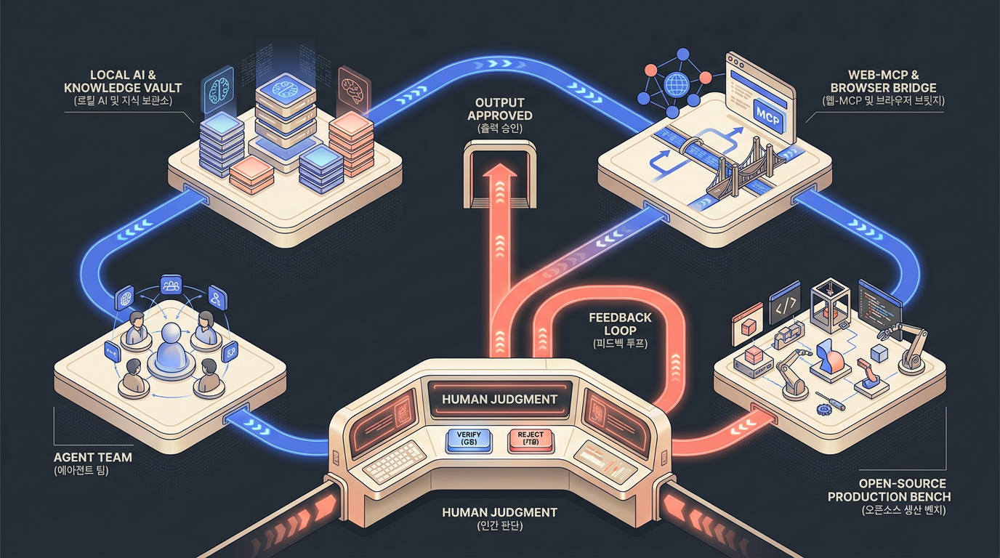

# 2026-09-19 · AI 도구는 운영 루프로 들어간다 · 릴리스 40건

배포일: 2026-09-19

최근 AI와 기술 동향을 빠르게 훑고 아이디어를 얻을 수 있도록 주제별로 정리한 학습 큐레이션입니다. 모든 자료를 다 읽지 않아도 큰 흐름을 파악할 수 있도록 카테고리별 맥락, 짧은 요약, 원본 링크, 공개 LilysAI 요약 링크를 함께 제공합니다.

<section class="release-infographic">
  <figure class="release-infographic__figure">
    
    <figcaption>이번 40선은 AI 도구가 흩어진 기능 목록에서 멈추지 않고, 지식·연결·실행·검토가 반복되는 운영 루프로 이동하는 흐름을 보여준다.</figcaption>
  </figure>
  

    
Release 40 Operating Loop

    
이번 인포그래픽은 지난 글의 작업면 지도와 다른 방식으로, 네 개의 독립된 스테이션이 아래쪽의 사람 판단 콘솔을 중심으로 순환하는 단면 구조를 택했다. 도구를 많이 모으는 장면이 아니라, 지식이 연결되고 실행 결과가 다시 검토되는 운영 루프를 한눈에 보이게 했다.

    <ul class="release-infographic__points">
      <li><strong>지식과 로컬 기반</strong> LLM Wiki, VoiceStudio, 공람문서 요약처럼 자료와 실행 환경을 내 쪽에 쌓는다.</li>
      <li><strong>연결과 실행</strong> WebMCP, 컴퓨터 유즈, 에이전트 팀이 웹·앱·코드 작업을 실제 행동으로 바꾼다.</li>
      <li><strong>생산 벤치</strong> HTML, 영상, 문서, 오픈소스 도구가 작업 결과물을 만든다.</li>
      <li><strong>사람의 판단</strong> 자동화가 넓어질수록 승인·반려·공개 범위·비용 판단은 마지막 콘솔에 남는다.</li>
    </ul>
  

</section>

## 먼저 결론

- 이번 40선의 핵심은 새로운 도구의 개수가 아니라, **지식 → 연결 → 실행 → 검토가 반복되는 운영 루프**입니다.
- 에이전트 팀과 컴퓨터 유즈는 AI를 답변자에서 행동자로 옮기고, WebMCP는 웹사이트가 AI에게 사용법을 직접 건네는 연결 계층을 보여줍니다.
- 로컬 AI와 오픈소스는 결과물을 내 환경에 남기는 기반을 만들지만, 공개 범위·비용·권한은 사람이 끝까지 확인해야 합니다.
- 이번 큐레이션은 분야별 링크 모음이 아니라, 내 업무에서 어느 지점을 먼저 연결할지 고르는 실행 지도입니다.

## 읽는 방법

- 먼저 큰 흐름과 카테고리별 요약으로 전체 지형을 잡으세요.
- 관심 있는 항목만 원본과 공개 요약 링크로 깊게 읽으세요.
- 마지막 복사용 링크 표와 용어 정리표를 함께 공유하면 읽는 사람이 빠르게 따라올 수 있습니다.

## 큰 흐름과 아이디어 씨앗

- OpenAI Codex와 코딩 에이전트 운영: 2건. Codex가 단발성 코드 생성기를 넘어 목표 기반 실행, 명령어 체계, 브라우저 도구 연결까지 포함한 작업 운영 도구로 확장되고 있습니다. 대표 자료는 GitHub - eternityspring/reelbench-skills: Learning notes and tooling skills for AI video, Review AI Expression: 어색한 AI 표현을 문맥에 맞게 검토하고 수정해 주는 Codex 스킬입니다.
- Claude Code와 에이전트 자동화: 3건. Claude Code 생태계는 대시보드, 스킬, 에이전트 관리, 자연어 코딩 방식으로 개발자의 반복 작업을 줄이는 방향으로 움직입니다. 대표 자료는 AI 에이전트 팀을 만들어주는 Buzz AI 기초 가이드 | 클로드코드·코덱스 한 팀으로 씁니다, 클로드 코드용 유니티 공식 플러그인: 스킬, CLI, 에디터 컨트롤, GitHub - alpic-ai/skybridge: Skybridge is a full-stack TypeScript framework for MCP Apps and ChatGPT입니다.
- Hermes와 개인 에이전트 런타임: 1건. Hermes 계열 자료는 개인이 직접 제어하는 에이전트 런타임과 워크플로우 레이어를 만들려는 흐름을 보여줍니다. 대표 자료는 자율형 AI 에이전트 헤르메스 쉽게 활용(김민정 HRX랩 부대표)입니다.
- MCP, 브라우저, 도구 연결: 3건. MCP와 브라우저 자동화는 AI가 외부 도구와 실제 웹 환경을 더 안정적으로 다루게 만드는 연결 계층으로 중요해지고 있습니다. 대표 자료는 WebMCP | 웹사이트는 이제 AI에게 사용법을 알려주게 됩니다., ChatGPT Astra 컴퓨터 유즈, 지금 업무에 써봐야 하는 이유!, GitHub - totec448-spec/chat-on-steroids: Cross-platform local MCP capabilities for ChatGPT with Chrome integration입니다.
- 개인 지식 시스템과 학습 노트: 1건. NotebookLM, Obsidian, LLM Wiki 흐름은 자료를 쌓는 것에서 끝나지 않고 다시 찾고, 연결하고, 실행 가능한 지식으로 바꾸는 방향을 보여줍니다. 대표 자료는 LLM Wiki입니다.
- 업무 문서와 공공 보고서 자동화: 1건. 공공 보고서, HWPX, 기관 문서 자동화 자료는 생성형 AI의 가치가 글 초안보다 현장의 형식과 검토 규칙을 지키는 데서 커진다는 점을 보여줍니다. 대표 자료는 HTML Anything: 모든 것을 다 HTML로 바꿔주는 도구입니다.
- AI 서비스 운영과 제품 전략: 4건. 새로운 AI 서비스는 기능만큼 가격, 환불, 운영 신뢰도, 장기 결제 리스크를 함께 평가해야 하는 단계로 들어섰습니다. 대표 자료는 구독자 6만 기념 Q&A (유투버 정체, 영상 제작 방법), GitHub - debpalash/VoiceStudio: VoiceStudio is the open-source, fully-local ElevenLabs alternative, New Note입니다.
- 로컬 AI와 개인 개발환경: 3건. 로컬 AI와 개인 개발환경 도구는 클라우드 의존을 줄이고, 개발자 각자의 장비와 워크플로우에 AI를 붙이는 방향으로 진화하고 있습니다. 대표 자료는 GitHub - jkf87/klef-collector-releases: KLEF 공람문서 요약, 멀티 자료 VoiceStudio: 로컬 음성 복제, 더빙, 인식 종합 솔루션, 맥북에 이식한 초파리의 뇌, 어떻게 둠을 플레이할 수 있는지 파헤쳐봤습니다.입니다.
- 플랫폼·OS와 사용자 생산성: 1건. 운영체제와 기본 사용성 업데이트는 작은 UX 변화 속에서도 다음 AI 기능과 생산성 습관의 변화를 읽게 해 줍니다. 대표 자료는 GitHub - roboflow/supervision: We write your reusable computer vision tools. 💜입니다.
- 오픈소스와 개발자 커뮤니티: 9건. 오픈소스와 개발자 커뮤니티 자료는 AI 시대에도 커밋, 리뷰, 기여 방식, 유지보수 문화가 중요한 경쟁력이 된다는 점을 보여줍니다. 대표 자료는 GitHub - syncthing/syncthing: Open Source Continuous File Synchronization · GitHub, Google ARTEMIS: 자연어 명령을 통한 안드로이드 자동화, GitHub - HandBrake/HandBrake: HandBrake's development repository · GitHub입니다.
- AI 에이전트와 코딩 워크플로우: 2건. AI 도구가 단순 답변기를 넘어 세션, 명령어, 하위 작업을 조율하는 작업 운영체제로 이동하고 있습니다. 대표 자료는 위키는 만들었는데, 뭘 하죠? — 쌓기만 하던 기록을 AI가 꺼내 쓰는 지식으로 | 브라이언 X 김재경(@tofukyung), [시즌 3] 유행 다 지나고 배우는 루프 엔지니어링 입문입니다.
- 기타 참고 자료: 10건. 여러 자료가 한 흐름으로 묶이며 새로운 학습 또는 실험 주제를 만들 수 있습니다. 대표 자료는 주식 자동 투자 서비스 만들기 1탄 (GPT 아스트라/ 클로드 Fable 5.1) -자료공개-, 그록봇은 챗봇과 뭐가 다를까?｜그록봇 개발자가 잘쓰는방법을 공개합니다., 포켓몬을 자동사냥하는 AI 제작법입니다.

## OpenAI Codex와 코딩 에이전트 운영

### 24. GitHub - eternityspring/reelbench-skills: Learning notes and tooling skills for AI video

AI 비디오 관련 학습 및 도구 스킬을 위한 reelbench-skills는 무엇인가요? AI 비디오의 작업 흐름, 도구, 실습을 위한 Claude Code/Codex 스킬 모음으로, 영상 분석 및 보고서 생성을 자동화하여 AI 비디오 제작 효율성을 높이는 데 기여합니다.

- 주제: GitHub - eternityspring/reelbench-skills: Learning notes and tooling skills for 
- 원본: [원본](https://github.com/eternityspring/reelbench-skills)
- 릴리스 공개 링크: [LilysAI 요약](https://lilys.ai/digest/11342977/13388646?s=1&noteVersionId=9994451)

### 33. Review AI Expression: 어색한 AI 표현을 문맥에 맞게 검토하고 수정해 주는 Codex 스킬

GitHub의 review-ai-expressions는 한국어 문서, 보고서, 슬라이드 등에서 상투적이거나 어색한 AI 표현을 문맥에 맞게 검토하고 수정해주는 Codex 스킬입니다. 원문의 의미와 서식을 보존하며 자연스러운 문장을 유지하는 것이 특징입니다.

- 주제: Review AI Expression: 어색한 AI 표현을 문맥에 맞게 검토하고 수정해 주는 Codex 스킬
- 원본: [원본](https://github.com/Ingyu87/review-ai-expressions)
- 릴리스 공개 링크: [LilysAI 요약](https://lilys.ai/digest/11327676/13368071?s=1&noteVersionId=9973232)

## Claude Code와 에이전트 자동화

### 19. AI 에이전트 팀을 만들어주는 Buzz AI 기초 가이드 | 클로드코드·코덱스 한 팀으로 씁니다

Buzz AI는 무엇이며, 어떻게 AI 에이전트 팀을 만들 수 있을까요? Buzz AI는 여러 AI 모델(클로드, GPT 등)을 한 워크스페이스에서 정식 팀원처럼 활용하여 협업하고 업무를 자동화할 수 있는 오픈소스 툴입니다. 이를 통해 리서치, 기획, 비평 등 다양한 역할을 수행하는 AI 팀을 구성하여...

- 주제: AI 에이전트 팀을 만들어주는 Buzz AI 기초 가이드 | 클로드코드·코덱스 한 팀으로 씁니다
- 원본: [원본](https://www.youtube.com/watch?v=af7FfTRwHyE)
- 릴리스 공개 링크: [LilysAI 요약](https://lilys.ai/digest/11352285/13400581?s=1&noteVersionId=10006688)

### 25. 클로드 코드용 유니티 공식 플러그인: 스킬, CLI, 에디터 컨트롤

클로드 코드용 유니티 공식 플러그인은 무엇인가요? 클로드 코드용 유니티 공식 플러그인은 유니티 개발자들이 AI 챗봇 클로드를 활용하여 게임 개발을 효율적으로 할 수 있도록 돕는 도구입니다. 이를 통해 UI, 2D/3D 그래픽, 오디오, 게임플레이 등 다양한 영역에서 개발 생산성을 높일 수 있습니다.

- 주제: 클로드 코드용 유니티 공식 플러그인: 스킬, CLI, 에디터 컨트롤
- 원본: [원본](https://unity.com/kr/blog/unity-plugin-for-claude-code)
- 릴리스 공개 링크: [LilysAI 요약](https://lilys.ai/digest/11338673/13382950?s=1&noteVersionId=9988607)

### 39. GitHub - alpic-ai/skybridge: Skybridge is a full-stack TypeScript framework for MCP Apps and ChatGPT

Skybridge는 어떤 프레임워크인가요? Skybridge는 Claude, ChatGPT 등 UI를 지원하는 MCP 클라이언트를 위한 풀스택 리액트 프레임워크로, 개발자들이 타입-세이프한 앱을 구축하고 배포할 수 있도록 돕습니다. 대화형 AI 앱 개발의 복잡성을 크게 줄여줍니다.

- 주제: GitHub - alpic-ai/skybridge: Skybridge is a full-stack TypeScript framework for 
- 원본: [원본](https://github.com/alpic-ai/skybridge)
- 릴리스 공개 링크: [LilysAI 요약](https://lilys.ai/digest/11319473/13357521?s=1&noteVersionId=9962440)

## Hermes와 개인 에이전트 런타임

### 28. 자율형 AI 에이전트 헤르메스 쉽게 활용(김민정 HRX랩 부대표)

개발자가 아니어도 자율형 AI 에이전트 '헤르메스'를 활용하는 방법은? 데스크톱 버전을 설치하고 메인 봇과 대화하며 업무를 지시하면, 헤르메스가 스스로 학습하고 발전하여 반복적인 업무를 자동화하고, 서브 에이전트들을 생성·관리하며 협업까지 가능하게 합니다. 기존 챗봇과 달리 AI가 직접 행동하고 업무...

- 주제: 자율형 AI 에이전트 헤르메스 쉽게 활용(김민정 HRX랩 부대표)
- 원본: [원본](https://www.youtube.com/watch?v=aaS2sVh-F10)
- 릴리스 공개 링크: [LilysAI 요약](https://lilys.ai/digest/11335906/13379442?s=1&noteVersionId=9984995)

## MCP, 브라우저, 도구 연결

### 18. WebMCP | 웹사이트는 이제 AI에게 사용법을 알려주게 됩니다.

웹사이트의 새로운 표준으로 떠오르는 WebMCP는 무엇인가요? WebMCP는 웹사이트가 AI 에이전트에게 자신의 사용법을 직접 알려주는 기술로, 기존 브라우저 에이전트의 한계인 느린 속도와 높은 토큰 소모를 해결하여 AI 에이전트가 웹사이트를 더 빠르고 효율적으로 활용할 수 있게 합니다.

- 주제: WebMCP | 웹사이트는 이제 AI에게 사용법을 알려주게 됩니다.
- 원본: [원본](https://www.youtube.com/watch?v=bQE0d3xET50)
- 릴리스 공개 링크: [LilysAI 요약](https://lilys.ai/digest/11366494/13420129?s=1&noteVersionId=10026720)

### 27. ChatGPT Astra 컴퓨터 유즈, 지금 업무에 써봐야 하는 이유!

ChatGPT Astra의 컴퓨터 유즈 기능은 무엇이며, 왜 업무에 활용해야 할까요? 이 기능은 AI가 컴퓨터 화면을 직접 보고 앱이나 웹을 조작하여 사람처럼 모든 작업을 처리할 수 있게 하며, 특히 API나 MCP를 제공하지 않는 서비스에서도 자동화가 가능해져 업무 효율을 극대화할 수 있습니다.

- 주제: ChatGPT Astra 컴퓨터 유즈, 지금 업무에 써봐야 하는 이유!
- 원본: [원본](https://www.youtube.com/watch?v=DtttpEUd-a0)
- 릴리스 공개 링크: [LilysAI 요약](https://lilys.ai/digest/11335924/13379476?s=1&noteVersionId=9985029)

### 40. GitHub - totec448-spec/chat-on-steroids: Cross-platform local MCP capabilities for ChatGPT with Chrome integration

ChatGPT의 기능을 하는 chat-on-steroids(CoS)는 무엇인가요? CoS는 ChatGPT가 파일을 읽고 편집하며, 터미널을 사용하고, 데스크톱을 제어할 수 있게 하여 실제 프로젝트 작업에 활용하고, 여러 AI 워커를 통해 독립적인 작업을 분할 처리하며, 장기 작업에 대한 제어력을...

- 주제: GitHub - totec448-spec/chat-on-steroids: Cross-platform local MCP capabilities f
- 원본: [원본](https://github.com/totec448-spec/chat-on-steroids)
- 릴리스 공개 링크: [LilysAI 요약](https://lilys.ai/digest/11319410/13357353?s=1&noteVersionId=9962270)

## 개인 지식 시스템과 학습 노트

### 38. LLM Wiki

LLM Wiki는 어떤 프로그램인가요? 사용자의 문서를 자동으로 정리하고 상호 연결된 개인 지식 베이스로 만들어주는 크로스 플랫폼 데스크톱 애플리케이션입니다. 기존 RAG 방식과 달리 LLM이 문서를 분석하여 위키를 점진적으로 구축하고 유지 관리합니다.

- 주제: LLM Wiki
- 원본: [원본](https://github.com/nashsu/llm_wiki)
- 릴리스 공개 링크: [LilysAI 요약](https://lilys.ai/digest/11322800/13361368?s=1&noteVersionId=9966350)

## 업무 문서와 공공 보고서 자동화

### 16. HTML Anything: 모든 것을 다 HTML로 바꿔주는 도구

HTML Anything은 어떤 도구인가요? 로컬 AI 에이전트가 다양한 형식의 입력을 바탕으로 HTML을 생성하고 편집하는 도구입니다. 사용자는 복잡한 코딩 없이도 AI가 생성한 HTML을 즉시 활용하여 웹 페이지, 보고서, 소셜 미디어 카드 등 다양한 콘텐츠를 만들고 할 수 있습니다.

- 주제: HTML Anything: 모든 것을 다 HTML로 바꿔주는 도구
- 원본: [원본](https://github.com/nexu-io/html-anything)
- 릴리스 공개 링크: [LilysAI 요약](https://lilys.ai/digest/11366602/13420286?s=1&noteVersionId=10026884)

## AI 서비스 운영과 제품 전략

### 4. 구독자 6만 기념 Q&A (유투버 정체, 영상 제작 방법)

유튜버 '저세상개발자'는 어떤 사람이며, 영상은 어떻게 제작하는가? 서울대 컴퓨터공학부 출신의 현직 웹 개발자로, AI 관련 개발 내용을 롱폼으로, 게임 개발 내용을 쇼츠로 올리며, 조회수가 잘 나오는 '이해가 안 될수록 반응이 좋은' 추상화된 대본을 바탕으로 프로그래밍 툴과 편집 툴을 활용해 직접...

- 주제: 구독자 6만 기념 Q&A (유투버 정체, 영상 제작 방법)
- 원본: [원본](https://www.youtube.com/watch?v=XECEGbZY4AU)
- 릴리스 공개 링크: [LilysAI 요약](https://lilys.ai/digest/11398036/13459274?s=1&noteVersionId=10067071)

### 11. GitHub - debpalash/VoiceStudio: VoiceStudio is the open-source, fully-local ElevenLabs alternative

VoiceStudio는 어떤 프로그램인가요? ElevenLabs의 오픈소스 대안으로, 음성 복제, 음성 디자인, 영상 더빙, 받아쓰기, 전사 및 오디오북 제작을 646개 언어로 지원하는 완전 로컬 기반의 프로그램입니다. 계정, API 키, 구독 없이 핵심 기능을 사용할 수 있어 개인 정보 보호와 비용...

- 주제: GitHub - debpalash/VoiceStudio: VoiceStudio is the open-source, fully-local Elev
- 원본: [원본](https://github.com/debpalash/VoiceStudio)
- 릴리스 공개 링크: [LilysAI 요약](https://lilys.ai/digest/11383180/13441886?s=1&noteVersionId=10049135)

### 12. New Note

VoiceStudio는 어떤 프로그램인가요? ElevenLabs의 오픈소스 대안으로, 음성 복제, 음성 디자인, 영상 더빙, 받아쓰기, 전사 및 오디오북 제작을 646개 언어로 지원하는 완전 로컬 기반의 프로그램입니다. 계정, API 키, 구독 없이 핵심 기능을 사용할 수 있어 개인 정보 보호와 비용...

- 주제: New Note
- 원본: [원본](https://github.com/debpalash/VoiceStudio)
- 릴리스 공개 링크: [LilysAI 요약](https://lilys.ai/digest/11383179/13441887?s=1&noteVersionId=10049136)

### 31. 최고의 에이전트 하네스 운영체제

AI 코드 에이전트의 성능을 최적화하는 ECC (Agent Harness Performance Optimization System)는 무엇인가요? ECC는 AI 에이전트가 코드를 작성할 때 계획, 테스트, 구현, 검토, 검증, 기억, 개선의 체계적인 엔지니어링 시스템과 도구 상자를 제공하여, 매번...

- 주제: 최고의 에이전트 하네스 운영체제
- 원본: [원본](https://github.com/affaan-m/ecc)
- 릴리스 공개 링크: [LilysAI 요약](https://lilys.ai/digest/11333078/13374939?s=1&noteVersionId=9980332)

## 로컬 AI와 개인 개발환경

### 13. GitHub - jkf87/klef-collector-releases: KLEF 공람문서 요약

KLEF 공람문서 도구는 무엇인가요? 접근 권한이 있는 공문을 하여 Chrome 공람 목록에 핵심 내용을 표시해주는 도구입니다. Qwen3.5 2B CPU 로컬 모델을 으로 사용하며, Chrome 웹 스토어 등록 전이라 GitHub에서 직접 다운로드하여 설치해야 합니다.

- 주제: GitHub - jkf87/klef-collector-releases: KLEF 공람문서 요약
- 원본: [원본](https://github.com/jkf87/klef-collector-releases)
- 릴리스 공개 링크: [LilysAI 요약](https://lilys.ai/digest/11380662/13438538?s=1&noteVersionId=10045714)

### 22. 멀티 자료 VoiceStudio: 로컬 음성 복제, 더빙, 인식 종합 솔루션

멀티 자료 VoiceStudio: 로컬 음성 복제, 더빙, 인식 종합 솔루션

- 주제: 멀티 자료 VoiceStudio: 로컬 음성 복제, 더빙, 인식 종합 솔루션
- 원본: 텍스트 노트
- 릴리스 공개 링크: [LilysAI 요약](https://lilys.ai/digest/11349913/13397476?s=1&noteVersionId=10003487)

### 23. 맥북에 이식한 초파리의 뇌, 어떻게 둠을 플레이할 수 있는지 파헤쳐봤습니다.

초파리 뇌를 맥북에 이식해 둠을 플레이하는 것은 어떻게 가능할까? 초파리 뇌지도 데이터(MCNS)를 기반으로 개발자가 게임 정보를 뉴런에 입력하고, 뉴런 활성화 규칙 및 게임 조작으로의 변환 규칙을 직접 설정했기 때문입니다. 이는 뇌지도 데이터만으로는 게임이 자동으로 작동하지 않으며, 개발자의 명확한...

- 주제: 맥북에 이식한 초파리의 뇌, 어떻게 둠을 플레이할 수 있는지 파헤쳐봤습니다.
- 원본: [원본](https://www.youtube.com/watch?v=z84C_kC0QvE)
- 릴리스 공개 링크: [LilysAI 요약](https://lilys.ai/digest/11347117/13393976?s=1&noteVersionId=9999899)

## 플랫폼·OS와 사용자 생산성

### 15. GitHub - roboflow/supervision: We write your reusable computer vision tools. 💜

Roboflow의 Supervision은 어떤 도구인가요? 컴퓨터 비전 애플리케이션 개발을 위한 필수 오픈소스 툴킷으로, 모델 학습부터 데이터 관리, 시각화까지 전반적인 과정을 간소화하여 개발자가 핵심 기능 구현에 집중할 수 있도록 돕습니다.

- 주제: GitHub - roboflow/supervision: We write your reusable computer vision tools. 💜
- 원본: [원본](https://github.com/roboflow/supervision)
- 릴리스 공개 링크: [LilysAI 요약](https://lilys.ai/digest/11369393/13424120?s=1&noteVersionId=10030850)

## 오픈소스와 개발자 커뮤니티

### 2. GitHub - syncthing/syncthing: Open Source Continuous File Synchronization · GitHub

Syncthing은 오픈 소스 파일 동기화 프로그램으로, 여러 컴퓨터 간에 파일을 안전하고 동기화하며, 특히 데이터 손실 방지 및 보안을 최우선 목표로 합니다.

- 주제: GitHub - syncthing/syncthing: Open Source Continuous File Synchronization · GitH
- 원본: [원본](https://github.com/syncthing/syncthing)
- 릴리스 공개 링크: [LilysAI 요약](https://lilys.ai/digest/11408618/13473314?s=1&noteVersionId=10081428)

### 6. Google ARTEMIS: 자연어 명령을 통한 안드로이드 자동화

구글의 ARTEMIS는 어떤 프로젝트인가요? 자연어 명령을 안드로이드 자동화로 전환하여 앱 테스트 및 일상 작업을 수행하는 오픈소스 프로젝트입니다. AI 코딩 어시스턴트와 연동되어 99% 이상의 높은 성공률로 복잡한 작업을 자동화합니다.

- 주제: Google ARTEMIS: 자연어 명령을 통한 안드로이드 자동화
- 원본: [원본](https://github.com/google/artemis)
- 릴리스 공개 링크: [LilysAI 요약](https://lilys.ai/digest/11395510/13456243?s=1&noteVersionId=10063950)

### 7. GitHub - HandBrake/HandBrake: HandBrake's development repository · GitHub

HandBrake는 어떤 프로그램인가요? HandBrake는 오픈소스 비디오 트랜스코더로, 다양한 기기에서 재생할 수 있도록 기존 비디오 파일을 MP4, MKV, WebM 등 최신 형식으로 변환해주는 유용한 도구입니다.

- 주제: GitHub - HandBrake/HandBrake: HandBrake's development repository · GitHub
- 원본: [원본](https://github.com/HandBrake/HandBrake)
- 릴리스 공개 링크: [LilysAI 요약](https://lilys.ai/digest/11392847/13452729?s=1&noteVersionId=10060327)

### 8. GitHub - HandBrake/HandBrake: HandBrake's development repository · GitHub

HandBrake는 어떤 프로그램인가요? HandBrake는 오픈 소스 비디오 트랜스코더로, 다양한 기기에서 재생 가능한 MP4, MKV, WebM 형식의 비디오 파일을 생성하며, DVD 및 Blu-ray 디스크를 포함한 대부분의 비디오 파일과 형식을 지원합니다.

- 주제: GitHub - HandBrake/HandBrake: HandBrake's development repository · GitHub
- 원본: [원본](https://github.com/HandBrake/HandBrake)
- 릴리스 공개 링크: [LilysAI 요약](https://lilys.ai/digest/11392846/13452728?s=1&noteVersionId=10060326)

### 14. GitHub - DigitalPlatDev/FreeDomain: Free domain registration and practical DNS learning resources for everyone.

DigitalPlat FreeDomain은 무엇을 제공하는 서비스인가요? 무료 도메인 등록과 실용적인 DNS 학습 자료를 제공하여, 누구나 웹사이트를 만들고 온라인 공간을 가질 수 있도록 돕는 서비스입니다.

- 주제: GitHub - DigitalPlatDev/FreeDomain: Free domain registration and practical DNS l
- 원본: [원본](https://github.com/DigitalPlatDev/FreeDomain)
- 릴리스 공개 링크: [LilysAI 요약](https://lilys.ai/digest/11369463/13424213?s=1&noteVersionId=10030944)

### 20. 토큰 42% 줄인다는 GitHub 트렌딩 Graft, 직접 실측해보겠습니다. | Astra 같이 쓰세요

GitHub 트렌딩 Graft가 주장하는 토큰 42% 감소는 실제 효과가 있을까? Graft는 코드베이스 탐색 방식을 지식 그래프 조회로 바꿔, 작은 프로젝트에서는 툴콜과 토큰 감소 효과가 컸고, 큰 프로젝트에서는 무거운 조사 작업에서 토큰 및 비용 절감 효과를 보였습니다.

- 주제: 토큰 42% 줄인다는 GitHub 트렌딩 Graft, 직접 실측해보겠습니다. | Astra 같이 쓰세요
- 원본: [원본](https://www.youtube.com/watch?v=j7ED8Irjp0o)
- 릴리스 공개 링크: [LilysAI 요약](https://lilys.ai/digest/11352221/13400498?s=1&noteVersionId=10006596)

### 21. Anything2Explainer: AI가 자동으로 조사, 나레이션, 스토리 구성, 모션그래픽까지 완성

'anything2explainer'는 어떤 기능을 제공하는가? 이 도구는 주제를 입력하면 AI가 자동으로 조사, 내레이션 작성, 스토리보드 구성, 모션 그래픽 비디오 제작까지 전 과정을 수행하여 설명 비디오를 생성해줍니다. 스톡 영상이나 생성형 AI 모델 없이 모든 프레임을 코드로 그려내며, 중국어와...

- 주제: Anything2Explainer: AI가 자동으로 조사, 나레이션, 스토리 구성, 모션그래픽까지 완성
- 원본: [원본](https://github.com/Vincentwei1021/anything2explainer)
- 릴리스 공개 링크: [LilysAI 요약](https://lilys.ai/digest/11349934/13397504?s=1&noteVersionId=10003515)

### 36. GitHub - remotion-dev/skills: Agent Skills · GitHub

Remotion Agent Skills는 무엇인가요? Remotion 프로젝트에서 AI 에이전트가 모범 사례를 따르도록 돕는 스킬 목록으로, 코드 작성, 프로젝트 생성, 렌더링 등 다양한 작업을 효율적으로 수행하게 합니다.

- 주제: GitHub - remotion-dev/skills: Agent Skills · GitHub
- 원본: [원본](https://github.com/remotion-dev/skills)
- 릴리스 공개 링크: [LilysAI 요약](https://lilys.ai/digest/11322922/13361546?s=1&noteVersionId=9966532)

### 37. GitHub - letta-ai/letta-code: Stateful agents that are like people, with memory, identity, and the ability to learn and adapt

Letta Code는 무엇인가요? 장기적인 학습 능력을 가진 AI 에이전트를 기반으로 하는 코딩 도구로, 기존 세션 기반 방식과 달리 에이전트가 사용자의 작업을 기억하고 학습하며 지속적으로 개선됩니다.

- 주제: GitHub - letta-ai/letta-code: Stateful agents that are like people, with memory,
- 원본: [원본](https://github.com/letta-ai/letta-code)
- 릴리스 공개 링크: [LilysAI 요약](https://lilys.ai/digest/11322898/13361525?s=1&noteVersionId=9966508)

## AI 에이전트와 코딩 워크플로우

### 9. 위키는 만들었는데, 뭘 하죠? — 쌓기만 하던 기록을 AI가 꺼내 쓰는 지식으로 | 브라이언 X 김재경(@tofukyung)

LLM 위키를 통해 쌓기만 하던 기록을 '바로 꺼내 쓰는 지식'으로 만드는 방법은? AI가 알아서 기억해주는 단순한 창고가 아니라, 나의 목적에 따라 선별한 '골드 데이터'를 AI가 잘 소화할 수 있는 형태로 손질하여 냉장고처럼 정리하고, 여러 에이전트가 협업하여 이 지식을 활용해 새로운 결과물을...

- 주제: 위키는 만들었는데, 뭘 하죠? — 쌓기만 하던 기록을 AI가 꺼내 쓰는 지식으로 | 브라이언 X 김재경(@tofukyung)
- 원본: [원본](https://www.youtube.com/watch?v=Ef4AGnSU8UE)
- 릴리스 공개 링크: [LilysAI 요약](https://lilys.ai/digest/11386153/13445533?s=1&noteVersionId=10052927)

### 29. [시즌 3] 유행 다 지나고 배우는 루프 엔지니어링 입문

루프 엔지니어링이란 무엇인가요? 루프 엔지니어링은 AI 에이전트가 인간의 개입 없이 스스로 행동(Action), 관찰(Observation), 결정(Decision)을 반복하며 작업을 자동화하는 개념입니다. 이를 통해 반복적인 수동 작업을 줄이고 AI가 자율적으로 목표를 달성하도록 돕습니다.

- 주제: [시즌 3] 유행 다 지나고 배우는 루프 엔지니어링 입문
- 원본: [원본](https://www.youtube.com/watch?v=uyYlnw2pnIs)
- 릴리스 공개 링크: [LilysAI 요약](https://lilys.ai/digest/11335819/13379335?s=1&noteVersionId=9984882)

## 기타 참고 자료

### 1. 주식 자동 투자 서비스 만들기 1탄 (GPT 아스트라/ 클로드 Fable 5.1) -자료공개-

GPT 아스트라와 클로드 Fable 5.1을 활용한 주식 자동 투자 서비스의 핵심은? 다양한 데이터 소스를 시냅스처럼 연결하여 AI 챗봇과 텔레그램 알림으로 유망 종목을 추천하고, 실제 매수까지 연동하는 자동화된 투자 시스템을 구축하는 것입니다. 이를 통해 방대한 주식 데이터를 효율적으로 분석하고 투자...

- 주제: 주식 자동 투자 서비스 만들기 1탄 (GPT 아스트라/ 클로드 Fable 5.1) -자료공개-
- 원본: [원본](https://www.youtube.com/watch?v=0v6qOxHeulY)
- 릴리스 공개 링크: [LilysAI 요약](https://lilys.ai/digest/11408935/13473682?s=1&noteVersionId=10081809)

### 3. 그록봇은 챗봇과 뭐가 다를까?｜그록봇 개발자가 잘쓰는방법을 공개합니다.

Grok Bot은 기존 챗봇과 무엇이 다른가요? Grok Bot은 클라우드 기반의 독립적인 AI 동료로서, 사용자의 컴퓨터와 분리되어 스스로 작업을 수행하고, 여러 봇이 팀을 이루어 복잡한 업무를 처리하며, 시간이 지날수록 학습하여 더욱 똑똑해지는 것이 핵심 차별점입니다.

- 주제: 그록봇은 챗봇과 뭐가 다를까?｜그록봇 개발자가 잘쓰는방법을 공개합니다.
- 원본: [원본](https://www.youtube.com/watch?v=YqfjcK8EZtw)
- 릴리스 공개 링크: [LilysAI 요약](https://lilys.ai/digest/11398162/13459453?s=1&noteVersionId=10067258)

### 5. 포켓몬을 자동사냥하는 AI 제작법

포켓몬을 자동사냥하는 AI 제작법

- 주제: 포켓몬을 자동사냥하는 AI 제작법
- 원본: [원본](https://www.youtube.com/watch?v=m5SPH4zLRaM)
- 릴리스 공개 링크: [LilysAI 요약](https://lilys.ai/digest/11398021/13459260?s=1&noteVersionId=10081803)

### 10. 요즘 Anthropic 개발자들은 README 대신 '이것'을 씁니다

Anthropic 개발자들이 README 대신 사용하는 '이것'은 무엇인가요? 복잡한 코드를 시각화하여 빠르게 이해할 수 있도록 돕는 다양한 AI 기반 스킬들입니다. 이 스킬들은 L5처럼 전체 코드를 한 장의 HTML로 하거나, Understand Anything처럼 코드 의존성을 지도로 보여주며...

- 주제: 요즘 Anthropic 개발자들은 README 대신 '이것'을 씁니다
- 원본: [원본](https://www.youtube.com/watch?v=wLNMpOeBYp0)
- 릴리스 공개 링크: [LilysAI 요약](https://lilys.ai/digest/11386135/13445511?s=1&noteVersionId=10052905)

### 17. 나만의 AI 보이스 앱 만들기: Fish Audio와 Google Apps Script 통합

나만의 AI 보이스 앱을 만드는 방법은? Fish Audio의 API 키를 발급받고, 구글 앱스 스크립트(GAS)를 활용해 AI가 생성한 코드를 붙여 넣기만 하면 됩니다. 코딩 지식 없이도 자연스러운 감정이 담긴 AI 음성을 생성할 수 있습니다.

- 주제: 나만의 AI 보이스 앱 만들기: Fish Audio와 Google Apps Script 통합
- 원본: [원본](https://www.youtube.com/watch?v=UoVE_nh5m1s)
- 릴리스 공개 링크: [LilysAI 요약](https://lilys.ai/digest/11366513/13420155?s=1&noteVersionId=10026747)

### 26. [시즌 3] GPT Astra 6로 리니지 like 게임 만들기(GPT Image 2.5)(프롬프트 공개)

GPT Astra 6와 GPT Image 2.5를 활용해 리니지 라이크 게임을 만드는 방법은? GPT Image 2.5의 이미지 일관성 및 재활용성 개선 덕분에 게임 에셋 제작이 훨씬 용이해졌으며, AI에게 의도와 목표만 명확히 제시하고 나머지는 AI가 리서치하고 코딩하도록 맡기는 방식으로 효율적인...

- 주제: [시즌 3] GPT Astra 6로 리니지 like 게임 만들기(GPT Image 2.5)(프롬프트 공개)
- 원본: [원본](https://www.youtube.com/watch?v=yNVgynAEoEM)
- 릴리스 공개 링크: [LilysAI 요약](https://lilys.ai/digest/11338614/13382869?s=1&noteVersionId=9988523)

### 30. Human Premium: AI 시대에 인간의 판단이 중요하다.

AI가 실행을 가져갈수록 사람에게는 더 적은 수의, 더 중요한 판단이 남습니다. Human Premium을 역량 이름이 아니라 판단을 어디에 배치하고 어떻게 조직의 반복 가능한 기준으로 남길 것인가의 문제로 봅니다.

- 주제: Human Premium: AI 시대에 인간의 판단이 중요하다.
- 원본: [원본](https://www.seigniter.com/perspectives/ax-judgment-placement)
- 릴리스 공개 링크: [LilysAI 요약](https://lilys.ai/digest/11333154/13375021?s=1&noteVersionId=9980422)

### 32. 9월 12일 줌미팅 세미나(Tunnel(프록시서버))

클라우드플레어의 터널(Tunnel)은 무엇이며 어떻게 활용할 수 있을까요? 터널은 내 서버를 외부에 노출하지 않고도 안전하게 접속할 수 있도록 돕는 리버스 프록시 서버 역할을 하며, 이를 통해 보안을 강화하고 접속 관리를 편리하게 할 수 있습니다.

- 주제: 9월 12일 줌미팅 세미나(Tunnel(프록시서버))
- 원본: 텍스트 노트
- 릴리스 공개 링크: [LilysAI 요약](https://lilys.ai/digest/11330681/13371849?s=1&noteVersionId=9977109)

### 34. 라즈베리파이가 들어간 로봇팔? myCobot 280 Pi 언박싱 & 실제 구동

PC 없이도 로봇팔을 제어할 수 있는 myCobot 280 Pi는 어떤 제품인가요? 이 로봇팔은 라즈베리파이 4B가 내장되어 있어 별도의 PC 없이 모니터, 키보드, 마우스만 연결하면 바로 사용할 수 있으며, 블록 코딩을 통해 초보자도 로봇 제어와 프로그래밍을 경험할 수 있습니다.

- 주제: 라즈베리파이가 들어간 로봇팔? myCobot 280 Pi 언박싱 & 실제 구동
- 원본: [원본](https://www.youtube.com/watch?v=YcDDDsUVjOw)
- 릴리스 공개 링크: [LilysAI 요약](https://lilys.ai/digest/11322980/13361624?s=1&noteVersionId=9980029)

### 35. 라즈베리파이가 들어간 로봇팔? myCobot 280 Pi 언박싱 & 실제 구동

PC가 따로 필요 없는 6축 로봇팔, myCobot 280 Pi는 어떤 제품인가요? 라즈베리파이 4B가 내장되어 별도의 PC 없이도 모니터와 주변 기기를 연결할 수 있으며, 블록 코딩으로 6개 관절을 제어할 수 있어 로봇 제어를 처음 접하는 사람들에게 적합합니다.

- 주제: 라즈베리파이가 들어간 로봇팔? myCobot 280 Pi 언박싱 & 실제 구동
- 원본: [원본](https://www.youtube.com/watch?v=YcDDDsUVjOw)
- 릴리스 공개 링크: [LilysAI 요약](https://lilys.ai/digest/11322979/13361623?s=1&noteVersionId=9966616)

## 복사용 링크 표

| 카테고리 | 주제 | 제목 | 원본 링크 | 릴리스 공개 링크 |
|---|---|---|---|---|
| OpenAI Codex와 코딩 에이전트 운영 | GitHub - eternityspring/reelbench-skills: Learning notes and tooling skills for  | GitHub - eternityspring/reelbench-skills: Learning notes and tooling skills for AI video | [원본](https://github.com/eternityspring/reelbench-skills) | [LilysAI 요약](https://lilys.ai/digest/11342977/13388646?s=1&noteVersionId=9994451) |
| OpenAI Codex와 코딩 에이전트 운영 | Review AI Expression: 어색한 AI 표현을 문맥에 맞게 검토하고 수정해 주는 Codex 스킬 | Review AI Expression: 어색한 AI 표현을 문맥에 맞게 검토하고 수정해 주는 Codex 스킬 | [원본](https://github.com/Ingyu87/review-ai-expressions) | [LilysAI 요약](https://lilys.ai/digest/11327676/13368071?s=1&noteVersionId=9973232) |
| Claude Code와 에이전트 자동화 | AI 에이전트 팀을 만들어주는 Buzz AI 기초 가이드 \| 클로드코드·코덱스 한 팀으로 씁니다 | AI 에이전트 팀을 만들어주는 Buzz AI 기초 가이드 \| 클로드코드·코덱스 한 팀으로 씁니다 | [원본](https://www.youtube.com/watch?v=af7FfTRwHyE) | [LilysAI 요약](https://lilys.ai/digest/11352285/13400581?s=1&noteVersionId=10006688) |
| Claude Code와 에이전트 자동화 | 클로드 코드용 유니티 공식 플러그인: 스킬, CLI, 에디터 컨트롤 | 클로드 코드용 유니티 공식 플러그인: 스킬, CLI, 에디터 컨트롤 | [원본](https://unity.com/kr/blog/unity-plugin-for-claude-code) | [LilysAI 요약](https://lilys.ai/digest/11338673/13382950?s=1&noteVersionId=9988607) |
| Claude Code와 에이전트 자동화 | GitHub - alpic-ai/skybridge: Skybridge is a full-stack TypeScript framework for  | GitHub - alpic-ai/skybridge: Skybridge is a full-stack TypeScript framework for MCP Apps and ChatGPT | [원본](https://github.com/alpic-ai/skybridge) | [LilysAI 요약](https://lilys.ai/digest/11319473/13357521?s=1&noteVersionId=9962440) |
| Hermes와 개인 에이전트 런타임 | 자율형 AI 에이전트 헤르메스 쉽게 활용(김민정 HRX랩 부대표) | 자율형 AI 에이전트 헤르메스 쉽게 활용(김민정 HRX랩 부대표) | [원본](https://www.youtube.com/watch?v=aaS2sVh-F10) | [LilysAI 요약](https://lilys.ai/digest/11335906/13379442?s=1&noteVersionId=9984995) |
| MCP, 브라우저, 도구 연결 | WebMCP \| 웹사이트는 이제 AI에게 사용법을 알려주게 됩니다. | WebMCP \| 웹사이트는 이제 AI에게 사용법을 알려주게 됩니다. | [원본](https://www.youtube.com/watch?v=bQE0d3xET50) | [LilysAI 요약](https://lilys.ai/digest/11366494/13420129?s=1&noteVersionId=10026720) |
| MCP, 브라우저, 도구 연결 | ChatGPT Astra 컴퓨터 유즈, 지금 업무에 써봐야 하는 이유! | ChatGPT Astra 컴퓨터 유즈, 지금 업무에 써봐야 하는 이유! | [원본](https://www.youtube.com/watch?v=DtttpEUd-a0) | [LilysAI 요약](https://lilys.ai/digest/11335924/13379476?s=1&noteVersionId=9985029) |
| MCP, 브라우저, 도구 연결 | GitHub - totec448-spec/chat-on-steroids: Cross-platform local MCP capabilities f | GitHub - totec448-spec/chat-on-steroids: Cross-platform local MCP capabilities for ChatGPT with Chrome integration | [원본](https://github.com/totec448-spec/chat-on-steroids) | [LilysAI 요약](https://lilys.ai/digest/11319410/13357353?s=1&noteVersionId=9962270) |
| 개인 지식 시스템과 학습 노트 | LLM Wiki | LLM Wiki | [원본](https://github.com/nashsu/llm_wiki) | [LilysAI 요약](https://lilys.ai/digest/11322800/13361368?s=1&noteVersionId=9966350) |
| 업무 문서와 공공 보고서 자동화 | HTML Anything: 모든 것을 다 HTML로 바꿔주는 도구 | HTML Anything: 모든 것을 다 HTML로 바꿔주는 도구 | [원본](https://github.com/nexu-io/html-anything) | [LilysAI 요약](https://lilys.ai/digest/11366602/13420286?s=1&noteVersionId=10026884) |
| AI 서비스 운영과 제품 전략 | 구독자 6만 기념 Q&A (유투버 정체, 영상 제작 방법) | 구독자 6만 기념 Q&A (유투버 정체, 영상 제작 방법) | [원본](https://www.youtube.com/watch?v=XECEGbZY4AU) | [LilysAI 요약](https://lilys.ai/digest/11398036/13459274?s=1&noteVersionId=10067071) |
| AI 서비스 운영과 제품 전략 | GitHub - debpalash/VoiceStudio: VoiceStudio is the open-source, fully-local Elev | GitHub - debpalash/VoiceStudio: VoiceStudio is the open-source, fully-local ElevenLabs alternative | [원본](https://github.com/debpalash/VoiceStudio) | [LilysAI 요약](https://lilys.ai/digest/11383180/13441886?s=1&noteVersionId=10049135) |
| AI 서비스 운영과 제품 전략 | New Note | New Note | [원본](https://github.com/debpalash/VoiceStudio) | [LilysAI 요약](https://lilys.ai/digest/11383179/13441887?s=1&noteVersionId=10049136) |
| AI 서비스 운영과 제품 전략 | 최고의 에이전트 하네스 운영체제 | 최고의 에이전트 하네스 운영체제 | [원본](https://github.com/affaan-m/ecc) | [LilysAI 요약](https://lilys.ai/digest/11333078/13374939?s=1&noteVersionId=9980332) |
| 로컬 AI와 개인 개발환경 | GitHub - jkf87/klef-collector-releases: KLEF 공람문서 요약 | GitHub - jkf87/klef-collector-releases: KLEF 공람문서 요약 | [원본](https://github.com/jkf87/klef-collector-releases) | [LilysAI 요약](https://lilys.ai/digest/11380662/13438538?s=1&noteVersionId=10045714) |
| 로컬 AI와 개인 개발환경 | 멀티 자료 VoiceStudio: 로컬 음성 복제, 더빙, 인식 종합 솔루션 | 멀티 자료 VoiceStudio: 로컬 음성 복제, 더빙, 인식 종합 솔루션 | 텍스트 노트 | [LilysAI 요약](https://lilys.ai/digest/11349913/13397476?s=1&noteVersionId=10003487) |
| 로컬 AI와 개인 개발환경 | 맥북에 이식한 초파리의 뇌, 어떻게 둠을 플레이할 수 있는지 파헤쳐봤습니다. | 맥북에 이식한 초파리의 뇌, 어떻게 둠을 플레이할 수 있는지 파헤쳐봤습니다. | [원본](https://www.youtube.com/watch?v=z84C_kC0QvE) | [LilysAI 요약](https://lilys.ai/digest/11347117/13393976?s=1&noteVersionId=9999899) |
| 플랫폼·OS와 사용자 생산성 | GitHub - roboflow/supervision: We write your reusable computer vision tools. 💜 | GitHub - roboflow/supervision: We write your reusable computer vision tools. 💜 | [원본](https://github.com/roboflow/supervision) | [LilysAI 요약](https://lilys.ai/digest/11369393/13424120?s=1&noteVersionId=10030850) |
| 오픈소스와 개발자 커뮤니티 | GitHub - syncthing/syncthing: Open Source Continuous File Synchronization · GitH | GitHub - syncthing/syncthing: Open Source Continuous File Synchronization · GitHub | [원본](https://github.com/syncthing/syncthing) | [LilysAI 요약](https://lilys.ai/digest/11408618/13473314?s=1&noteVersionId=10081428) |
| 오픈소스와 개발자 커뮤니티 | Google ARTEMIS: 자연어 명령을 통한 안드로이드 자동화 | Google ARTEMIS: 자연어 명령을 통한 안드로이드 자동화 | [원본](https://github.com/google/artemis) | [LilysAI 요약](https://lilys.ai/digest/11395510/13456243?s=1&noteVersionId=10063950) |
| 오픈소스와 개발자 커뮤니티 | GitHub - HandBrake/HandBrake: HandBrake's development repository · GitHub | GitHub - HandBrake/HandBrake: HandBrake's development repository · GitHub | [원본](https://github.com/HandBrake/HandBrake) | [LilysAI 요약](https://lilys.ai/digest/11392847/13452729?s=1&noteVersionId=10060327) |
| 오픈소스와 개발자 커뮤니티 | GitHub - HandBrake/HandBrake: HandBrake's development repository · GitHub | GitHub - HandBrake/HandBrake: HandBrake's development repository · GitHub | [원본](https://github.com/HandBrake/HandBrake) | [LilysAI 요약](https://lilys.ai/digest/11392846/13452728?s=1&noteVersionId=10060326) |
| 오픈소스와 개발자 커뮤니티 | GitHub - DigitalPlatDev/FreeDomain: Free domain registration and practical DNS l | GitHub - DigitalPlatDev/FreeDomain: Free domain registration and practical DNS learning resources for everyone. | [원본](https://github.com/DigitalPlatDev/FreeDomain) | [LilysAI 요약](https://lilys.ai/digest/11369463/13424213?s=1&noteVersionId=10030944) |
| 오픈소스와 개발자 커뮤니티 | 토큰 42% 줄인다는 GitHub 트렌딩 Graft, 직접 실측해보겠습니다. \| Astra 같이 쓰세요 | 토큰 42% 줄인다는 GitHub 트렌딩 Graft, 직접 실측해보겠습니다. \| Astra 같이 쓰세요 | [원본](https://www.youtube.com/watch?v=j7ED8Irjp0o) | [LilysAI 요약](https://lilys.ai/digest/11352221/13400498?s=1&noteVersionId=10006596) |
| 오픈소스와 개발자 커뮤니티 | Anything2Explainer: AI가 자동으로 조사, 나레이션, 스토리 구성, 모션그래픽까지 완성 | Anything2Explainer: AI가 자동으로 조사, 나레이션, 스토리 구성, 모션그래픽까지 완성 | [원본](https://github.com/Vincentwei1021/anything2explainer) | [LilysAI 요약](https://lilys.ai/digest/11349934/13397504?s=1&noteVersionId=10003515) |
| 오픈소스와 개발자 커뮤니티 | GitHub - remotion-dev/skills: Agent Skills · GitHub | GitHub - remotion-dev/skills: Agent Skills · GitHub | [원본](https://github.com/remotion-dev/skills) | [LilysAI 요약](https://lilys.ai/digest/11322922/13361546?s=1&noteVersionId=9966532) |
| 오픈소스와 개발자 커뮤니티 | GitHub - letta-ai/letta-code: Stateful agents that are like people, with memory, | GitHub - letta-ai/letta-code: Stateful agents that are like people, with memory, identity, and the ability to learn and adapt | [원본](https://github.com/letta-ai/letta-code) | [LilysAI 요약](https://lilys.ai/digest/11322898/13361525?s=1&noteVersionId=9966508) |
| AI 에이전트와 코딩 워크플로우 | 위키는 만들었는데, 뭘 하죠? — 쌓기만 하던 기록을 AI가 꺼내 쓰는 지식으로 \| 브라이언 X 김재경(@tofukyung) | 위키는 만들었는데, 뭘 하죠? — 쌓기만 하던 기록을 AI가 꺼내 쓰는 지식으로 \| 브라이언 X 김재경(@tofukyung) | [원본](https://www.youtube.com/watch?v=Ef4AGnSU8UE) | [LilysAI 요약](https://lilys.ai/digest/11386153/13445533?s=1&noteVersionId=10052927) |
| AI 에이전트와 코딩 워크플로우 | [시즌 3] 유행 다 지나고 배우는 루프 엔지니어링 입문 | [시즌 3] 유행 다 지나고 배우는 루프 엔지니어링 입문 | [원본](https://www.youtube.com/watch?v=uyYlnw2pnIs) | [LilysAI 요약](https://lilys.ai/digest/11335819/13379335?s=1&noteVersionId=9984882) |
| 기타 참고 자료 | 주식 자동 투자 서비스 만들기 1탄 (GPT 아스트라/ 클로드 Fable 5.1) -자료공개- | 주식 자동 투자 서비스 만들기 1탄 (GPT 아스트라/ 클로드 Fable 5.1) -자료공개- | [원본](https://www.youtube.com/watch?v=0v6qOxHeulY) | [LilysAI 요약](https://lilys.ai/digest/11408935/13473682?s=1&noteVersionId=10081809) |
| 기타 참고 자료 | 그록봇은 챗봇과 뭐가 다를까?｜그록봇 개발자가 잘쓰는방법을 공개합니다. | 그록봇은 챗봇과 뭐가 다를까?｜그록봇 개발자가 잘쓰는방법을 공개합니다. | [원본](https://www.youtube.com/watch?v=YqfjcK8EZtw) | [LilysAI 요약](https://lilys.ai/digest/11398162/13459453?s=1&noteVersionId=10067258) |
| 기타 참고 자료 | 포켓몬을 자동사냥하는 AI 제작법 | 포켓몬을 자동사냥하는 AI 제작법 | [원본](https://www.youtube.com/watch?v=m5SPH4zLRaM) | [LilysAI 요약](https://lilys.ai/digest/11398021/13459260?s=1&noteVersionId=10081803) |
| 기타 참고 자료 | 요즘 Anthropic 개발자들은 README 대신 '이것'을 씁니다 | 요즘 Anthropic 개발자들은 README 대신 '이것'을 씁니다 | [원본](https://www.youtube.com/watch?v=wLNMpOeBYp0) | [LilysAI 요약](https://lilys.ai/digest/11386135/13445511?s=1&noteVersionId=10052905) |
| 기타 참고 자료 | 나만의 AI 보이스 앱 만들기: Fish Audio와 Google Apps Script 통합 | 나만의 AI 보이스 앱 만들기: Fish Audio와 Google Apps Script 통합 | [원본](https://www.youtube.com/watch?v=UoVE_nh5m1s) | [LilysAI 요약](https://lilys.ai/digest/11366513/13420155?s=1&noteVersionId=10026747) |
| 기타 참고 자료 | [시즌 3] GPT Astra 6로 리니지 like 게임 만들기(GPT Image 2.5)(프롬프트 공개) | [시즌 3] GPT Astra 6로 리니지 like 게임 만들기(GPT Image 2.5)(프롬프트 공개) | [원본](https://www.youtube.com/watch?v=yNVgynAEoEM) | [LilysAI 요약](https://lilys.ai/digest/11338614/13382869?s=1&noteVersionId=9988523) |
| 기타 참고 자료 | Human Premium: AI 시대에 인간의 판단이 중요하다. | Human Premium: AI 시대에 인간의 판단이 중요하다. | [원본](https://www.seigniter.com/perspectives/ax-judgment-placement) | [LilysAI 요약](https://lilys.ai/digest/11333154/13375021?s=1&noteVersionId=9980422) |
| 기타 참고 자료 | 9월 12일 줌미팅 세미나(Tunnel(프록시서버)) | 9월 12일 줌미팅 세미나(Tunnel(프록시서버)) | 텍스트 노트 | [LilysAI 요약](https://lilys.ai/digest/11330681/13371849?s=1&noteVersionId=9977109) |
| 기타 참고 자료 | 라즈베리파이가 들어간 로봇팔? myCobot 280 Pi 언박싱 & 실제 구동 | 라즈베리파이가 들어간 로봇팔? myCobot 280 Pi 언박싱 & 실제 구동 | [원본](https://www.youtube.com/watch?v=YcDDDsUVjOw) | [LilysAI 요약](https://lilys.ai/digest/11322980/13361624?s=1&noteVersionId=9980029) |
| 기타 참고 자료 | 라즈베리파이가 들어간 로봇팔? myCobot 280 Pi 언박싱 & 실제 구동 | 라즈베리파이가 들어간 로봇팔? myCobot 280 Pi 언박싱 & 실제 구동 | [원본](https://www.youtube.com/watch?v=YcDDDsUVjOw) | [LilysAI 요약](https://lilys.ai/digest/11322979/13361623?s=1&noteVersionId=9966616) |

## 용어 정리

| 용어 | 쉬운 설명 | 일상 예시 |
|---|---|---|
| AI 에이전트 | 목표를 받고 여러 단계를 스스로 처리하는 AI 도구입니다. | 여행지를 말하면 항공권, 숙소, 일정 후보를 차례로 알아봐 주는 비서와 비슷합니다. |
| 멀티 에이전트 | 여러 AI 에이전트가 역할을 나눠 동시에 또는 순서대로 일하는 방식입니다. | 한 명은 자료 조사, 한 명은 글쓰기, 한 명은 검수를 맡는 작은 프로젝트 팀처럼 보면 됩니다. |
| CLI | 마우스 대신 글자 명령어로 프로그램을 실행하고 제어하는 방식입니다. | 음식점 키오스크 버튼을 누르는 대신 직원에게 '김밥 두 줄 포장'이라고 말하는 것에 가깝습니다. |
| MCP | AI가 외부 도구나 데이터 소스와 약속된 방식으로 연결되도록 돕는 통신 규격입니다. | 여러 전자제품을 같은 충전 케이블로 꽂을 수 있게 맞춘 표준 포트처럼 이해하면 쉽습니다. |
| RAG | AI가 답을 만들기 전에 관련 문서나 자료를 먼저 찾아 참고하게 하는 방식입니다. | 시험 답안을 쓰기 전에 책장에서 관련 페이지를 찾아 펴 놓고 쓰는 것과 비슷합니다. |
| 컨텍스트 | AI가 답변할 때 참고하는 대화 내용, 문서, 코드 같은 작업 기억입니다. | 회의 중 칠판에 적어 둔 결정사항과 참고 메모를 보며 다음 말을 이어가는 상황입니다. |
| LLM | 글을 이해하고 생성하도록 학습된 대규모 언어 AI 모델입니다. | 수많은 책과 문서를 읽고 문맥에 맞춰 답을 만들어 내는 아주 큰 자동완성 엔진처럼 볼 수 있습니다. |
| 로컬 AI | 클라우드 서버가 아니라 내 컴퓨터에서 직접 실행하는 AI 환경입니다. | 음악을 스트리밍하지 않고 휴대폰에 저장해 오프라인으로 듣는 것과 비슷합니다. |
| GitHub | 코드와 문서를 저장하고 협업하는 개발자용 온라인 작업 공간입니다. | 여러 사람이 같은 문서함을 보며 수정 이력과 담당 작업을 관리하는 공유 캐비닛과 비슷합니다. |

## 이번 글에서 남겨둘 판단

이번 40건을 읽으며 가장 먼저 확인할 것은 “어떤 모델이 더 좋은가”가 아닙니다. 내가 가진 자료가 어디에 쌓이고, 어떤 연결을 통해 실제 행동으로 넘어가며, 어떤 결과물을 남기고, 마지막에 사람이 무엇을 승인할지를 그려보는 일이 먼저입니다.

AI 도구가 운영 루프에 들어갈수록 사람의 역할은 사라지지 않고 더 선명해집니다. 좋은 자동화는 사람을 완전히 빼는 구조가 아니라, 반복 실행은 기계에 맡기고 판단이 필요한 지점은 사람이 놓치지 않게 만드는 구조입니다.
