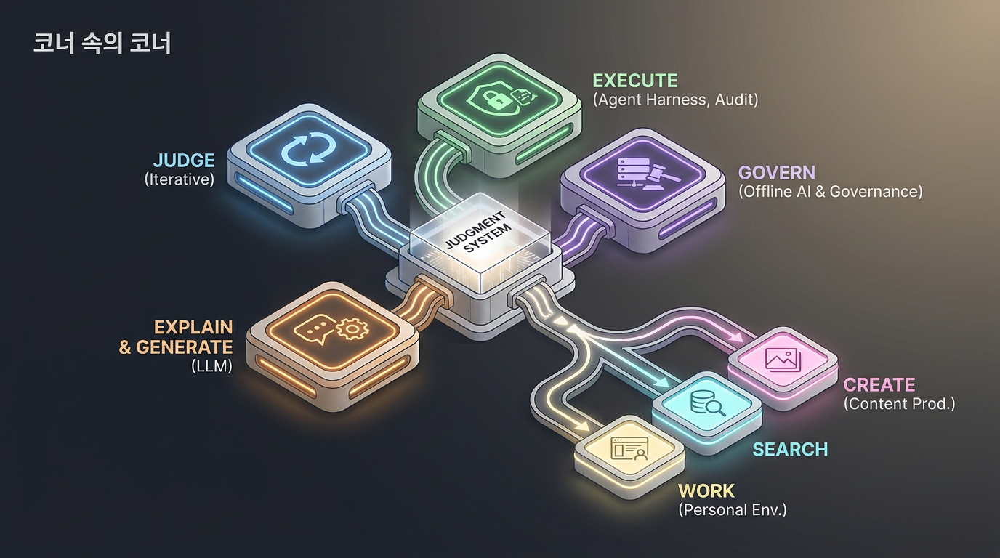

# 2026-09-26 · 판단 시스템으로 묶이는 AI 도구들 · 릴리스 40건

<section class="release-infographic">
  <figure class="release-infographic__figure">
    
    <figcaption>이번 40선은 도구 목록이 아니라, 판단·설명·실행·거버넌스가 한 시스템 안에서 역할을 나누는 장면으로 다시 묶었다.</figcaption>
  </figure>
  

    
Judgment System · Release 40

    
이번에는 지도나 파이프라인 대신, 중앙 허브를 둘러싼 방사형 모듈 구조를 택했다. 빠른 판단을 맡는 Jev, 설명과 생성을 맡는 LLM, 실행을 관리하는 하네스, 책임과 접근성을 다루는 거버넌스가 서로 다른 부품처럼 연결되는 모습이다.

    <ul class="release-infographic__points">
      <li><strong>JUDGE</strong> 반복 분류·선택·점수화처럼 기준이 분명한 판단을 빠르게 처리한다.</li>
      <li><strong>EXPLAIN &amp; GENERATE</strong> LLM은 결과의 의미를 풀고 사람에게 전달할 답변과 콘텐츠를 만든다.</li>
      <li><strong>EXECUTE &amp; GOVERN</strong> 에이전트 하네스는 권한·예산·감사를 품고, 오프라인 AI와 교육 거버넌스는 사용 조건을 다시 묻는다.</li>
      <li><strong>SEARCH · CREATE · WORK</strong> 검색, 콘텐츠 제작, 개인 작업 환경은 판단 시스템의 실제 적용면이다.</li>
    </ul>
  

</section>

## 먼저 결론

- 이번 40건의 핵심은 “더 똑똑한 모델 하나”가 아니라, **판단과 생성을 분리하고 실행과 책임을 다시 연결하는 시스템**입니다.
- Jev는 반복 판단의 속도와 비용을 줄이는 쪽에, LLM은 설명·대화·콘텐츠 생성 쪽에 놓일 때 역할이 선명해집니다.
- 에이전트 하네스가 권한·예산·파일·터미널을 관리하기 시작하면서, AI 도구 선택은 곧 운영과 감사의 설계가 됩니다.
- 로컬 AI, 오프라인 지식 서버, 교육 거버넌스 자료는 자동화의 반대편이 아니라 “누가 언제 무엇을 통제할 것인가”를 정하는 기반입니다.

## 큰 흐름

이번 묶음에는 Jev 관련 노트가 여러 개 포함되어 있습니다. 이 자료들은 빠른 분류·점수화와 설명·생성을 분리하는 접근을 소개하며, 실험 수치는 영상별 조건을 확인해 해석해야 합니다. 동시에 에이전트 도구는 실행 권한·비용·역할 관리로 확장되고, 교육·오프라인 접근·개인 작업 환경 자료는 기술 도입의 맥락과 책임을 함께 묻습니다.

## 주제별 학습 노트

### 에이전트 운영과 개발 자동화

에이전트가 늘면서 관심은 모델 성능에서 실행 하네스, 예산·권한, 파일·터미널 연결, 역할 분담과 감사 가능성으로 옮겨간다. Paperclip·Octop·Codex Harness·Agentfiles 등은 관리 계층을, Gajae Way·Chat on Steroids는 도구와 로컬 환경의 연결 경계를 보여준다.

#### 1. GitHub - paperclipai/paperclip: The open-source app everyone uses to manage agents at work · GitHub

Paperclip은 여러 AI 에이전트에 목표·역할·예산을 배정하고 조직도와 작업 흐름을 한 대시보드에서 관리하는 오픈소스 오케스트레이션 앱이다. 에이전트 수가 늘어날 때 작업 추적과 거버넌스를 어떻게 다룰지 보여준다.

- [원본](https://github.com/paperclipai/paperclip)

#### 4. GitHub - Yeachan-Heo/gajae-way: Gateway that hosts an operator-owned agent session behind durable jo

Gajae Way는 작업자의 에이전트 세션을 게이트웨이 뒤에 두고 외부 제어 표면과 연결하는 프로젝트다. 에이전트 접근을 소유자 통제와 경계 설정 아래 운영하는 구조에 초점을 둔다.

- [원본](https://github.com/Yeachan-Heo/gajae-way)

#### 7. magpie

Magpie는 로컬 게이트웨이 하나로 DeepSeek·Kimi·GLM·Qwen·OpenRouter·Ollama 등 여러 모델 공급자를 Codex·Claude Code·Gemini CLI 같은 에이전트에 연결한다. OpenAI Responses와 Anthropic Messages 등 API 형식을 중계·변환해 기존 에이전트에서 모델 선택 폭을 넓히는 구조다.

- [원본](https://github.com/yetone/magpie)

#### 11. GitHub - zai-org/ZCode: Z.ai's coding agent harness. Powerful, intelligent, extensible. · GitHub

ZCode는 Z.ai의 코딩 에이전트 실행 하네스 저장소다. 에이전트의 도구 연결과 실행 구조를 살펴보며 코딩 에이전트 제품이 모델 외에 어떤 런타임을 필요로 하는지 이해할 수 있다.

- [원본](https://github.com/zai-org/ZCode)

#### 12. Designing delightful frontends with GPT-5.4 | OpenAI Developers

OpenAI 개발자 문서는 GPT-5.4로 매력적인 프런트엔드를 설계하는 접근을 다룬다. 요구사항을 시각적 구성과 상호작용으로 바꾸고, 결과를 반복 검토하는 프런트엔드 작업 흐름을 살펴본다.

- [원본](https://developers.openai.com/blog/designing-delightful-frontends-with-gpt-5-4)

#### 13. oh-my-hermes/README.ko.md at main · rlaope/oh-my-hermes · GitHub

oh-my-hermes 한국어 README는 Hermes 위에서 작업 라우팅과 워크플로를 관리하는 운영 계층을 설명한다. 기존 런타임을 대체하기보다 역할 분담과 실행 경계를 보완하는 구성을 보여준다.

- [원본](https://github.com/rlaope/oh-my-hermes/blob/main/README.ko.md)

#### 32. GitHub - TencentCloud/Octop: A smarter, self-hosted AI assistant — multi-user, multi-agent. · GitHub

Octop은 자체 호스팅형 다중 사용자·다중 에이전트 AI 비서 프로젝트다. 개인 또는 팀 환경에서 에이전트, 도구, 세션을 관리하는 제품 구조를 살펴본다.

- [원본](https://github.com/TencentCloud/Octop)

#### 33. GitHub - Railly/agentfiles: Browse, create, and edit AI agent files across Claude Code, Cursor, Code

Agentfiles는 Obsidian에서 Claude Code·Cursor·Codex·Windsurf 등 여러 코딩 에이전트의 스킬 파일을 찾아보고 만들고 관리하는 플러그인이다. 볼트 안의 지침을 정리하고 에이전트별 재사용 설정을 연결한다.

- [원본](https://github.com/Railly/agentfiles)

#### 34. GitHub - revfactory/codex-harness: Codex-native harness with reusable agents, persistent multi-agent

Codex Harness는 프로젝트를 살펴 작은 에이전트 팀과 재사용 스킬을 만드는 Codex용 하네스 팩토리다. 독립 작업 실행, 통합, 검증을 오케스트레이션하며, 원본 Claude Code 프로젝트의 성능 자료가 이 포팅의 성능을 입증하지 않는다고 분명히 한다.

- [원본](https://github.com/revfactory/codex-harness)

#### 38. GitHub - totec448-spec/chat-on-steroids: Cross-platform local MCP capabilities for ChatGPT with Chro

Chat on Steroids는 ChatGPT에서 로컬 파일·터미널·브라우저 작업과 MCP 도구를 연결하는 프로젝트다. 작업 실행과 로컬 데이터 접근을 모델 대화와 결합할 때 권한·검토·상태 저장을 어떻게 다루는지 보여준다.

- [원본](https://github.com/totec448-spec/chat-on-steroids)

### Jev 판단형 AI와 응용

최근 자료 다수는 Jev를 생성형 AI의 대체재가 아니라 반복 분류·선택·점수화에 특화된 구성 요소로 다룬다. 실습 자료는 입력(State)과 판단 질문을 분리하고, 앱이 기준값을 적용하며, LLM이 설명·답변을 맡는 역할 분담을 보여준다. 영상의 속도·비용 수치는 개별 실험 결과이므로 업무·데이터·비교 모델 조건을 함께 확인해야 한다.

#### 2. GitHub - pjt3591oo/laya-server: typesafe ai > systemone > jev · GitHub

laya-server는 TypeSafe AI의 Jev를 서버 측에서 연결하는 Python 프로젝트다. 저장소 설명은 애플리케이션의 기존 시스템과 빠른 구조화 판단을 잇는 구현 맥락을 제공한다.

- [원본](https://github.com/pjt3591oo/laya-server)

#### 8. Jev 진짜 200배 빠르고 400배 저렴한지 테스트 해봤습니다.

영상은 Jev의 속도·비용 주장을 고객 문의와 댓글 분류 실험으로 점검하고 LLM 단독 처리와 비교한다. 제시된 실측치는 6~8배 빠르고 14~76배 저렴한 구간이며, 범용 우월성보다 반복 분류·라우팅 업무에서의 조합 가능성을 보여준다.

- [원본](https://www.youtube.com/watch?v=GeM9URVnPV8)

#### 15. Jev 실습 자료 드립니다 (Jev는 빠르게 판단하는 AI)

Jev 실습 자료는 원문(State)에 질문 기준(Noul·Choice·Score)을 적용해 분류 결과를 얻고, 앱 규칙으로 다음 행동을 정한 뒤 Gemini가 답변을 작성하는 흐름을 안내한다. 플레이그라운드 실습과 사람 검토 원칙도 함께 다룬다.

- [원본](https://www.youtube.com/watch?v=OjbYLmVajKg) · [보충 실습 자료 A](https://www.youtube.com/watch?v=VQ0mjnVN6uk)

#### 18. AI 에이전트에 '직관'을 달아주면 일어나는 일 (Typesafe Jev 파헤치기), jev 특강

영상은 Jev를 텍스트를 길게 생성하는 LLM과 대비해, 의미를 이해한 뒤 점수·확률로 판단 결과를 내는 방식으로 설명한다. 고객 문의 분류 같은 반복 판단에서 LLM과 역할을 나누는 구상을 소개한다.

- [원본](https://www.youtube.com/watch?v=_MgtIbZMPC4)

#### 20. 200배 빠른데 400배 싸다, AI 업계 지각 변동, LLM 아닌 새로운 AI 등장 Jev… 단어 생성이 아니라 확률이 바꾸는 AI 생산성

영상은 Jev의 빠른 점수화와 생성형 모델의 답변 작성을 결합하는 생산성 흐름을 설명한다. 성능 표현은 영상의 실험 조건과 비교 대상을 함께 읽고, 반복 분류처럼 판단 기준이 명확한 업무에 한정해 해석해야 한다.

- [원본](https://www.youtube.com/watch?v=72rJKQ2a6Ak)

#### 23. Jev API 사용법 공개! | 주식 투자부터 수능 예측까지 10배 더 똑똑하게 일하는 법

Jev API 활용을 주식 데이터와 시험 예측 등 사례로 설명하는 영상이다. 입력 자료와 질문을 구조화해 판단 결과를 받고, 이를 앱의 명시적 규칙과 후속 생성 모델에 연결하는 API 작업 흐름을 다룬다.

- [원본](https://www.youtube.com/watch?v=hRW-Gh5Y4MM)

#### 24. 최근 난리난 Jev 직접 써봤습니다. 제 게임을 손 안 대고 깼습니다.

영상은 Jev를 게임 에이전트에 연결해 게임을 자동 플레이하는 사례를 보여준다. 모델이 행동을 직접 실행한다고 혼동하지 않도록 점수 출력, 임계값 규칙, 클릭·키 입력을 담당하는 코드의 역할을 나눠 살핀다.

- [원본](https://www.youtube.com/watch?v=Evq6yIh4f1I)

#### 29. 최대 200배 빠른 AI? 제브(Jev)의 성능 주장과 조건

영상은 Jev의 최대 속도 주장을 조건별로 나누어 설명한다. 처리 방식과 비교 기준이 결과를 바꾸므로, 성능 배수 자체보다 어떤 입력·업무·비용 기준에서 나온 수치인지 점검하도록 한다.

- [원본](https://www.youtube.com/watch?v=0y245p0kSQQ)

#### 35. 출시하자마자 난리 난 AI, JEV는 대체 뭐가 다른가

영상은 Jev를 생성형 AI와 비교하며 빠른 분류·판단에 맞춘 모델의 특징과 실제 사용 맥락을 소개한다. 모델 선택은 속도뿐 아니라 설명 필요성, 기준 설정, 오판 검토 책임을 함께 고려해야 한다.

- [원본](https://www.youtube.com/watch?v=lx3YkhzM_04)

#### 37. [시즌 3] Jev란 무엇인가?

영상은 Jev의 기본 원리와 LLM과의 차이를 설명한다. Jev는 선택·점수·확률 같은 구조화 결과를 내고, 결과의 의미 해석과 행동 규칙은 애플리케이션과 사람이 맡는다는 경계를 강조한다.

- [원본](https://www.youtube.com/watch?v=mDnbjbjosFY)

### 교육·AI 거버넌스

교육 자료는 AI 도구 도입이 학습자 행위자성, 문화적 맥락, 접근성, 평가와 공공성에 미치는 영향을 묻는다. 자동화 편의만으로 결론내리지 않고 교사·학생·공동체가 목적과 기준을 정하는 일이 핵심이다.

#### 3. 교실속알고리즘_한국어번역본.pdf

UNESCO의 2026년 교육·AI 논의집 비공식 한국어 번역본이다. 26편의 글이 인간의 행위자성, 청소년 발달, 교수·평가, 지식과 표현, 교육의 공공성 등을 질문하며, AI를 교육 목적에 맞게 다루는 정책·실천 과제를 제시한다.

- [원본](https://unesdoc.unesco.org/ark:/48223/pf0000399335)

#### 27. GitHub - raphysicst-create/edunet-mcp: edunet-mcp for korean teachers · GitHub

edunet-mcp는 교사가 에듀넷 교수학습 자료와 성취기준 근거를 검색하도록 돕는 MCP 서버다. 기본 검색 결과와 선택형 상세 구조 분석을 구분하고, 근거가 포함된 자료 탐색 흐름을 제시한다.

- [원본](https://github.com/raphysicst-create/edunet-mcp)

### AI 콘텐츠 제작

텍스트·음성·영상·발표 자료를 만드는 도구들이 기획부터 편집까지 여러 단계를 묶는다. 자동 생성 자체보다 원본 자료, 프롬프트, 후편집, 접근성과 사람의 검수가 품질을 좌우한다.

#### 5. anything2explainer: 주제만 입력하면 AI가 스토리보드 제작부터 비디오 제작까지 처리

anything2explainer는 주제를 입력하면 조사와 스토리보드, 내레이션, 모션그래픽을 거쳐 설명 영상을 만드는 에이전트형 제작 파이프라인을 소개한다. 기획과 제작 단계를 하나의 자동화 흐름으로 묶는 사례다.

- [원본](https://github.com/Vincentwei1021/anything2explainer)

#### 6. GitHub - contenjoo/easycut: 쉬운 Mac 영상 편집기 — STT 대본 편집, 자막, 무음 컷, Claude AI 편집 · GitHub

EasyCut은 macOS용 영상 편집기로, 음성 인식 대본에서 문장을 편집해 영상을 자르고 자막을 만들며 무음 구간을 정리한다. Claude 기반 편집 기능을 기존 타임라인 작업에 결합한다.

- [원본](https://github.com/contenjoo/easycut)

#### 9. 클로드 오퍼스 5.5가 직접 만든 영상, 이 정도까지 왔습니다 | 힉스필드 X 클로드 오퍼스 5.5

영상은 Claude Opus 5.5와 Higgsfield로 생성한 장면을 시연하며, 프롬프트와 영상 생성·후반 작업이 어디까지 이어졌는지 살펴본다. 결과물의 인상과 제작 과정을 구분해 보는 미디어 리터러시 자료다.

- [원본](https://www.youtube.com/watch?v=-oy8vOHt2PU)

#### 10. Gemini 3.8 Flash TTS and Gemini 3.8 Flash-Lite TTS

Google의 Gemini 3.8 Flash 및 Flash-Lite 텍스트 음성 변환 발표 자료다. 음성 생성 기능과 모델 선택을 공식 설명에 따라 살펴보고, 실제 사용 전 언어·품질·접근 조건을 확인하도록 돕는다.

- [원본](https://blog.google/innovation-and-ai/models-and-research/gemini-models/gemini-3-8-text-to-speech/)

#### 16. GitHub - gongnyang/bookforge: 주제 한 줄 → 상업도서급 한국어 전자책 PDF. Claude Code·Codex 겸용 에이전트 스킬 — 6 스타일 팩, 실측

Bookforge는 주제 한 줄에서 한국어 전자책 PDF까지 만드는 Claude Code·Codex 겸용 스킬이다. 조사, 원고 구성, 편집 단계를 반복 가능한 제작 절차로 묶는다.

- [원본](https://github.com/gongnyang/bookforge)

#### 17. 시네마틱 HTML Presentation

Scrolline Deck은 스크롤 입력에 맞춰 장면 전환과 머무름을 연출하는 HTML 프레젠테이션 제작 스킬이다. Vite, GSAP ScrollTrigger, Lenis와 12개 장면 기법을 활용해 웹 발표를 구성한다.

- [원본](https://github.com/gongnyang/awesome-html-scrolline-deck)

#### 26. GitHub - renoise-ai/awesome-gpt-image-2-5-prompts: Curated GPT Image 2.5 (ChatGPT Images 2.5) text-t

저자가 결과와 함께 공개한 프롬프트, OpenAI 출시 예시, 사례 연구를 모은 GPT Image 2.5 텍스트-이미지 프롬프트 컬렉션이다. 참조 이미지를 요구하지 않는 프롬프트를 목적별로 비교하고, 권리·출처 표시를 확인해 활용하도록 안내한다.

- [원본](https://github.com/renoise-ai/awesome-gpt-image-2-5-prompts)

#### 28. Scrolline Deck: 스크롤 기반의 시네마틱 HTML 프리젠테이션 제작 도구

Scrolline Deck은 스크롤에 반응하는 장면별 HTML 발표를 만드는 저장소·스킬이다. 진입·유지·퇴장 연출을 설계해 문서형 슬라이드와 다른 서사형 프레젠테이션을 제작한다.

- [원본](https://github.com/gongnyang/awesome-html-scrolline-deck)

### AI 검색·지식 활용

검색은 관련 자료를 가져오는 데서 출처를 선별하고 근거를 확인하는 흐름으로 확장된다. Jev 기반 검색 예제와 Needle 실습은 retrieval 결과와 생성 응답의 경계를 살피게 한다.

#### 14. awesome-llm-apps/advanced_llm_apps/needle at main · Shubhamsaboo/awesome-llm-apps · GitHub

Needle은 키워드 일치보다 의미를 기준으로 GitHub 문서에서 관련 문장을 찾고 강조하는 검색 도구다. Chrome 확장이나 React 앱으로 원문 맥락을 열어 보며 검색 결과를 검토하고, Jev를 검색 기반으로 활용한다.

- [원본](https://github.com/Shubhamsaboo/awesome-llm-apps/tree/main/advanced_llm_apps/needle)

#### 31. GitHub - superagents-lab/jev-search: Search the web with TypeSafe's Jev: source selection, query und

jev-search는 TypeSafe Jev를 활용해 웹 검색 결과의 출처를 선택하고 질문에 답하도록 구성한 검색 프로젝트다. 결과 생성보다 근거 후보를 빠르게 분류·선별하는 검색 파이프라인에 초점을 둔다.

- [원본](https://github.com/superagents-lab/jev-search)

### 오프라인·로컬 AI

Project NOMAD와 Colibri는 네트워크·하드웨어 제약을 제품 설계의 출발점으로 삼는다. 로컬 실행은 접근성과 통제력을 높일 수 있지만 저장 공간, 메모리, 모델 선택과 업데이트 책임을 동반한다.

#### 19. [적정기술]Project NOMAD: 디지털 격차 해소 및 비상 상황 대비해 인터넷 연결 없이 위키피디아, 수천 권의 책과 강좌, 지도, 로컬 AI까지 모두 사용할 수 있는 서버

Project NOMAD는 인터넷이 없는 환경에서 위키백과, 책·강좌, 지도와 로컬 AI를 제공하려는 휴대형 오프라인 지식 서버다. 디지털 격차나 재난 상황에서 로컬 자원만으로 정보 접근을 유지하는 설계가 핵심이다.

- [원본](https://github.com/Crosstalk-Solutions/project-nomad)

### 에이전트와 생성형 AI 연결

구조화 판단 API와 생성형 모델, 에이전트 API를 조합해 탐색·실행·응답 흐름을 분리한다. 업무 규칙과 사람 승인 지점을 명시하면 자동화의 효율과 책임 경계를 함께 설계할 수 있다.

#### 21. [Meta Muse] 질문 대신 실행하는 AI 메타 뮤즈: AI 에이전트가 우리의 일상을 바꿀 5가지 시나리오

Meta Muse를 주제로, 사용자가 질문을 직접 쓰기보다 AI가 주변 맥락을 파악해 작업을 수행하는 에이전트 시나리오를 소개한다. 일상 업무 자동화의 편의와 권한·감독 경계를 함께 생각하게 한다.

- [원본](https://www.youtube.com/watch?v=BtvX-_mVbCg)

#### 22. 클로드코드로 만들던 자동화, 이제 OpenAI가 대신 해줍니다｜Agents API 뜯어봤습니다

영상은 OpenAI Agents API를 살펴보며 기존 Claude Code 자동화와 비교한다. 에이전트 실행, 도구 호출, 반복 작업을 API 기반으로 구성할 때 개발자가 얻는 제어 지점을 짚는다.

- [원본](https://www.youtube.com/watch?v=lGWkQ5KXZ9w)

#### 39. 주식 자동 투자 서비스 만들기 1탄 (GPT 아스트라/ 클로드 Fable 5.1) -자료공개-

GPT 아스트라와 클로드 Fable 5.1을 활용한 주식 자동 투자 서비스의 핵심은? 다양한 데이터 소스를 시냅스처럼 연결하여 AI 챗봇과 텔레그램 알림으로 유망 종목을 추천하고, 실제 매수까지 연동하는 자동화된 투자 시스템을 구축하는 것입니다. 이를 통해 방대한 주식 데이터를 효율적으로 분석하고 투자 의사결정을 지원하며, 궁극적으로는 개인 맞춤형 자동 투자 환경을 구현할 수 있습니다.

- [원본](https://www.youtube.com/watch?v=0v6qOxHeulY)
- [공개 요약](https://lilys.ai/digest/11408935/13473682?s=1&noteVersionId=10081809)

### 로컬 AI 실행

대형 모델을 사용자 하드웨어에서 실행하려는 시도는 모델 규모와 기기 자원의 제약을 연결한다. 실사용 가능성은 메모리·속도·정확도와 라이선스를 함께 비교해야 한다.

#### 25. GitHub - JustVugg/colibri: Run frontier MoE models on hardware you already own — pure C, zero deps,

Colibri는 순수 C로 다양한 크기의 MoE 모델을 보유한 컴퓨터에서 실행하려는 프로젝트다. RAM·VRAM·저장장치를 계층적으로 활용해 하드웨어 제약을 줄이는 로컬 추론 접근을 설명한다.

- [원본](https://github.com/JustVugg/colibri)

### 개인 지식·개발 환경

개인 지식과 개발 도구는 노트·파일·Linux·브라우저를 연결하는 작업 환경으로 진화한다. 중요한 점은 연결 수보다 자료 출처, 동기화 안전성, 권한 관리와 다시 찾을 수 있는 구조다.

#### 30. AI와 리눅스로 만드는 나만의 작업 환경, 옵시디언 그 너머

영상은 AI 도구와 리눅스를 활용해 개인 작업 환경을 구성하는 방법을 소개한다. 클라우드 서비스에만 의존하지 않고 파일·앱·자동화를 조합해 자신에게 맞는 생산성 환경을 만드는 관점을 다룬다.

- [원본](https://www.youtube.com/watch?v=9O4ww5XDMRM)

#### 36. 9월19일 줌미팅 세미나(Aside)

Aside 세미나는 AI 브라우저와 앱 배포, ChatGPT·GitHub 기반 개발 흐름을 시연한다. 도구 선택과 구독 비용, 자동화 경계를 함께 다루므로, 발표자의 경험과 서비스의 보편적 사실을 구분해 읽도록 정리했다.

- [원본](https://www.youtube.com/watch?v=qeQGMWB4u78)

#### 40. GitHub - syncthing/syncthing: Open Source Continuous File Synchronization · GitHub

Syncthing은 오픈 소스 파일 동기화 프로그램으로, 여러 컴퓨터 간에 파일을 안전하고 쉽게 동기화하며, 특히 데이터 손실 방지 및 보안을 최우선 목표로 합니다.

- [원본](https://github.com/syncthing/syncthing)
- [공개 요약](https://lilys.ai/digest/11408618/13473314?s=1&noteVersionId=10081428)

## 복사용 링크 표

| 카테고리 | 주제 | 제목 | 원본 링크 | 릴리스 공개 링크 |
|---|---|---|---|---|
| 에이전트 운영과 개발 자동화 | 목표·예산·조직도를 갖춘 AI 에이전트 회사 운영 | GitHub - paperclipai/paperclip: The open-source app everyone uses to manage agents at work · GitHub | https://github.com/paperclipai/paperclip | — |
| Jev 판단형 AI와 응용 | Python 서버에서 Jev를 연결하는 예제 | GitHub - pjt3591oo/laya-server: typesafe ai > systemone > jev · GitHub | https://github.com/pjt3591oo/laya-server | — |
| 교육·AI 거버넌스 | 교육 현장의 AI와 인간 행위자성 | 교실속알고리즘_한국어번역본.pdf | https://unesdoc.unesco.org/ark:/48223/pf0000399335 | — |
| 에이전트 운영과 개발 자동화 | 작업자 소유 세션을 위한 에이전트 게이트웨이 | GitHub - Yeachan-Heo/gajae-way: Gateway that hosts an operator-owned agent session behind durable jo | https://github.com/Yeachan-Heo/gajae-way | — |
| AI 콘텐츠 제작 | 주제 입력에서 설명 영상까지의 생성 파이프라인 | anything2explainer: 주제만 입력하면 AI가 스토리보드 제작부터 비디오 제작까지 처리 | https://github.com/Vincentwei1021/anything2explainer | — |
| AI 콘텐츠 제작 | 대본 기반 영상 편집과 AI 지원 | GitHub - contenjoo/easycut: 쉬운 Mac 영상 편집기 — STT 대본 편집, 자막, 무음 컷, Claude AI 편집 · GitHub | https://github.com/contenjoo/easycut | — |
| 에이전트 운영과 개발 자동화 | 여러 AI 모델을 코딩 에이전트에 연결하는 로컬 게이트웨이 | magpie | https://github.com/yetone/magpie | — |
| Jev 판단형 AI와 응용 | Jev 처리 성능 실험과 업무 범위 | Jev 진짜 200배 빠르고 400배 저렴한지 테스트 해봤습니다. | https://www.youtube.com/watch?v=GeM9URVnPV8 | — |
| AI 콘텐츠 제작 | Claude Opus 영상 생성 사례 | 클로드 오퍼스 5.5가 직접 만든 영상, 이 정도까지 왔습니다 \| 힉스필드 X 클로드 오퍼스 5.5 | https://www.youtube.com/watch?v=-oy8vOHt2PU | — |
| AI 콘텐츠 제작 | Gemini 텍스트 음성 변환 | Gemini 3.8 Flash TTS and Gemini 3.8 Flash-Lite TTS | https://blog.google/innovation-and-ai/models-and-research/gemini-models/gemini-3-8-text-to-speech/ | — |
| 에이전트 운영과 개발 자동화 | 코딩 에이전트 실행 하네스 | GitHub - zai-org/ZCode: Z.ai's coding agent harness. Powerful, intelligent, extensible. · GitHub | https://github.com/zai-org/ZCode | — |
| 에이전트 운영과 개발 자동화 | GPT-5.4 기반 프런트엔드 설계 | Designing delightful frontends with GPT-5.4 \| OpenAI Developers | https://developers.openai.com/blog/designing-delightful-frontends-with-gpt-5-4 | — |
| 에이전트 운영과 개발 자동화 | Hermes 워크플로 운영 계층 | oh-my-hermes/README.ko.md at main · rlaope/oh-my-hermes · GitHub | https://github.com/rlaope/oh-my-hermes/blob/main/README.ko.md | — |
| AI 검색·지식 활용 | Needle 문서 검색 예제 | awesome-llm-apps/advanced_llm_apps/needle at main · Shubhamsaboo/awesome-llm-apps · GitHub | https://github.com/Shubhamsaboo/awesome-llm-apps/tree/main/advanced_llm_apps/needle | — |
| Jev 판단형 AI와 응용 | Jev·앱 규칙·Gemini 실습 | Jev 실습 자료 드립니다 (Jev는 빠르게 판단하는 AI) | https://www.youtube.com/watch?v=OjbYLmVajKg ; https://www.youtube.com/watch?v=VQ0mjnVN6uk | — |
| AI 콘텐츠 제작 | 한국어 전자책 제작 자동화 | GitHub - gongnyang/bookforge: 주제 한 줄 → 상업도서급 한국어 전자책 PDF. Claude Code·Codex 겸용 에이전트 스킬 — 6 스타일 팩, 실측 | https://github.com/gongnyang/bookforge | — |
| AI 콘텐츠 제작 | 스크롤형 웹 프레젠테이션 | 시네마틱 HTML Presentation | https://github.com/gongnyang/awesome-html-scrolline-deck | — |
| Jev 판단형 AI와 응용 | 점수 기반 판단형 AI 설명 | AI 에이전트에 '직관'을 달아주면 일어나는 일 (Typesafe Jev 파헤치기), jev 특강 | https://www.youtube.com/watch?v=_MgtIbZMPC4 | — |
| 오프라인·로컬 AI | 인터넷 없는 지식 서버 | [적정기술]Project NOMAD: 디지털 격차 해소 및 비상 상황 대비해 인터넷 연결 없이 위키피디아, 수천 권의 책과 강좌, 지도, 로컬 AI까지 모두 사용할 수 있는 서버 | https://github.com/Crosstalk-Solutions/project-nomad | — |
| Jev 판단형 AI와 응용 | Jev와 LLM의 역할 분담 | 200배 빠른데 400배 싸다, AI 업계 지각 변동, LLM 아닌 새로운 AI 등장 Jev… 단어 생성이 아니라 확률이 바꾸는 AI 생산성 | https://www.youtube.com/watch?v=72rJKQ2a6Ak | — |
| 에이전트와 생성형 AI 연결 | 맥락 인식형 에이전트 시나리오 | [Meta Muse] 질문 대신 실행하는 AI 메타 뮤즈: AI 에이전트가 우리의 일상을 바꿀 5가지 시나리오 | https://www.youtube.com/watch?v=BtvX-_mVbCg | — |
| 에이전트와 생성형 AI 연결 | Agents API 자동화 분석 | 클로드코드로 만들던 자동화, 이제 OpenAI가 대신 해줍니다｜Agents API 뜯어봤습니다 | https://www.youtube.com/watch?v=lGWkQ5KXZ9w | — |
| Jev 판단형 AI와 응용 | Jev API 활용 사례 | Jev API 사용법 공개! \| 주식 투자부터 수능 예측까지 10배 더 똑똑하게 일하는 법 | https://www.youtube.com/watch?v=hRW-Gh5Y4MM | — |
| Jev 판단형 AI와 응용 | 게임 자동 플레이 에이전트 | 최근 난리난 Jev 직접 써봤습니다. 제 게임을 손 안 대고 깼습니다. | https://www.youtube.com/watch?v=Evq6yIh4f1I | — |
| 로컬 AI 실행 | 소비자 하드웨어용 MoE 모델 실행 | GitHub - JustVugg/colibri: Run frontier MoE models on hardware you already own — pure C, zero deps, | https://github.com/JustVugg/colibri | — |
| AI 콘텐츠 제작 | 이미지 생성 프롬프트 자료 | GitHub - renoise-ai/awesome-gpt-image-2-5-prompts: Curated GPT Image 2.5 (ChatGPT Images 2.5) text-t | https://github.com/renoise-ai/awesome-gpt-image-2-5-prompts | — |
| 교육·AI 거버넌스 | 교사용 에듀넷 자료 MCP | GitHub - raphysicst-create/edunet-mcp: edunet-mcp for korean teachers · GitHub | https://github.com/raphysicst-create/edunet-mcp | — |
| AI 콘텐츠 제작 | 장면 전환형 HTML 프레젠테이션 | Scrolline Deck: 스크롤 기반의 시네마틱 HTML 프리젠테이션 제작 도구 | https://github.com/gongnyang/awesome-html-scrolline-deck | — |
| Jev 판단형 AI와 응용 | 속도 주장과 측정 조건 | 최대 200배 빠른 AI? 제브(Jev)의 성능 주장과 조건 | https://www.youtube.com/watch?v=0y245p0kSQQ | — |
| 개인 지식·개발 환경 | 리눅스 기반 개인 작업 환경 | AI와 리눅스로 만드는 나만의 작업 환경, 옵시디언 그 너머 | https://www.youtube.com/watch?v=9O4ww5XDMRM | — |
| AI 검색·지식 활용 | Jev 기반 웹 검색 | GitHub - superagents-lab/jev-search: Search the web with TypeSafe's Jev: source selection, query und | https://github.com/superagents-lab/jev-search | — |
| 에이전트 운영과 개발 자동화 | 자체 호스팅 멀티 에이전트 비서 | GitHub - TencentCloud/Octop: A smarter, self-hosted AI assistant — multi-user, multi-agent. · GitHub | https://github.com/TencentCloud/Octop | — |
| 에이전트 운영과 개발 자동화 | 코딩 에이전트 설정 파일 관리 | GitHub - Railly/agentfiles: Browse, create, and edit AI agent files across Claude Code, Cursor, Code | https://github.com/Railly/agentfiles | — |
| 에이전트 운영과 개발 자동화 | Codex 에이전트 실행 환경 | GitHub - revfactory/codex-harness: Codex-native harness with reusable agents, persistent multi-agent | https://github.com/revfactory/codex-harness | — |
| Jev 판단형 AI와 응용 | Jev의 특징과 활용 맥락 | 출시하자마자 난리 난 AI, JEV는 대체 뭐가 다른가 | https://www.youtube.com/watch?v=lx3YkhzM_04 | — |
| 개인 지식·개발 환경 | Aside·AI 도구 개발 세미나 | 9월19일 줌미팅 세미나(Aside) | https://www.youtube.com/watch?v=qeQGMWB4u78 | — |
| Jev 판단형 AI와 응용 | Jev 입문과 판단 결과 해석 | [시즌 3] Jev란 무엇인가? | https://www.youtube.com/watch?v=mDnbjbjosFY | — |
| 에이전트 운영과 개발 자동화 | ChatGPT와 로컬 도구 연결 | GitHub - totec448-spec/chat-on-steroids: Cross-platform local MCP capabilities for ChatGPT with Chro | https://github.com/totec448-spec/chat-on-steroids | — |
| 에이전트와 생성형 AI 연결 | AI를 활용한 주식 자동화 서비스 | 주식 자동 투자 서비스 만들기 1탄 (GPT 아스트라/ 클로드 Fable 5.1) -자료공개- | https://www.youtube.com/watch?v=0v6qOxHeulY | https://lilys.ai/digest/11408935/13473682?s=1&noteVersionId=10081809 |
| 개인 지식·개발 환경 | 오픈소스 파일 동기화 | GitHub - syncthing/syncthing: Open Source Continuous File Synchronization · GitHub | https://github.com/syncthing/syncthing | https://lilys.ai/digest/11408618/13473314?s=1&noteVersionId=10081428 |

## 용어 정리

| 용어 | 쉬운 설명 | 예시 |
|---|---|---|
| 구조화 판단 | 문장 대신 선택·점수·확률 같은 정해진 형태로 결과를 주는 방식입니다. | 문의 내용을 배송·환불 중 하나로 분류하고 긴급도를 0~1로 표시합니다. |
| LLM | 글을 읽고 자연어 응답을 생성하는 대규모 언어 모델입니다. | 고객 문의를 읽고 사람이 보낼 답변 초안을 만듭니다. |
| MCP | AI 앱과 외부 도구가 약속된 방식으로 연결되게 하는 규격입니다. | AI가 파일 검색 도구를 같은 연결 방식으로 호출합니다. |
| 에이전트 하네스 | 에이전트가 도구를 쓰고 작업을 이어가게 관리하는 실행 환경입니다. | 권한·작업 큐·예산을 둔 작업대에서 AI 에이전트가 업무를 수행합니다. |
| RAG / 검색 증강 | 답변 전에 관련 문서를 찾아 근거로 참고하는 방식입니다. | 답하기 전에 학교 안내서에서 해당 규정을 검색합니다. |
| MoE | 여러 전문가 하위 모델 중 필요한 일부를 골라 계산하는 모델 구조입니다. | 상황에 따라 번역 전문가나 코딩 전문가 경로를 선택하는 팀과 비슷합니다. |
| 오프라인 우선 | 인터넷이 끊겨도 핵심 기능과 자료를 사용할 수 있게 설계하는 접근입니다. | 여행 중 네트워크가 없어도 저장해 둔 지도와 문서를 엽니다. |
| 행위자성 | 사람이 선택하고 행동을 이끌 수 있는 힘입니다. | 학생이 AI 답을 그대로 내기보다 근거를 확인하고 최종 답을 결정합니다. |

## 이번 글에서 남겨둘 판단

AI 도구를 고를 때 기능표부터 비교하면 금방 복잡해집니다. 먼저 업무 안에서 반복해서 판단해야 하는 지점과, 설명·생성이 필요한 지점을 나누는 편이 낫습니다. 그다음 어떤 실행 권한을 에이전트에게 줄지, 로컬에 남겨야 할 자료가 무엇인지, 사람이 마지막에 확인해야 할 기준이 무엇인지 정하면 도구 목록이 구조로 바뀝니다.

이번 40건은 그 구조를 만드는 재료에 가깝습니다. Jev 같은 판단형 AI, 에이전트 하네스, 로컬·오프라인 실행, 교육 거버넌스와 콘텐츠 제작을 한꺼번에 읽어야 하는 이유도 여기에 있습니다. 자동화의 완성도는 모델 하나의 성능보다 **판단을 어디에 두고, 실행을 어디까지 허용하며, 책임을 어떻게 남기는가**에서 갈립니다.
